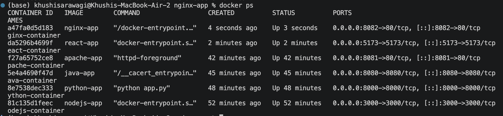
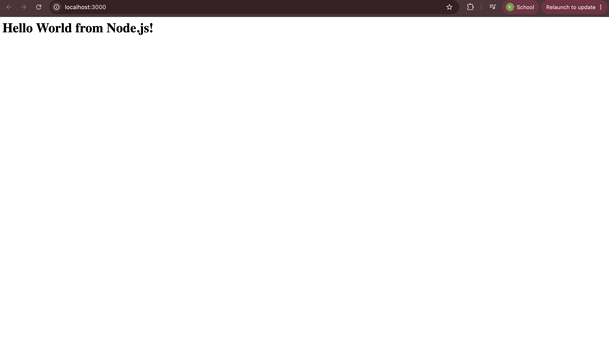
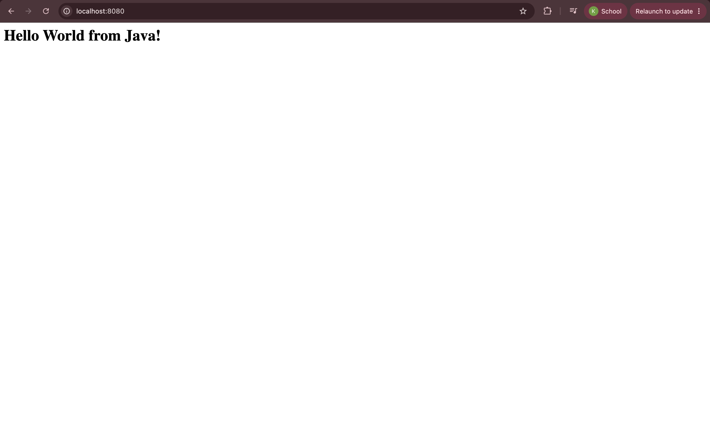
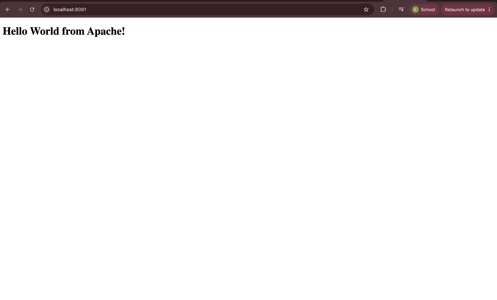
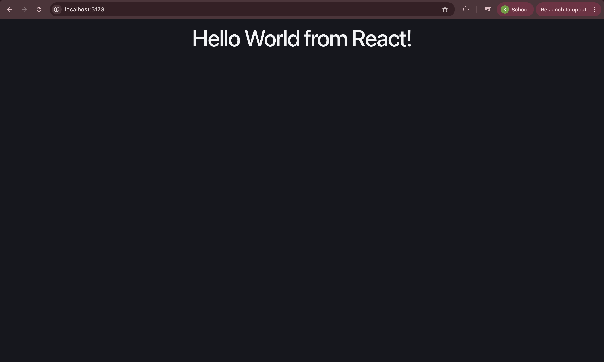
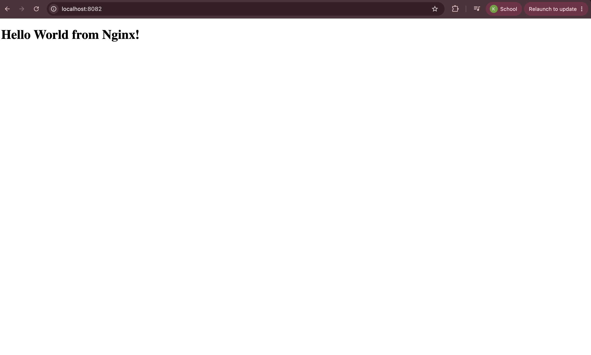

# Docker Homework

## Task: Hello World Applications

Created and containerized Hello World web applications using Docker.

### Applications

| Application | Port | Docker Image | Verification |
|---|---:|---|---|
| Node.js | 3000 | `nodejs-app` | Hello World from Node.js |
| Python | 8000 | `python-app` | Hello World from Python |
| Java | 8080 | `java-app` | Hello World from Java |
| Apache | 8081 | `apache-app` | Hello World from Apache |
| React | 5173 | `react-app` | Hello World from React |
| Nginx | 8082 | `nginx-app` | Hello World from Nginx |

### Folder Structure

```text
nodejs-app/
├── server.js
└── Dockerfile

python-app/
├── app.py
└── Dockerfile

java-app/
├── Main.java
└── Dockerfile

Apache-app/
├── index.html
└── Dockerfile

React-app/
├── src/
├── package.json
└── Dockerfile

nginx-app/
├── index.html
└── Dockerfile
```

### Docker Commands Practiced

```bash
docker build -t <image-name> .
docker run -d -p <host-port>:<container-port> <image-name>
docker ps
```

### Browser Verification

The applications were verified in the browser using:

```text
http://localhost:3000
http://localhost:8000
http://localhost:8080
http://localhost:8081
http://localhost:5173
http://localhost:8082
```

### Screenshots












