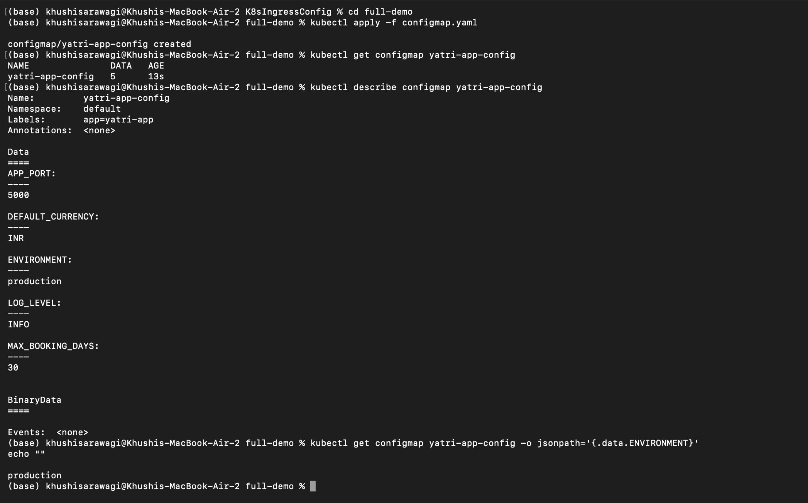
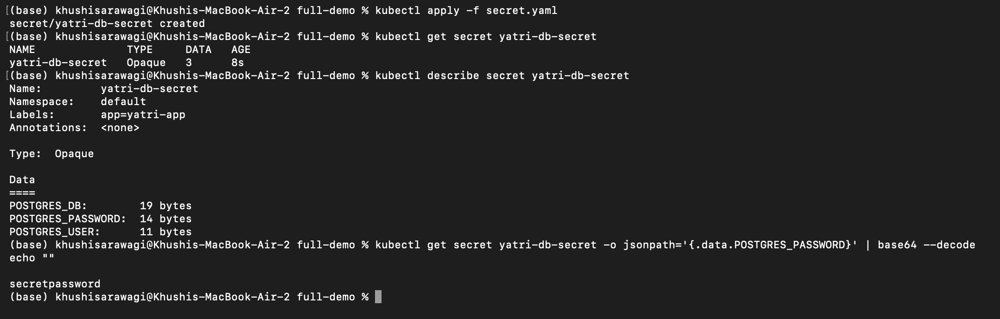
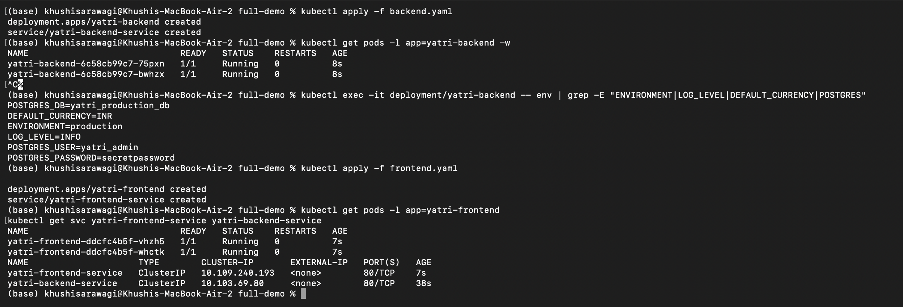
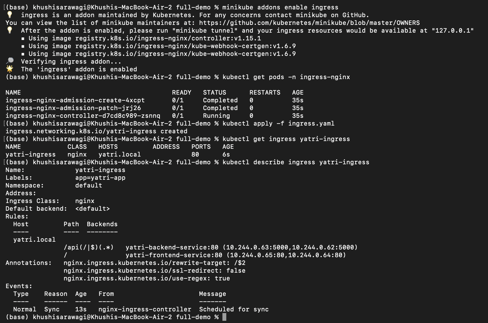
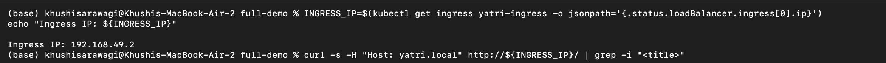

# Kubernetes Ingress, ConfigMaps, and Secrets

This folder demonstrates how Kubernetes can expose multiple internal Services through one NGINX Ingress Controller. It also shows how to keep application configuration in a ConfigMap and database credentials in a Secret.

The main working example is in `full-demo/`:

```text
Browser / curl
			|
			| http://yatri.local/       -> frontend
			| http://yatri.local/api/   -> backend API
			v
NGINX Ingress Controller
			|                         |
			v                         v
Frontend ClusterIP         Backend ClusterIP
NGINX Pods                 Python Pods
			|                         |
			+-- ConfigMap             +-- ConfigMap + Secret
```

## What is included?

| Directory | Purpose |
| --- | --- |
| `configmap/` | Standalone ConfigMap example for non-sensitive settings |
| `secret/` | Standalone Secret example for encoded database values |
| `ingress/` | Basic host/path Ingress and a TLS Ingress example |
| `full-demo/` | Complete frontend, backend, ConfigMap, Secret, and Ingress application |
| `troubleshooting/` | Notes about Secret Base64 encoding |
| `assets/` | Terminal and browser screenshots from the lab |

## Prerequisites

The commands below are written for Minikube with the NGINX Ingress addon:

```bash
kubectl version --client
minikube status
kubectl config current-context
```

Start Minikube if necessary and use the Minikube context:

```bash
minikube start
kubectl config use-context minikube
```

The full demo uses the `default` namespace, matching the manifests in this folder.

## Core Kubernetes concepts

### ConfigMap

A ConfigMap stores non-sensitive key-value configuration separately from a container image. The demo stores values such as `ENVIRONMENT`, `LOG_LEVEL`, `DEFAULT_CURRENCY`, and `APP_PORT`. Deployments import these values as environment variables with `envFrom`.

Do not place passwords, API keys, or tokens in a ConfigMap because its values are plain text.

### Secret

A Secret stores sensitive values separately from application manifests. Kubernetes Secret data is commonly written as Base64-encoded text, but Base64 is encoding, not encryption. Use RBAC, encryption at rest, and an external secret manager for production credentials.

The demo Secret contains PostgreSQL-style values:

- `POSTGRES_USER`
- `POSTGRES_PASSWORD`
- `POSTGRES_DB`

The backend reads these values through `secretKeyRef`. It prints the username and database name for demonstration, but intentionally does not print the password.

### Ingress

An Ingress defines HTTP or HTTPS routing rules. The NGINX Ingress Controller receives the request and sends it to an internal Kubernetes Service. In this demo:

- Host `yatri.local` and path `/` route to `yatri-frontend-service`.
- Host `yatri.local` and path `/api/...` route to `yatri-backend-service`.
- The backend Service forwards port `80` to the Python container on port `5000`.
- The frontend Service forwards port `80` to NGINX on port `80`.

Ingress does not run by itself. A compatible Ingress Controller must be installed in the cluster.

## Full demo architecture

The `full-demo/` manifests create:

| File | Resource | Purpose |
| --- | --- | --- |
| `configmap.yaml` | ConfigMap | Five non-sensitive application settings |
| `secret.yaml` | Secret | Three database values |
| `frontend.yaml` | Deployment + Service | Two NGINX frontend replicas |
| `backend.yaml` | Deployment + Service | Two Python API replicas on port `5000` |
| `ingress.yaml` | Ingress | Routes `/` and `/api/` by host and path |
| `run-demo.sh` | Bash script | Enables Ingress and deploys the complete demo |
| `cleanup.sh` | Bash script | Removes the demo resources |

The Ingress uses the regex path `/api(/|$)(.*)` and the rewrite target `/$2`. Therefore, a request to `/api/` reaches the backend as `/`, and a request to `/api/status` reaches it as `/status`.

## Run the complete demo

Change into the demo directory and run the supplied script:

```bash
cd K8sIngressConfig/full-demo
bash run-demo.sh
```

The script:

1. Enables the Minikube NGINX Ingress addon.
2. Waits for the Ingress Controller to become ready.
3. Applies the ConfigMap and Secret.
4. Deploys the frontend and backend Services and Pods.
5. Applies the Ingress routing rules.
6. Adds the Minikube IP and `yatri.local` to `/etc/hosts` if needed.

The script may ask for your macOS administrator password when it updates `/etc/hosts`.

## Run the demo manually

From the repository root, use the actual paths in this folder:

```bash
minikube addons enable ingress
kubectl wait --namespace ingress-nginx \
	--for=condition=ready pod \
	--selector=app.kubernetes.io/component=controller \
	--timeout=120s

kubectl apply -f K8sIngressConfig/full-demo/configmap.yaml
kubectl apply -f K8sIngressConfig/full-demo/secret.yaml
kubectl apply -f K8sIngressConfig/full-demo/frontend.yaml
kubectl apply -f K8sIngressConfig/full-demo/backend.yaml

kubectl rollout status deployment/yatri-frontend
kubectl rollout status deployment/yatri-backend

kubectl apply -f K8sIngressConfig/full-demo/ingress.yaml
kubectl get pods
kubectl get services
kubectl get ingress yatri-ingress
```

Configure local name resolution:

```bash
echo "$(minikube ip) yatri.local" | sudo tee -a /etc/hosts
```

Avoid adding the same line repeatedly. Check first with:

```bash
grep yatri.local /etc/hosts
```

## Test the routes

Test the frontend route:

```bash
curl http://yatri.local/
```

Open `http://yatri.local/` in a browser. It should display the default NGINX welcome page.

Test the backend API route:

```bash
curl http://yatri.local/api/
```

Expected response:

```text
Yatri Backend API
=================
ENVIRONMENT     : production
LOG_LEVEL       : INFO
DEFAULT_CURRENCY: INR
POSTGRES_USER   : yatri_admin
POSTGRES_DB     : yatri_production_db
```

The response demonstrates that the backend received values from both the ConfigMap and Secret. The password is not printed.

Inspect the routing and backend environment:

```bash
kubectl describe ingress yatri-ingress
kubectl get endpoints yatri-frontend-service yatri-backend-service
kubectl exec deploy/yatri-backend -- env | grep -E 'ENVIRONMENT|LOG_LEVEL|POSTGRES'
```

## Screenshots from the demo

### ConfigMap

The first screenshot shows the ConfigMap being applied, inspected, and queried with JSONPath. The `production` value confirms that configuration is stored separately from the image.



### Secret

The second screenshot shows the Secret being applied and inspected. Secret values are hidden by `kubectl describe`; decoding is demonstrated separately to show that Base64 is not encryption.



### Frontend and backend Services

The third screenshot shows the frontend and backend Deployments and their ClusterIP Services becoming available. These Services remain internal; the Ingress is the external HTTP entry point.



### Ingress Controller and routing

The fourth screenshot shows the Minikube NGINX Ingress addon, controller Pod, Ingress creation, and the `yatri-ingress` routing rules.



### Route test

The fifth screenshot begins the frontend route test with the `yatri.local` Host header. The visible capture does not show the response body, so use `curl http://yatri.local/` and `curl http://yatri.local/api/` to verify the completed routes.



## Standalone examples

The full demo is the recommended path because it connects all concepts. The smaller directories can be applied independently when studying one resource:

### ConfigMap

```bash
kubectl apply -f configmap/app-config.yaml
kubectl get configmap yatri-app-config
kubectl describe configmap yatri-app-config
```

### Secret

```bash
kubectl apply -f secret/db-secret.yaml
kubectl get secret yatri-db-secret
kubectl describe secret yatri-db-secret
```

To encode a value without adding a newline:

```bash
printf 'mypassword' | base64
```

To decode a stored value for controlled testing:

```bash
kubectl get secret yatri-db-secret \
	-o jsonpath='{.data.POSTGRES_PASSWORD}' | base64 --decode
echo
```

### Basic Ingress

The basic Ingress manifest uses the same `yatri.local` host and routes `/api` to the backend and `/` to the frontend. It disables HTTP-to-HTTPS redirect because this example does not provide a TLS certificate.

```bash
kubectl apply -f ingress/ingress-routes.yaml
kubectl describe ingress yatri-ingress
```

Apply it after the frontend and backend Services exist.

### TLS Ingress

`ingress/ingress-tls.yaml` demonstrates host-based HTTPS routing:

- `portal.campus.local` routes to the frontend.
- `api.campus.local/api/...` routes to the backend.
- Both hosts use the `campus-tls-cert` Secret.

The TLS Secret must exist before applying this manifest. The repository does not include a certificate Secret, so create one for a local lab or use a certificate manager in a real cluster:

```bash
kubectl create secret tls campus-tls-cert \
	--cert=./tls.crt \
	--key=./tls.key
kubectl apply -f ingress/ingress-tls.yaml
```

Do not commit private keys to the repository.

## Troubleshooting

Check the controller, Ingress, Services, endpoints, and events:

```bash
kubectl get pods -n ingress-nginx
kubectl get ingress
kubectl describe ingress yatri-ingress
kubectl get services
kubectl get endpoints
kubectl get events --sort-by=.lastTimestamp
```

If `yatri.local` does not resolve:

```bash
minikube ip
grep yatri.local /etc/hosts
curl -H 'Host: yatri.local' "http://$(minikube ip)/"
```

If the Ingress has no backend endpoints, verify that the Service selectors match the Pod labels:

```bash
kubectl get pods --show-labels
kubectl get endpoints yatri-frontend-service yatri-backend-service
```

If the backend is unavailable, inspect its logs and configuration:

```bash
kubectl logs deploy/yatri-backend
kubectl describe deploy/yatri-backend
kubectl get configmap yatri-app-config -o yaml
kubectl get secret yatri-db-secret
```

## Cleanup

Use the supplied script from the `full-demo` directory:

```bash
cd K8sIngressConfig/full-demo
bash cleanup.sh
```

Or remove the full demo resources directly:

```bash
kubectl delete -f K8sIngressConfig/full-demo/ingress.yaml
kubectl delete -f K8sIngressConfig/full-demo/backend.yaml
kubectl delete -f K8sIngressConfig/full-demo/frontend.yaml
kubectl delete -f K8sIngressConfig/full-demo/secret.yaml
kubectl delete -f K8sIngressConfig/full-demo/configmap.yaml
```
