# Kubernetes Networking and Deployment Strategies

This folder demonstrates Kubernetes workload controllers, Service types, DNS discovery, and release strategies. The commands below use the manifests in this folder, so run them from the `K8sNetworking` directory.

## Prerequisites

You need `kubectl` and a running Kubernetes cluster. Minikube, Docker Desktop Kubernetes, Kind, or a managed cluster can be used.

```bash
cd K8sNetworking
kubectl version --client
kubectl cluster-info
kubectl get nodes -o wide
```

Use a namespace for the exercise:

```bash
kubectl create namespace networking-demo
kubectl config set-context --current --namespace=networking-demo
```

Resource names, Pod IPs, ClusterIPs, and timestamps will be different in your output. Capture the actual output from your cluster for the submission.

## 1. StatefulSet vs Deployment vs DaemonSet

| Feature | Deployment | StatefulSet | DaemonSet |
| --- | --- | --- | --- |
| Main purpose | Stateless applications | Stateful applications that need identity or storage | One Pod on every eligible node |
| Pod identity | Interchangeable names | Stable ordinal names such as `web-stateful-0` | Associated with a node |
| Scaling | Any replica count | Ordered replicas with stable identities | Automatically follows node count |
| Storage | Usually shared or ephemeral | Per-Pod PersistentVolumeClaims are common | Usually node-local or agent storage |
| Startup and shutdown | Generally parallel or rolling | Ordered by default | One instance per eligible node |
| Typical examples | NGINX, APIs, web applications | MySQL, Kafka, ZooKeeper, Elasticsearch | Log collectors, monitoring agents, security agents |
| Service pattern | ClusterIP or LoadBalancer | Headless Service is common | ClusterIP or host-level access |

### Deployment

Use a Deployment for interchangeable, stateless Pods. It manages ReplicaSets, supports rolling updates and rollbacks, and keeps the desired replica count running.

### StatefulSet

Use a StatefulSet when each replica needs a predictable name, stable network identity, ordered startup, or its own persistent volume. A StatefulSet normally works with a headless Service so Pods can discover one another directly.

### DaemonSet

Use a DaemonSet when a node-level agent should run on every eligible node. The number of Pods changes as nodes are added or removed. This folder's DaemonSet examples are under `K8sPodsReplicaset`; the networking examples use a StatefulSet with a headless Service instead.

## 2. Deployment vs ReplicaSet

| Feature | Deployment | ReplicaSet |
| --- | --- | --- |
| Responsibility | Manages application releases and ReplicaSets | Maintains a number of identical Pods |
| Updates | Rolling update, pause, resume, and rollback | No built-in release history or rollout workflow |
| Revision history | Yes | No |
| Recommended directly? | Yes, for most stateless applications | Usually no; a Deployment creates and manages it |
| Self-healing | Yes, through its ReplicaSet | Yes, recreates deleted Pods |
| Scaling | `kubectl scale deployment ...` | `kubectl scale replicaset ...` |

A ReplicaSet answers, “How many matching Pods should exist?” A Deployment answers that question and also manages versions of the application. Use a Deployment unless you specifically need a standalone ReplicaSet.

## 3. Deployment strategies

### Rolling update

A rolling update gradually replaces old Pods with new Pods while keeping the Service available. The complete example is in `rollingupdate/` and uses four replicas, `maxSurge: 1`, `maxUnavailable: 0`, a readiness probe, and a NodePort Service on `30010`. This preserves the desired capacity when the existing and replacement Pods remain healthy; it cannot guarantee availability during node failures, broken images, or cluster outages.

```bash
kubectl apply -f rollingupdate/deployment-v1.yaml
kubectl apply -f rollingupdate/service.yaml
kubectl rollout status deployment/app-rolling
kubectl get pods -l app=app-rolling --show-labels
curl http://$(minikube ip):30010

# Apply the v2 Deployment manifest to start the rolling update.
kubectl apply -f rollingupdate/deployment-v2.yaml
kubectl rollout status deployment/app-rolling
kubectl rollout history deployment/app-rolling
kubectl get pods -l app=app-rolling --show-labels
curl http://$(minikube ip):30010

# Roll back from v2 to the previous revision.
kubectl rollout undo deployment/app-rolling
kubectl rollout status deployment/app-rolling
```

Run `minikube service app-rolling-service --url` and open the URL printed by that command in a browser. Alternatively, open `http://<minikube-ip>:30010`, replacing `<minikube-ip>` with the value from `minikube ip`.

The rollout evidence shows the initial v1 Pods, the completed v2 rollout, and the rollback:

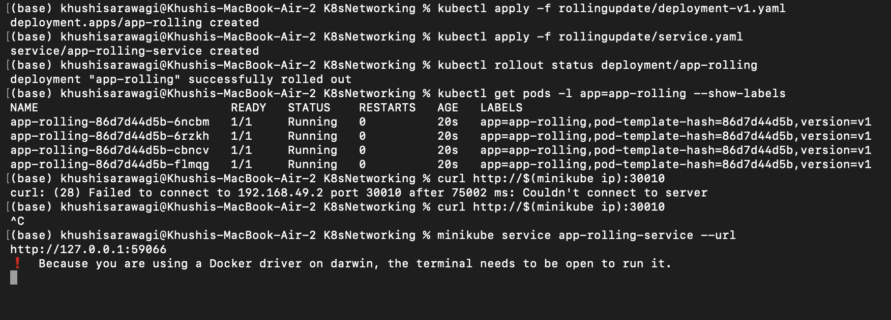

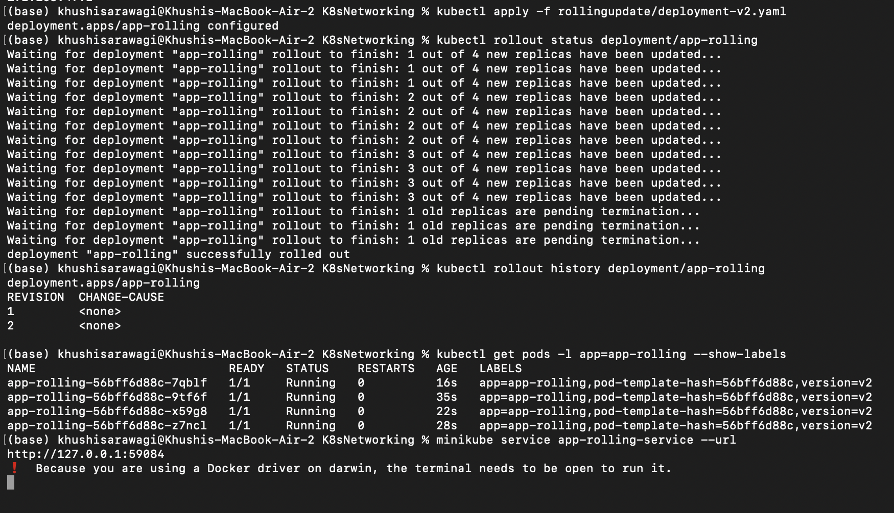

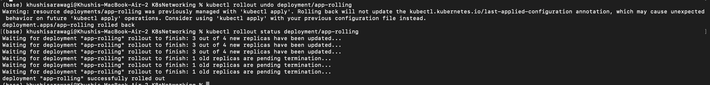

Browser results:

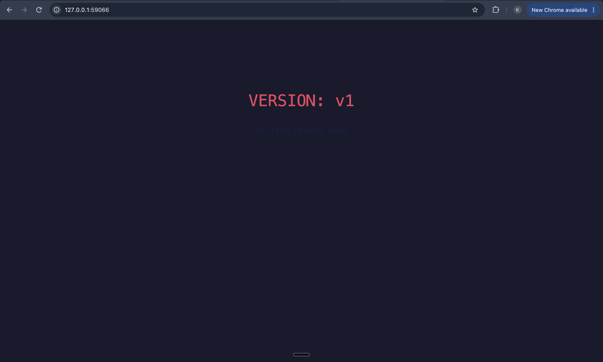

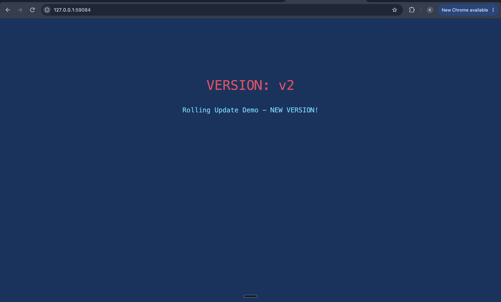

### Canary deployment

A canary sends a small portion of traffic to a new version while most traffic remains on the stable version. This folder uses two Deployments with a shared `app: myapp-canary` label. Nine stable Pods and one canary Pod produce an approximate 90/10 split.

Why use it: expose a small number of users to a change, monitor errors and latency, and roll back with limited impact.

Deploy and test the canary:

```bash
kubectl apply -f canary/deployment-stable.yaml
kubectl apply -f canary/service.yaml
kubectl rollout status deployment/app-stable

kubectl apply -f canary/deployment-canary.yaml
kubectl rollout status deployment/app-canary
kubectl get pods -l app=myapp-canary --show-labels
kubectl get endpoints myapp-canary-service
```

Test the approximate traffic split through the NodePort:

```bash
for i in $(seq 1 20); do curl -s http://$(minikube ip):30030 | grep -o 'STABLE v1\|CANARY v2'; done
```

Promote or roll back:

```bash
# Promote the canary to 100 percent
kubectl scale deployment app-canary --replicas=9
kubectl scale deployment app-stable --replicas=0

# Or roll back to stable
kubectl scale deployment app-canary --replicas=0
kubectl scale deployment app-stable --replicas=9
```

Kubernetes Service load balancing does not provide an exact percentage. Use Argo Rollouts, Flagger, or an ingress controller when precise weighted traffic is required.

Canary verification:

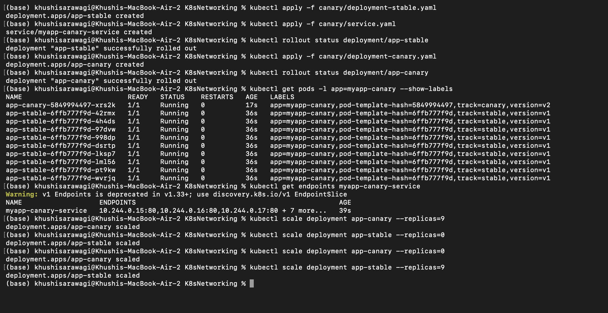

### Blue-green deployment

Blue-green keeps two complete versions running. Blue is the current version and Green is the tested version. Changing the Service selector switches all traffic from one version to the other.

Why use it: provide fast cutover and rollback, avoid mixed-version traffic, and test the new version before making it live. The trade-off is approximately twice the compute cost while both environments run.

Deploy both versions and route traffic to Blue:

```bash
kubectl apply -f bluegreen/deployment-blue.yaml
kubectl apply -f bluegreen/deployment-green.yaml
kubectl rollout status deployment/app-blue
kubectl rollout status deployment/app-green
kubectl apply -f bluegreen/service-blue.yaml
kubectl get endpoints myapp-service
curl http://$(minikube ip):30020
```

Switch to Green and verify the response:

```bash
kubectl apply -f bluegreen/service-green.yaml
kubectl describe service myapp-service | grep Selector
kubectl get endpoints myapp-service
curl http://$(minikube ip):30020
```

Roll back by applying `bluegreen/service-blue.yaml` again:

```bash
kubectl apply -f bluegreen/service-blue.yaml
curl http://$(minikube ip):30020
```

Blue-green verification:

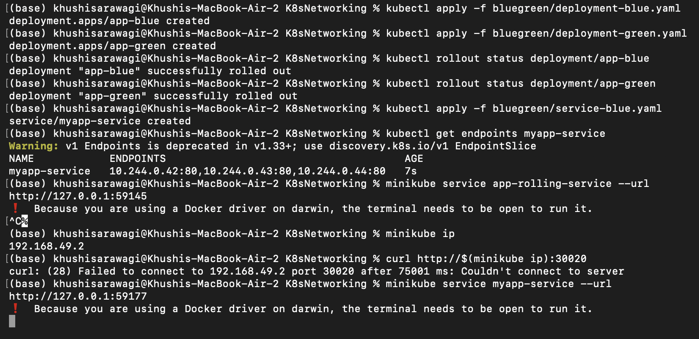

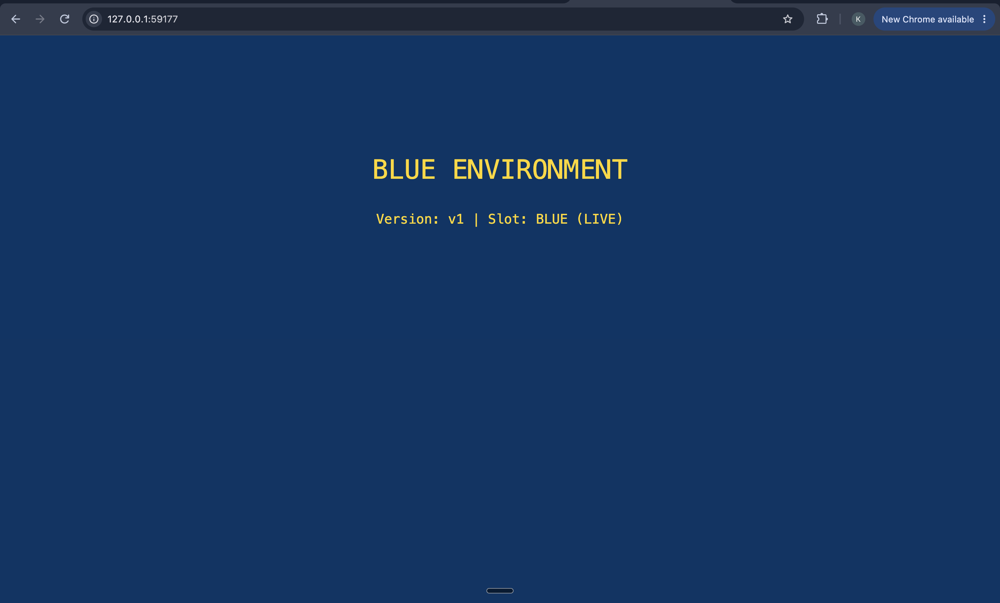

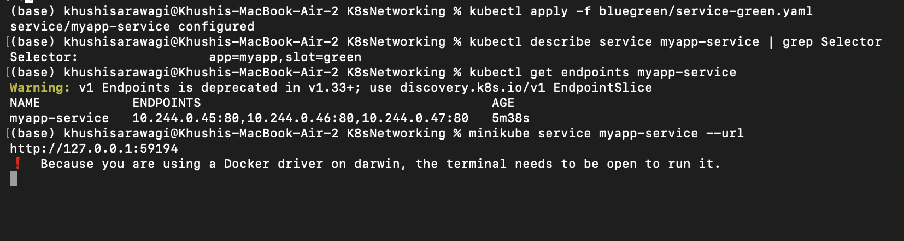

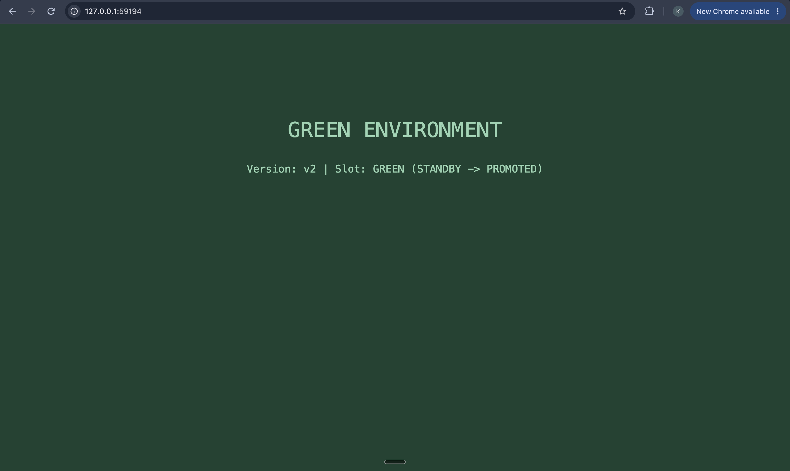

## 4. Kubernetes Services

A Service gives a changing group of Pods a stable network endpoint. Its selector finds matching Pods, and its endpoints are updated when Pods become ready, are deleted, or are replaced.

### ClusterIP

ClusterIP is the default Service type. It provides an internal virtual IP and DNS name that can be reached from inside the cluster, but not directly from the public internet. It is used for service-to-service communication, internal APIs, databases, and backends behind an Ingress.

Manifest files:

- `clusterip/app-deployment.yaml`
- `clusterip/service.yaml`
- `clusterip/client-pod.yaml`

Run it:

```bash
kubectl apply -f clusterip/app-deployment.yaml
kubectl apply -f clusterip/service.yaml
kubectl apply -f clusterip/client-pod.yaml
kubectl rollout status deployment/web-app-clusterip
kubectl get service web-service-clusterip
kubectl get endpoints web-service-clusterip
kubectl exec curl-client -- curl -s http://web-service-clusterip:8080
kubectl exec curl-client -- curl -s http://web-service-clusterip.networking-demo.svc.cluster.local:8080
```

The last command uses the Service FQDN. To view the internal Service from a local browser, forward it to your computer:

```bash
kubectl port-forward service/web-service-clusterip 8080:8080
```

Open `http://localhost:8080` to view the NGINX page.

Terminal verification:

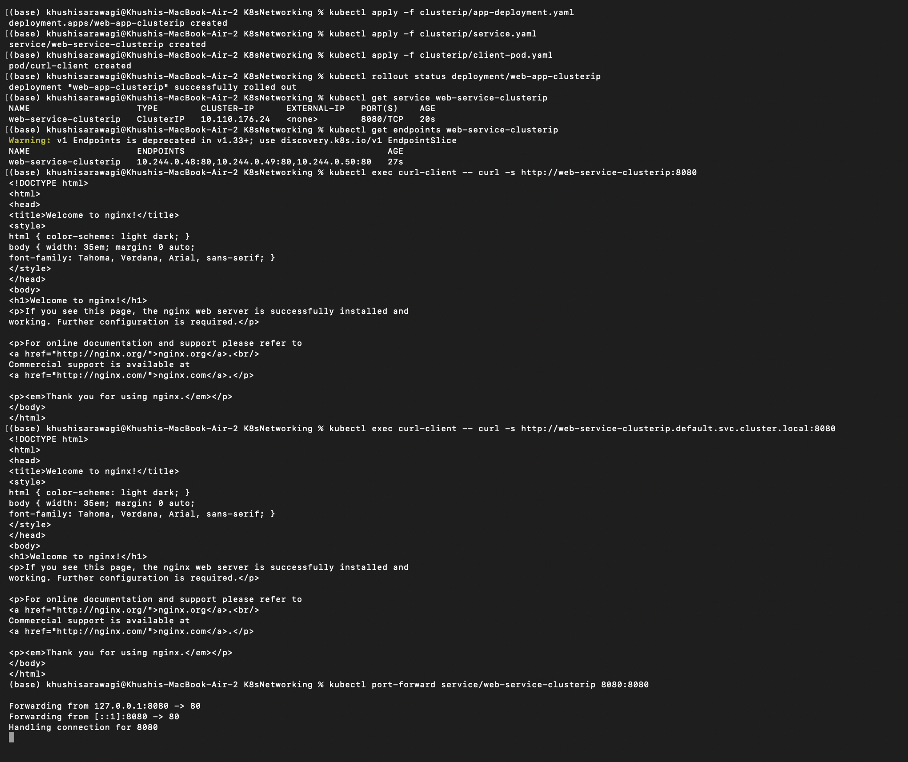

Browser result:

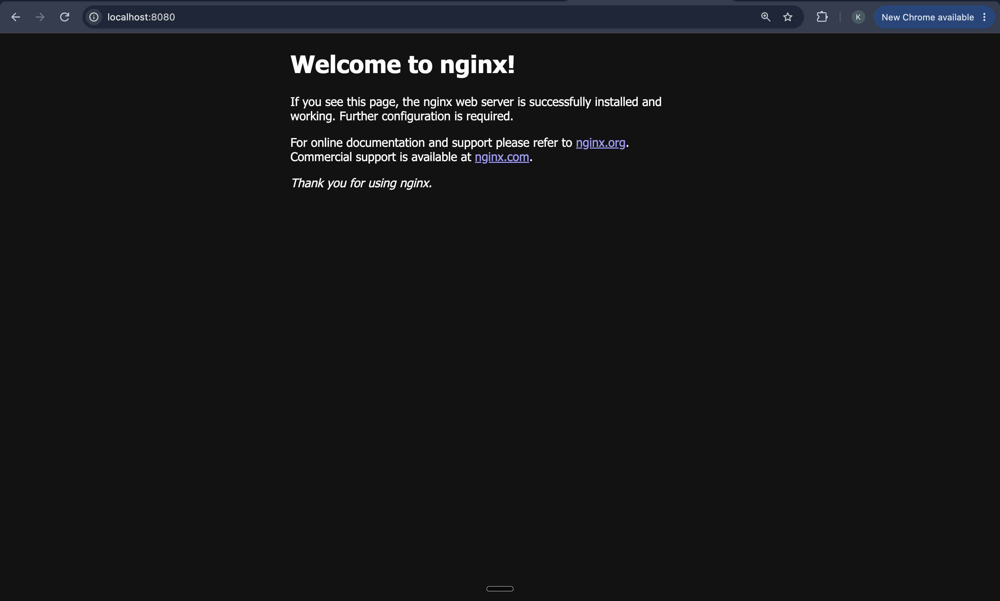

### NodePort

NodePort exposes a Service on a static port on each node, normally from `30000` to `32767`. This is useful for local clusters, development, and exposing an ingress controller. It is less convenient than a cloud LoadBalancer for production because users must know a node address and high port.

Run it:

```bash
kubectl apply -f nodeport/app-deployment.yaml
kubectl apply -f nodeport/service.yaml
kubectl rollout status deployment/web-app-nodeport
kubectl get service web-service-nodeport
kubectl get endpoints web-service-nodeport
```

The manifest uses NodePort `30080`:

```bash
curl http://$(minikube ip):30080
```

Open the same URL in a browser to view the NGINX page. With Docker Desktop, try `http://localhost:30080`.

Terminal verification:

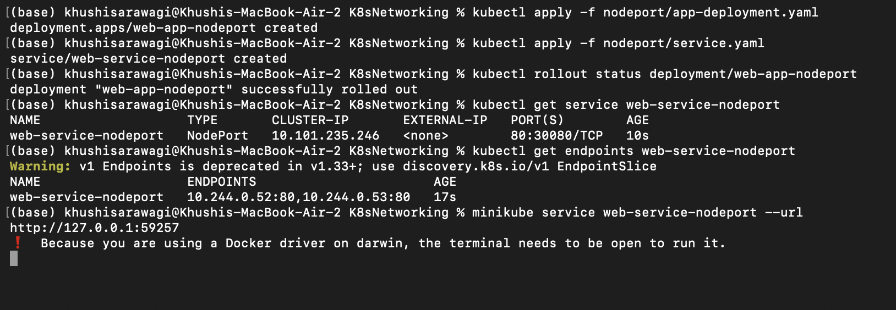

Browser result:

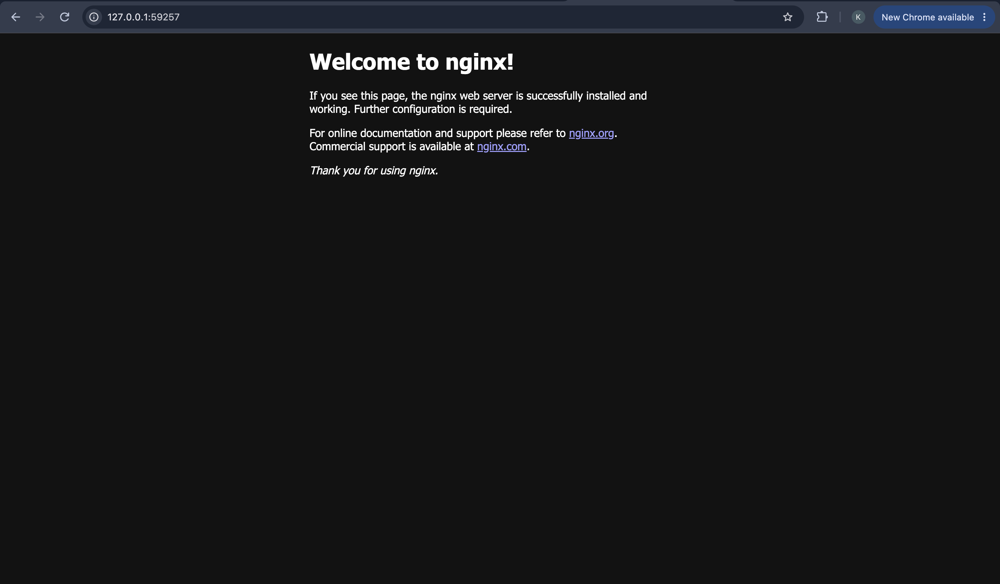

### LoadBalancer

LoadBalancer asks the cloud provider to create an external load balancer. It is commonly used for public HTTP services, APIs, and ingress-controller entry points. A managed cloud cluster should populate `EXTERNAL-IP`; a local cluster may show `<pending>`.

Run it:

```bash
kubectl apply -f loadbalancer/app-deployment.yaml
kubectl apply -f loadbalancer/service.yaml
kubectl rollout status deployment/web-app-loadbalancer
kubectl get service web-service-loadbalancer -w
```

When an external address is available:

```bash
curl http://<external-ip-or-hostname>
```

Open `http://<external-ip-or-hostname>` in a browser when an external address is available. For Minikube, use `minikube tunnel` in another terminal first. Do not expose a cloud LoadBalancer unnecessarily because it may create charges.

The captured local-cluster result shows the Service waiting for a cloud address and the tunnel being started:

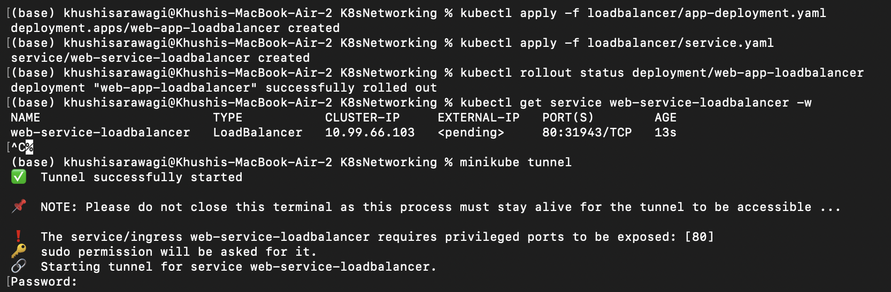

Browser result:

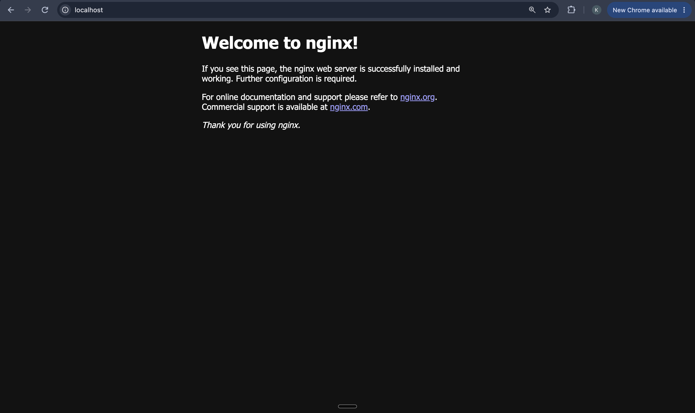

### ExternalName

ExternalName creates a DNS CNAME alias inside the cluster. It has no selector, no Pods, and no ClusterIP. This folder maps `external-database-service` to `nencyravaliya.me`.

Run and test it:

```bash
kubectl apply -f externalname/service.yaml
kubectl apply -f externalname/client-pod.yaml
kubectl get service external-database-service
kubectl exec dns-test-client -- nslookup external-database-service
kubectl exec dns-test-client -- curl -I http://external-database-service
```

ExternalName is useful for giving applications a stable internal name for an external database, API, or legacy service. It only changes DNS; it does not proxy traffic or remap ports. HTTPS can require the external hostname for TLS certificate and SNI validation. This example is DNS-only, so it does not have a Kubernetes browser page.

DNS verification:

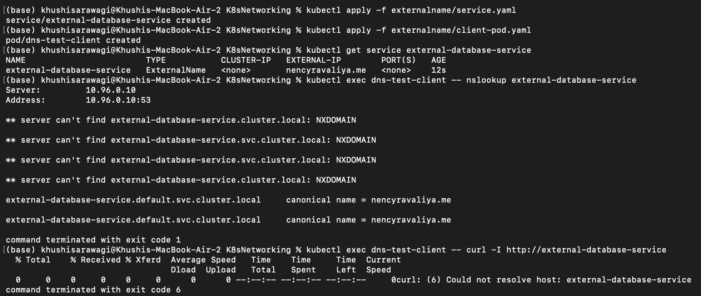

### Headless Service

A headless Service sets `clusterIP: None`. It does not provide a virtual IP or kube-proxy load balancing. CoreDNS returns the IP addresses of matching Pods, and when paired with a StatefulSet it can provide stable per-Pod DNS names.

Run it:

```bash
kubectl apply -f headless/service.yaml
kubectl apply -f headless/app-statefulset.yaml
kubectl apply -f headless/client-pod.yaml
kubectl rollout status statefulset/web-stateful
kubectl get service web-service-headless
kubectl get pods -l app=web-headless -o wide
kubectl exec headless-dns-client -- nslookup web-service-headless
kubectl exec headless-dns-client -- nslookup web-stateful-0.web-service-headless
```

A per-Pod DNS name has this structure:

```text
<pod-name>.<service-name>.<namespace>.svc.cluster.local
```

For a browser screenshot, forward one StatefulSet Pod:

```bash
kubectl port-forward pod/web-stateful-0 8083:80
```

Open `http://localhost:8083` to view one StatefulSet Pod directly. The DNS lookup is the important evidence because direct Pod discovery is the main purpose of this Service.

Terminal verification:

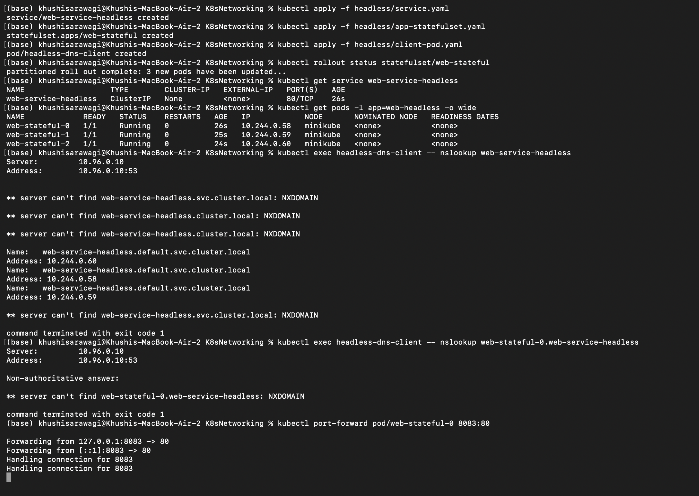

Browser result:

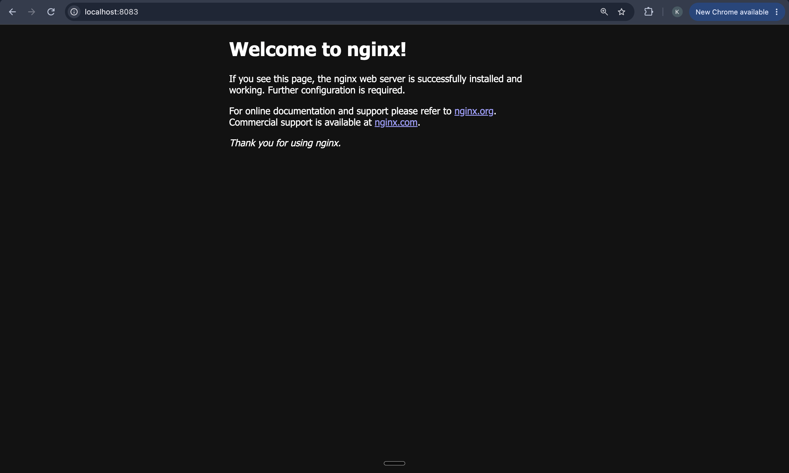

## 5. FQDN and CoreDNS

### What is an FQDN?

FQDN means **Fully Qualified Domain Name**. It identifies a host from the DNS root through every domain component and normally ends with a trailing dot in DNS notation. For a Kubernetes Service, the standard FQDN is:

```text
<service-name>.<namespace>.svc.cluster.local
```

For example, the ClusterIP Service in this folder can be reached from the `networking-demo` namespace using:

```text
web-service-clusterip.networking-demo.svc.cluster.local
```

The full Kubernetes DNS pattern is:

```text
<name>.<namespace>.svc.<cluster-domain>
```

The default cluster domain is `cluster.local`, but administrators can configure a different domain. Short names work because Kubernetes adds search suffixes from `/etc/resolv.conf`, but FQDNs are explicit and useful across namespaces, scripts, logs, and troubleshooting.

### What is CoreDNS?

CoreDNS is the DNS server normally installed inside a Kubernetes cluster. It watches the Kubernetes API for Services and Pods, creates DNS records, and answers DNS requests from Pods. The `kubelet` configures each Pod to use the cluster DNS Service, commonly named `kube-dns` in the `kube-system` namespace.

CoreDNS is used for:

- Service-name discovery between microservices.
- Resolving a normal ClusterIP Service to one virtual IP.
- Resolving a headless Service to multiple Pod IP addresses.
- Resolving StatefulSet Pod names such as `web-stateful-0.web-service-headless...`.
- Returning an ExternalName CNAME for external DNS targets.
- Forwarding names outside the cluster to upstream DNS servers.

### DNS record behavior

| Kubernetes object | Typical DNS result |
| --- | --- |
| Normal Service | One Service IP, for example `web-service-clusterip.networking-demo.svc.cluster.local` |
| Headless Service | Multiple matching Pod IPs |
| StatefulSet Pod with headless Service | Stable Pod-specific record |
| ExternalName Service | CNAME to the configured external hostname |
| Pod hostname | Pod-related record depending on cluster DNS configuration |

Inspect CoreDNS and test resolution:

```bash
kubectl get service -n kube-system kube-dns
kubectl get pods -n kube-system -l k8s-app=kube-dns
kubectl logs -n kube-system -l k8s-app=kube-dns --tail=50
kubectl exec curl-client -- cat /etc/resolv.conf
kubectl exec curl-client -- nslookup web-service-clusterip
kubectl exec curl-client -- nslookup web-service-clusterip.networking-demo.svc.cluster.local
```

If DNS fails, check that CoreDNS Pods are Running, the `kube-dns` Service exists, the client Pod has the expected `/etc/resolv.conf`, and the target Service has endpoints:

```bash
kubectl get endpoints web-service-clusterip
kubectl describe pod -n kube-system -l k8s-app=kube-dns
kubectl get events --sort-by=.lastTimestamp
```

The Service DNS, ExternalName CNAME, and headless Pod-discovery results are shown in the networking examples above. Together they demonstrate the three common DNS behaviors: resolving a Service to one virtual IP, resolving an external alias to a CNAME, and resolving a headless Service to multiple Pod addresses.


## Cleanup

Delete examples individually when finished:

```bash
kubectl delete -f clusterip/client-pod.yaml -f clusterip/service.yaml -f clusterip/app-deployment.yaml
kubectl delete -f nodeport/service.yaml -f nodeport/app-deployment.yaml
kubectl delete -f loadbalancer/service.yaml -f loadbalancer/app-deployment.yaml
kubectl delete -f externalname/client-pod.yaml -f externalname/service.yaml
kubectl delete -f headless/client-pod.yaml -f headless/service.yaml -f headless/app-statefulset.yaml
kubectl delete -f rollingupdate/service.yaml -f rollingupdate/deployment-v1.yaml -f rollingupdate/deployment-v2.yaml
kubectl delete -f canary/service.yaml -f canary/deployment-canary.yaml -f canary/deployment-stable.yaml
kubectl delete -f bluegreen/service-blue.yaml -f bluegreen/deployment-blue.yaml -f bluegreen/deployment-green.yaml
kubectl delete namespace networking-demo
```
