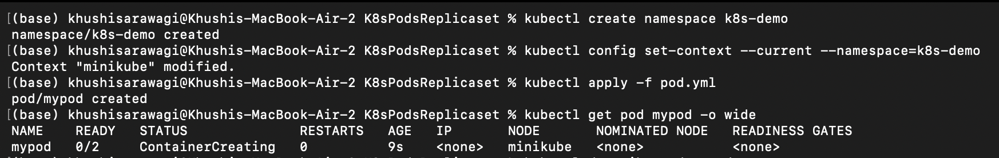
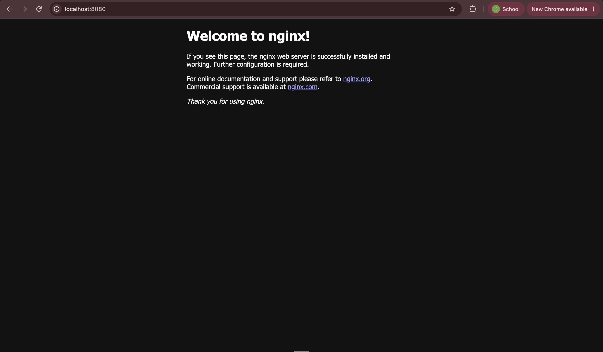
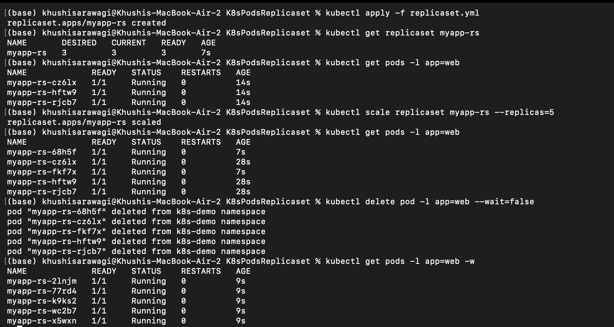
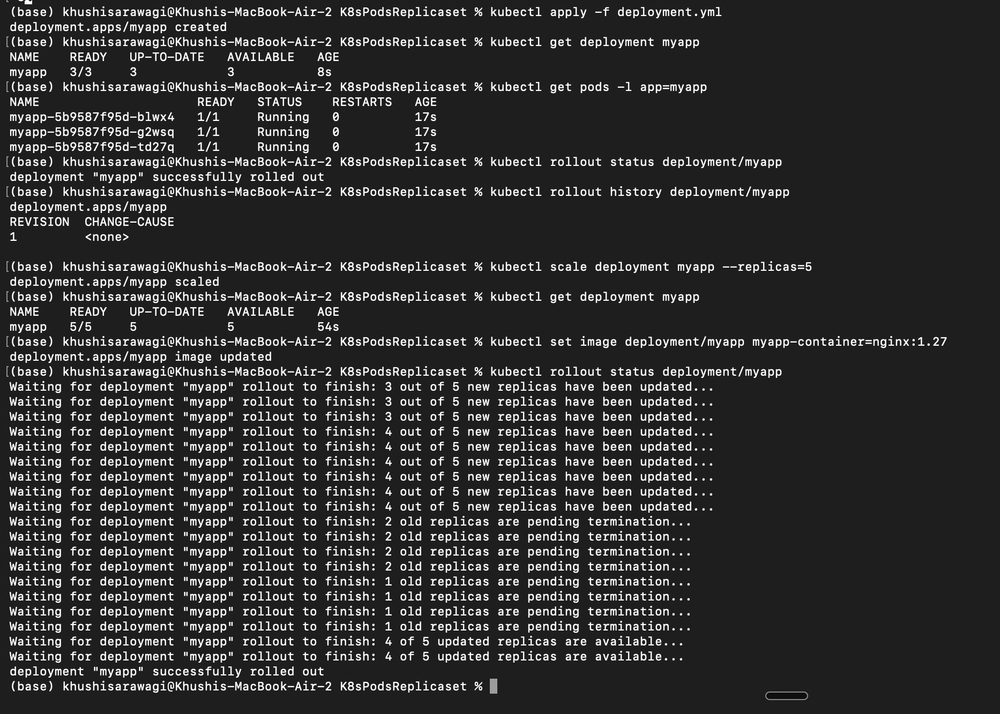
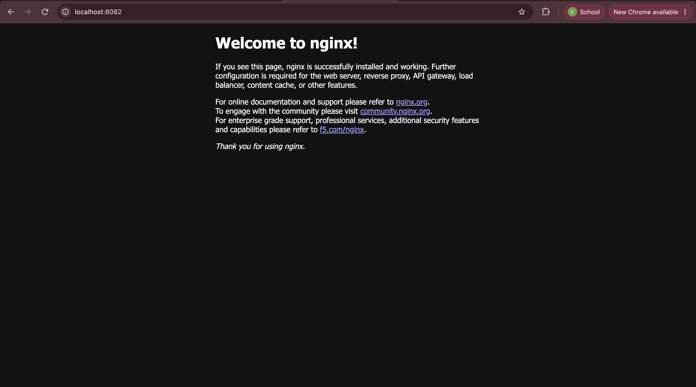
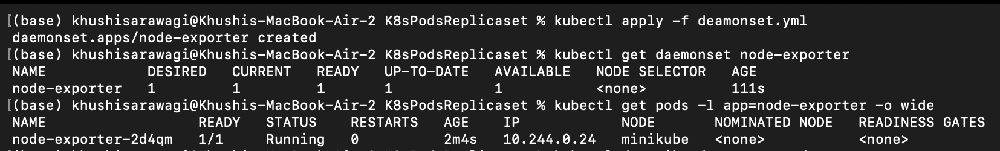

# Kubernetes Pods and Controllers

This folder demonstrates the main Kubernetes workload resources:

- `pod.yml` - a Pod containing an NGINX application container and a BusyBox logger container.
- `deployment.yml` - a Deployment that maintains three NGINX application Pods.
- `replicaset.yml` - a ReplicaSet that maintains three NGINX web Pods.
- `deamonset.yml` - a DaemonSet that runs node-exporter on every eligible node. The filename is spelled `deamonset.yml`, but the Kubernetes resource is correctly named `DaemonSet`.
- `statefulset.yml` - a StatefulSet that runs three MySQL Pods with stable identities and persistent volumes.

## Prerequisites

Install `kubectl` and connect it to a Kubernetes cluster. A local cluster such as Minikube, Docker Desktop Kubernetes, or Kind is suitable for practice.

Check the client and cluster connection:

```bash
kubectl version --client
kubectl cluster-info
kubectl get nodes
```

For a homework submission, copy the command output into your notes or take a terminal screenshot after each major step. Pod names and IP addresses will be different on every cluster, so your output will not exactly match the examples below.

Use a namespace for this exercise so the resources are easy to find and remove:

```bash
kubectl create namespace k8s-demo
kubectl config set-context --current --namespace=k8s-demo
```

## Kubernetes resources

### Pod

A Pod is the smallest deployable unit in Kubernetes. It contains one or more containers that share the same network namespace, IP address, and attached volumes. Containers in the same Pod are intended to be tightly coupled.

The example Pod contains:

- `app`: an NGINX container.
- `logger`: a BusyBox container that prints `log` every five seconds.

Use a Pod when you need to demonstrate or run a simple tightly coupled workload. A Pod is not normally used directly for production applications because Kubernetes will not automatically recreate it after deletion or manage rolling updates for it. A Deployment, StatefulSet, or DaemonSet is usually a better choice.

Apply and inspect it:

```bash
kubectl apply -f pod.yml
kubectl get pod mypod -o wide
kubectl describe pod mypod
kubectl logs mypod -c app
kubectl logs mypod -c logger
```

Example output to capture:

```text
NAME    READY   STATUS    RESTARTS   AGE
mypod   2/2     Running   0          20s
```

Screenshot of the Pod commands:



This Pod does not expose a web Service. To view the NGINX container in a browser, forward its port and open [http://localhost:8080](http://localhost:8080):

```bash
kubectl port-forward pod/mypod 8080:80
```

Leave this command running while taking the browser screenshot. Stop it with `Ctrl+C` afterward. The browser screenshot should show the default NGINX welcome page.

Browser screenshot from `http://localhost:8080`:



The Pod has two containers, so specify `-c` when viewing a particular container's logs.

### ReplicaSet

A ReplicaSet keeps a specified number of identical Pod replicas running. The `replicaset.yml` file requests three Pods with the label `app: web` and uses that label in its selector.

Use a ReplicaSet when you need basic replica self-healing and scaling. In most applications, create it indirectly through a Deployment instead. A Deployment adds declarative updates, rolling updates, rollback support, and revision history.

Apply and inspect it:

```bash
kubectl apply -f replicaset.yml
kubectl get replicaset myapp-rs
kubectl get pods -l app=web
kubectl scale replicaset myapp-rs --replicas=5
kubectl get pods -l app=web
```

Example output to capture:

```text
NAME             READY   STATUS    RESTARTS   AGE
myapp-rs-abc12   1/1     Running   0          15s
myapp-rs-def34   1/1     Running   0          15s
myapp-rs-ghi56   1/1     Running   0          15s
```

Screenshot of the ReplicaSet commands, scaling, and self-healing:



The ReplicaSet does not create a Service, so it is not reachable from a browser until you forward a Pod port:

```bash
kubectl port-forward pod/<one-web-pod-name> 8081:80
```

Open [http://localhost:8081](http://localhost:8081) and take a screenshot of the NGINX page. Replace `<one-web-pod-name>` with a name returned by `kubectl get pods -l app=web`.

ReplicaSet browser screenshot: capture the page at `http://localhost:8081` after running the port-forward command and add it here as `assets/nginx81.png`.

If one of the three Pods is deleted, the ReplicaSet creates a replacement:

```bash
kubectl delete pod -l app=web --wait=false
kubectl get pods -l app=web -w
```

### Deployment

A Deployment manages ReplicaSets and provides controlled application releases. The `deployment.yml` file declares three NGINX replicas and labels them `app: myapp`.

Use a Deployment for stateless applications such as web servers and APIs. It keeps the desired number of replicas available, supports rolling updates, and allows you to roll back a failed release.

Apply and inspect it:

```bash
kubectl apply -f deployment.yml
kubectl get deployment myapp
kubectl get pods -l app=myapp
kubectl rollout status deployment/myapp
kubectl rollout history deployment/myapp
```

Example output to capture:

```text
NAME    READY   UP-TO-DATE   AVAILABLE   AGE
myapp   3/3     3            3           30s
```

Screenshot of the Deployment commands and rollout:



Expose one Deployment Pod locally for a browser screenshot:

```bash
kubectl port-forward deployment/myapp 8082:80
```

Open [http://localhost:8082](http://localhost:8082) and capture the NGINX welcome page. The Deployment manifest creates Pods but does not create a permanent Service, so `port-forward` is used for this demonstration.

Browser screenshot from `http://localhost:8082`:



Scale the application:

```bash
kubectl scale deployment myapp --replicas=5
kubectl get deployment myapp
```

Update the container image and monitor the rollout:

```bash
kubectl set image deployment/myapp myapp-container=nginx:1.27
kubectl rollout status deployment/myapp
```

Roll back if the update is unsuccessful:

```bash
kubectl rollout undo deployment/myapp
```

### DaemonSet

A DaemonSet ensures that a copy of a Pod runs on every eligible node. The `deamonset.yml` example runs `prom/node-exporter`, which is commonly used to collect node-level metrics.

Use a DaemonSet for node-local agents that should run everywhere, such as monitoring agents, log collectors, security agents, or storage helpers. The number of Pods changes automatically when nodes join or leave the cluster.

Apply and inspect it:

```bash
kubectl apply -f deamonset.yml
kubectl get daemonset node-exporter
kubectl get pods -l app=node-exporter -o wide
kubectl describe daemonset node-exporter
```

Example output to capture:

```text
NAME           DESIRED   CURRENT   READY   UP-TO-DATE   AVAILABLE   NODE SELECTOR   AGE
node-exporter  1         1         1       1            1           <none>          30s
```

Screenshot of the DaemonSet commands and node placement:



Node-exporter exposes metrics rather than an HTML website. To inspect its metrics in a browser, forward port `9100` from one DaemonSet Pod:

```bash
kubectl port-forward pod/<node-exporter-pod-name> 9100:9100
```

Open [http://localhost:9100/metrics](http://localhost:9100/metrics) and take a screenshot showing the metrics text. Replace `<node-exporter-pod-name>` with a name returned by `kubectl get pods -l app=node-exporter`.

The DaemonSet may not run on control-plane nodes when those nodes have a taint. This is expected unless the manifest includes a matching toleration.

### StatefulSet

A StatefulSet manages applications that need stable identity, ordered deployment or termination, and persistent storage. The `statefulset.yml` example requests three MySQL Pods. Each Pod receives a stable ordinal name such as `mysql-0`, `mysql-1`, or `mysql-2`, and each replica receives its own PersistentVolumeClaim from `volumeClaimTemplates`.

Use a StatefulSet for stateful systems such as databases, queues, and clustered applications. Unlike a Deployment, its Pods are not interchangeable: their names, network identities, and volumes remain associated with their ordinal identity.

This example also expects:

- A headless Service named `mysql` because `serviceName: mysql` is configured.
- A StorageClass that can provision the requested 5 GiB volumes.
- A MySQL image and cluster resources that are suitable for the target architecture.

Create the required headless Service before applying the StatefulSet. A reusable Service definition is:

```yaml
apiVersion: v1
kind: Service
metadata:
  name: mysql
spec:
  clusterIP: None
  selector:
    app: mysql
  ports:
    - port: 3306
      targetPort: 3306
```

Save that definition as `mysql-service.yml` if you want to manage it as a file, then run:

```bash
kubectl apply -f mysql-service.yml
kubectl apply -f statefulset.yml
kubectl get statefulset mysql
kubectl get pods -l app=mysql -w
kubectl get pvc
kubectl describe statefulset mysql
```

Example output to capture:

```text
NAME    READY   AGE
mysql   3/3     1m

NAME                 STATUS   VOLUME   CAPACITY   ACCESS MODES   AGE
mysql-persistent-storage-mysql-0   Bound    ...      5Gi        RWO            1m
```

StatefulSet screenshot: add a screenshot of `kubectl get statefulset`, `kubectl get pods`, and `kubectl get pvc` here after running the commands. No StatefulSet image was available in this folder yet.

MySQL is a database and does not provide a browser website. Use `kubectl get pods`, `kubectl get pvc`, and `kubectl get service mysql` as the terminal evidence for this section. Do not take a browser screenshot for MySQL unless you separately install a database web client.

The password in this learning example is stored directly in the manifest. Do not use that approach in a real environment; use a Kubernetes Secret or an external secret manager instead. Also note that multiple independent MySQL containers do not automatically form a production-ready MySQL cluster.

## Recommended application order

The manifests are independent examples. Applying every file at once creates multiple unrelated NGINX workloads, plus node-exporter and MySQL. Apply only the example you want to study:

```bash
kubectl apply -f pod.yml
kubectl apply -f replicaset.yml
kubectl apply -f deployment.yml
kubectl apply -f deamonset.yml
kubectl apply -f statefulset.yml
```

List all resources in the namespace:

```bash
kubectl get all
kubectl get pvc
kubectl get events --sort-by=.lastTimestamp
```

## Evidence checklist for a submission

For each resource, capture the following evidence:

| Resource | Terminal evidence | Browser evidence |
| --- | --- | --- |
| Pod | `kubectl get pod`, `kubectl logs` | NGINX page at `http://localhost:8080` |
| ReplicaSet | `kubectl get replicaset`, `kubectl get pods -l app=web` | NGINX page at `http://localhost:8081` |
| Deployment | `kubectl get deployment`, `kubectl rollout status` | NGINX page at `http://localhost:8082` |
| DaemonSet | `kubectl get daemonset`, `kubectl get pods -o wide` | Metrics at `http://localhost:9100/metrics` |
| StatefulSet | `kubectl get statefulset`, `kubectl get pvc` | Not applicable; MySQL has no website |

When a port-forward command is running, use a second terminal for `kubectl` commands. Include the terminal output and the browser screenshot in the submission. Close each port-forward with `Ctrl+C` before starting the next one.

## Debugging commands

```bash
kubectl get pods -o wide
kubectl describe pod <pod-name>
kubectl logs <pod-name>
kubectl logs <pod-name> -c <container-name>
kubectl get events --sort-by=.lastTimestamp
kubectl explain deployment.spec
kubectl explain statefulset.spec.volumeClaimTemplates
```

Common Pod states:

- `Pending`: the scheduler cannot place the Pod, or a volume/image is not ready.
- `ImagePullBackOff`: Kubernetes cannot download the container image.
- `CrashLoopBackOff`: the container starts and repeatedly exits.
- `Running`: the containers have started, but check readiness and logs before considering the workload healthy.

## Cleanup

Delete individual examples:

```bash
kubectl delete -f pod.yml
kubectl delete -f replicaset.yml
kubectl delete -f deployment.yml
kubectl delete -f deamonset.yml
kubectl delete -f statefulset.yml
kubectl delete service mysql
```

StatefulSet PersistentVolumeClaims are often retained after the StatefulSet is deleted. Review them before removing storage:

```bash
kubectl get pvc
kubectl delete pvc -l app=mysql
```

To remove everything created in this exercise, delete the namespace. This also removes its namespaced resources and PVCs:

```bash
kubectl delete namespace k8s-demo
```

## Quick comparison

| Resource | Main purpose | Identity and storage | Typical use |
| --- | --- | --- | --- |
| Pod | Run one or more tightly coupled containers | Ephemeral | Learning, debugging, one-off workloads |
| ReplicaSet | Keep a number of identical Pods running | Interchangeable Pods | Basic replica management; usually managed by a Deployment |
| Deployment | Release and scale stateless workloads | Interchangeable Pods, rolling updates | Web servers and APIs |
| DaemonSet | Run one Pod on each eligible node | Tied to nodes | Monitoring and log agents |
| StatefulSet | Run workloads with stable identity and storage | Stable names and per-replica volumes | Databases and clustered applications |
