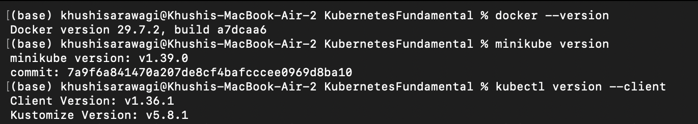
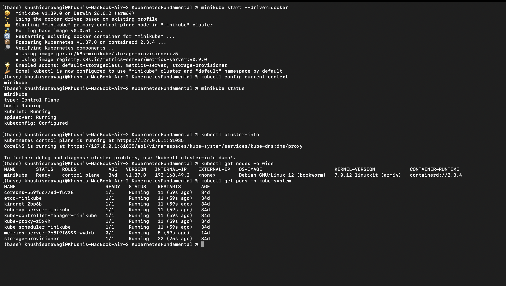
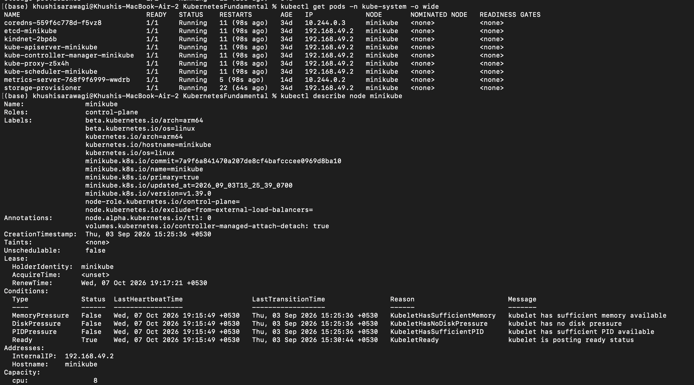
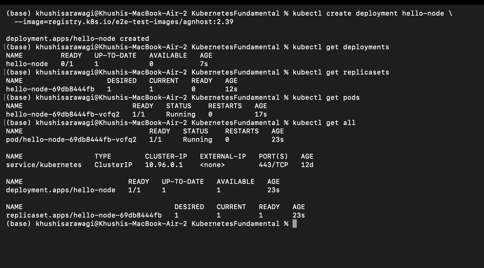
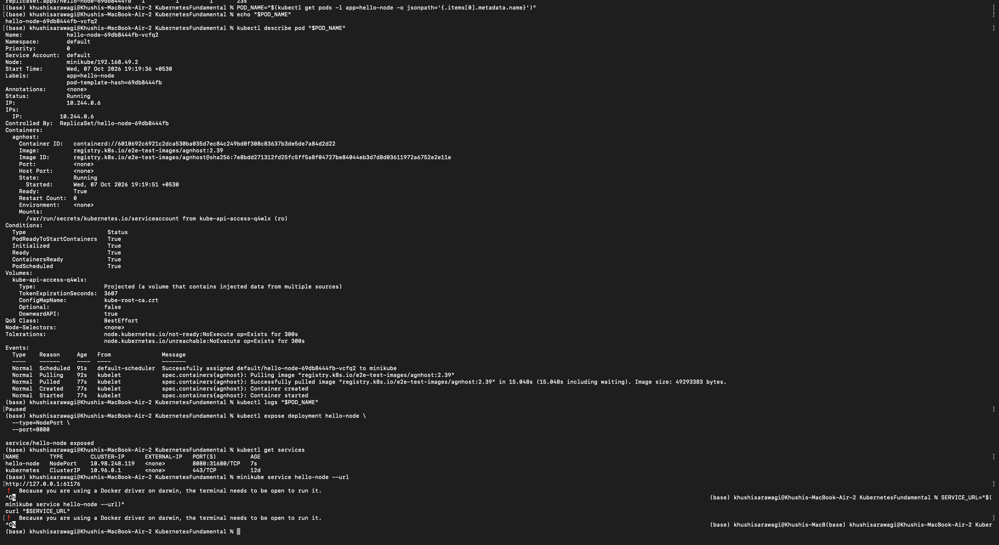
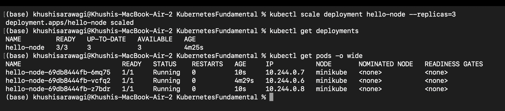
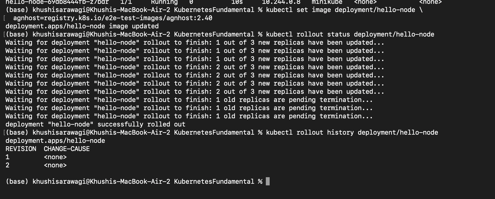

# Kubernetes Fundamentals

## 1. Install and configure Minikube

Install [Docker Desktop](https://docs.docker.com/desktop/setup/install/mac-install/),
[Minikube](https://minikube.sigs.k8s.io/docs/start/), and `kubectl`.

Verify the installations:

```bash
docker --version
minikube version
kubectl version --client
```

Start and configure the cluster:

```bash
minikube start --driver=docker
kubectl config current-context
```

The active context should be `minikube`.

### Screenshot



## 2. Verify Kubernetes cluster status

```bash
minikube status
kubectl cluster-info
kubectl get nodes -o wide
kubectl get pods -n kube-system
```

Expected results:

- Minikube `host`, `kubelet`, and `apiserver` are `Running`.
- The Minikube node has `STATUS` `Ready`.
- Kubernetes system Pods are `Running` or `Completed`.

### Screenshot



## 3. Kubernetes architecture notes

A Kubernetes cluster contains a **control plane** and **worker nodes**.
Minikube uses one local node for this exercise.

| Component | Function |
|---|---|
| `kube-apiserver` | Receives and validates requests from `kubectl` and other components. |
| `etcd` | Stores the cluster configuration and current state. |
| `kube-scheduler` | Selects a suitable node for Pods that need to run. |
| `kube-controller-manager` | Keeps the actual cluster state aligned with the desired state. |
| `kubelet` | Ensures that the assigned Pods are running on a node. |
| `kube-proxy` | Routes Service traffic to the correct Pods. |
| Container runtime | Pulls images and runs containers; Minikube uses `containerd`. |

Typical request flow:

1. `kubectl` sends a request to the API server.
2. The API server stores the desired state in `etcd`.
3. Controllers and the scheduler create and assign Pods.
4. The kubelet asks the container runtime to start the containers.
5. Services and `kube-proxy` provide network access to the Pods.

Inspect the architecture:

```bash
kubectl get pods -n kube-system -o wide
kubectl describe node minikube
```

### Screenshot



## 4. Basic Kubernetes objects and commands

| Object | Description |
|---|---|
| Pod | The smallest deployable unit; it runs one or more containers. |
| Deployment | Describes and updates the desired number of application Pods. |
| ReplicaSet | Maintains the requested number of Pod replicas. |
| Service | Provides a stable network endpoint for a group of Pods. |
| Namespace | Separates and organizes resources in a cluster. |
| ConfigMap | Stores non-sensitive configuration values. |
| Secret | Stores sensitive configuration values. |

Basic commands:

```bash
kubectl get all
kubectl get pods
kubectl describe pod <pod-name>
kubectl get deployments
kubectl get replicasets
kubectl get services
kubectl logs <pod-name>
kubectl exec -it <pod-name> -- sh
kubectl delete deployment <deployment-name>
kubectl delete service <service-name>
kubectl explain deployment
```

## 5. Kubernetes Basics tutorial hands-on

### Create and inspect a Deployment

```bash
kubectl create deployment hello-node \
  --image=registry.k8s.io/e2e-test-images/agnhost:2.39

kubectl get deployments
kubectl get replicasets
kubectl get pods
kubectl get all
```

### Screenshot



### Inspect the Pod

```bash
POD_NAME="$(kubectl get pods -l app=hello-node -o jsonpath='{.items[0].metadata.name}')"
echo "$POD_NAME"
kubectl describe pod "$POD_NAME"
kubectl logs "$POD_NAME"
```

### Expose the Deployment

```bash
kubectl expose deployment hello-node \
  --type=NodePort \
  --port=8080

kubectl get services
minikube service hello-node --url
```

Use the printed URL in a browser or with `curl`.

```bash
SERVICE_URL="$(minikube service hello-node --url)"
curl "$SERVICE_URL"
```

### Screenshot



### Scale the Deployment

```bash
kubectl scale deployment hello-node --replicas=3
kubectl get deployments
kubectl get pods -o wide
```

### Screenshot



### Update the Deployment

```bash
kubectl set image deployment/hello-node \
  agnhost=registry.k8s.io/e2e-test-images/agnhost:2.40
kubectl rollout status deployment/hello-node
kubectl rollout history deployment/hello-node
```

### Screenshot



### Clean up the tutorial resources

```bash
kubectl delete service hello-node
kubectl delete deployment hello-node
kubectl get all
minikube stop
```

## Commands used

The commands used for this task are documented in Sections 1–5. The
corresponding screenshots are stored in `KubernetesFundamental/assets/`.

## Push the work to GitHub

From the repository root:

```bash
git add KubernetesFundamental/README.md KubernetesFundamental/assets/
git commit -m "Document Kubernetes fundamentals"
git push origin <branch-name>
```

## References

- [Kubernetes Basics Tutorial](https://kubernetes.io/docs/tutorials/kubernetes-basics/)
- [Minikube Installation Guide](https://minikube.sigs.k8s.io/docs/start/)
- [Kubernetes Architecture](https://kubernetes.io/docs/concepts/architecture/)
- [Kubernetes GitHub Repository](https://github.com/Nency-kRavaliya/Kubernetes)
