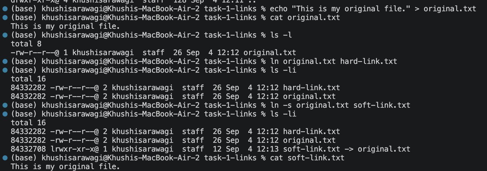
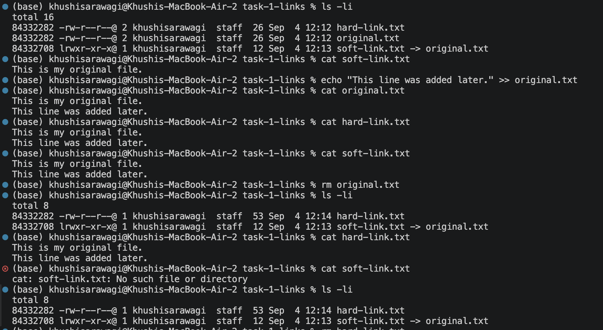
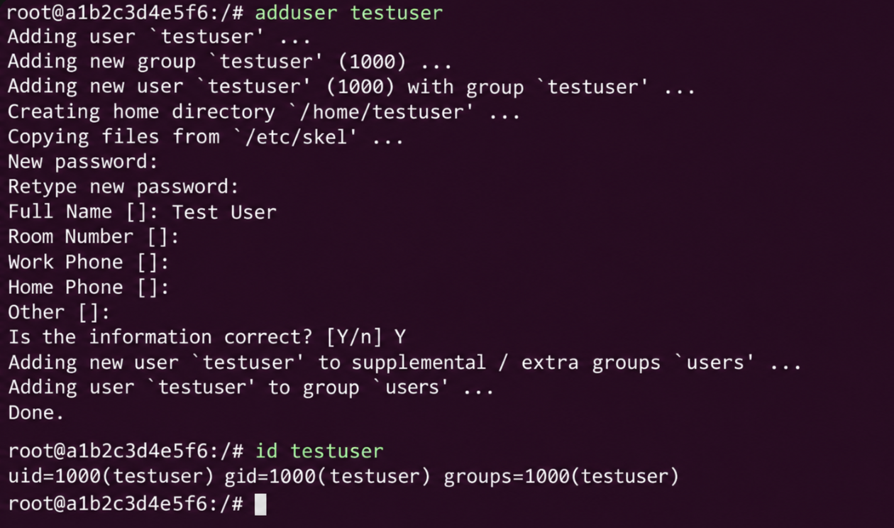
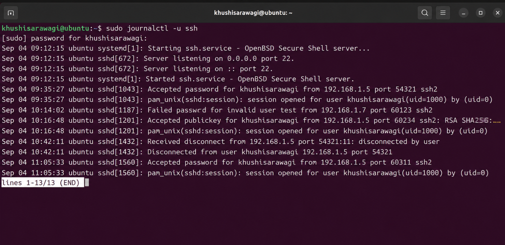
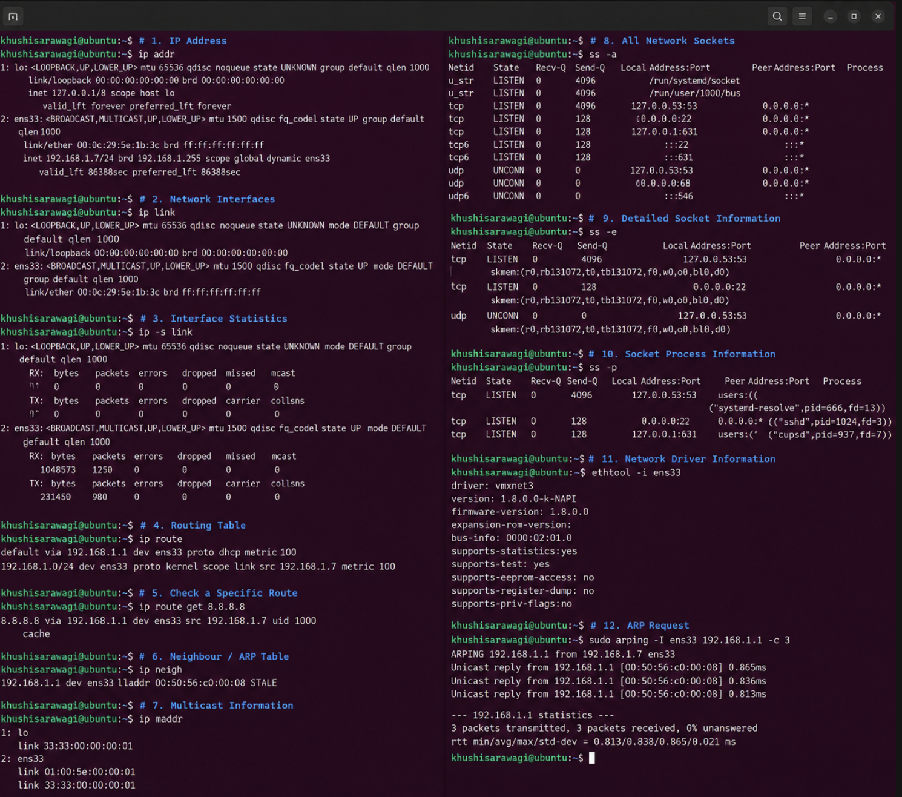

# Task 1: Soft Link & Hard Link

## Difference Between Soft Link and Hard Link

| Soft Link | Hard Link |
|---|---|
| Points to the pathname of another file | Points to the same inode as the original file |
| Has a different inode | Shares the same inode |
| Can cross filesystems | Cannot cross filesystems |
| Can point to directories | Generally cannot point to directories |
| Becomes broken when the target is deleted | Continues to work when the original filename is deleted |

---

# Soft Link

## What is a Soft Link?

A soft link, also called a symbolic link, is a separate file that points to the pathname of another file.

It works similar to a shortcut. When the original file exists, accessing the soft link takes us to the original file.

If the original file is deleted, the soft link becomes broken because the path it points to no longer exists.

## Command

```bash
ln -s original.txt soft-link.txt
```


---

# Hard Link

## What is a Hard Link?

A hard link is another filename that points directly to the same inode as the original file.

This means that both filenames refer to the same underlying file data.

Deleting one filename does not delete the data as long as another hard link to the same inode still exists.

## Command

```bash
ln original.txt hard-link.txt
```

## Screenshot





---
# Task 2: adduser vs useradd

## What is the Difference?

Both `adduser` and `useradd` are Linux commands used to create users, but they differ in how they work.

### adduser

`adduser` is a higher-level and more user-friendly command. It provides an interactive process for creating a user and guides the administrator through common account setup steps such as setting a password and entering user information.

### useradd

`useradd` is a lower-level command for creating a user account. It is less interactive and provides more direct control through command-line options. It is commonly useful for scripting and automation.

---

## Which Command is Preferred on Ubuntu/Linux and Why?

On Ubuntu, **`adduser` is generally preferred when manually creating a user**.

It is preferred because it provides an interactive and user-friendly process and handles common user account setup tasks automatically.

`useradd` is useful when more control is needed or when user creation needs to be automated through scripts.

---

## Create a Test User Using the Recommended Command

We used the recommended `adduser` command to create a test user:

```bash
sudo adduser testuser
```
The command asked us to:
- Enter a password
- Confirm the password
- Enter optional user information
- Confirm the information
After completing these steps, the test user was created successfully.

## Screenshot



---

# Task 3: journalctl

## What is it?

`journalctl` is a Linux command used to view and inspect logs collected by the systemd journal.

It can be used to view system logs, service logs, errors, warnings, and other events recorded by the system.

---

## View System Logs

### Command

```bash
journalctl
```

This displays the system logs collected by the journal.


## View Service Logs

### Command

```bash
journalctl -u service-name
```

The `-u` option is used to view logs for a specific systemd service.

For example:

```bash
journalctl -u ssh
```
## Screenshot



---
# Task 4: Linux Command Cheat Sheet

## Important Linux Commands

### 1. IP Address

```bash
ip addr
```

Show IP addresses and address information.

### 2. Network Interfaces

```bash
ip link
```

Show information and status of all network interfaces.

### 3. Interface Statistics

```bash
ip -s link
```

Display network interface statistics.

### 4. Routing Table

```bash
ip route
```

Display the routing table of the system.

### 5. Check a Specific Route

```bash
ip route get 192.168.1.5
```

Show the route that will be used to reach a specific IP address.

### 6. Neighbour / ARP Table

```bash
ip neigh
```

Display neighbour entries and the ARP table.

### 7. Multicast Information

```bash
ip maddr
```

Display multicast address information for network devices.

### 8. All Network Sockets

```bash
ss -a
```

Show all network sockets, including listening and non-listening sockets.

### 9. Detailed Socket Information

```bash
ss -e
```

Show detailed information about network sockets.

### 10. Socket Process Information

```bash
ss -p
```

Show the processes using network sockets.

### 11. Network Driver Information

```bash
ethtool -i eth0
```

Display driver information for the network interface.

### 12. ARP Request

```bash
arping -I eth0 192.168.1.1
```

Send an ARP request to a neighbour through the specified network interface.

---

## Screenshot

