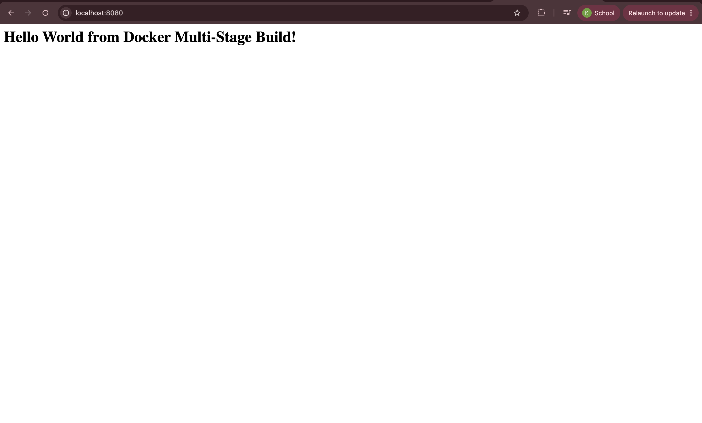
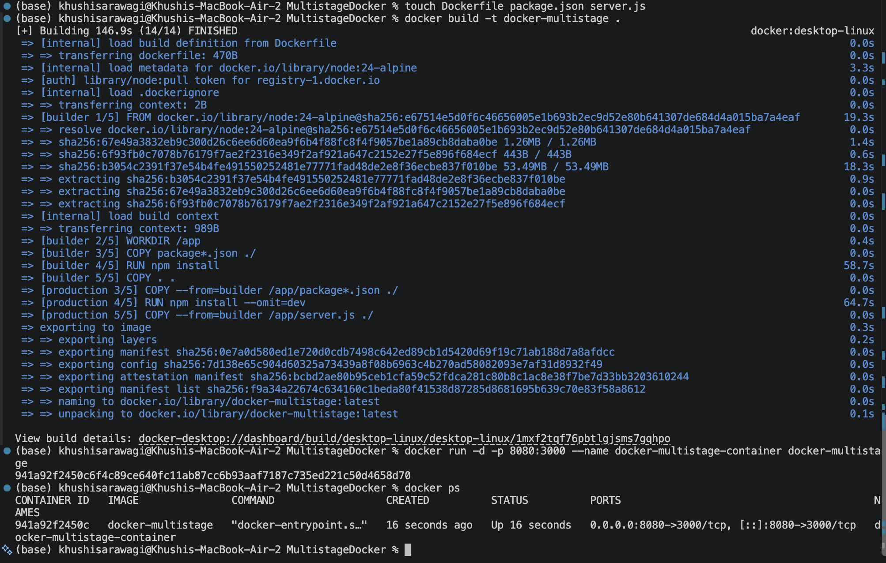

# Docker Multi-Stage Build Homework

## Task 1: Multi-Stage Docker Build

Created and ran a Node.js application using a multi-stage Dockerfile.

### Dockerfile

The Dockerfile uses two stages:

- **Build stage:** Installs dependencies and prepares the application.
- **Production stage:** Creates the final production image and runs the application.

### Build

```bash
docker build -t docker-multistage .
```

### Run

```bash
docker run -d -p 8080:3000 --name docker-multistage-container docker-multistage
```

### Verification

Application URL:

```text
http://localhost:8080
```

Expected output:

**Hello World from Docker Multi-Stage Build!**

### Docker Container

```bash
docker ps
```

The container was verified as running with host port `8080` mapped to container port `3000`.

---

## Task 2: Documentation

**Name:** Khushi Sarawagi

**Enrollment Number:** 24bcs10361

### Application Screenshot



### Docker PS Screenshot



---

## Task 3: Docker Application Deployment

Previously deployed three different application types using Docker:

- Node.js
- Python
- Java

### Node.js


### Python


### Java


### Logs (Docker ps)
