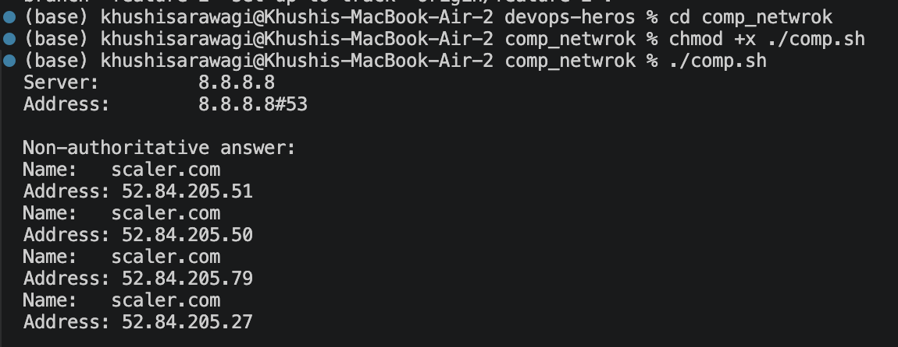
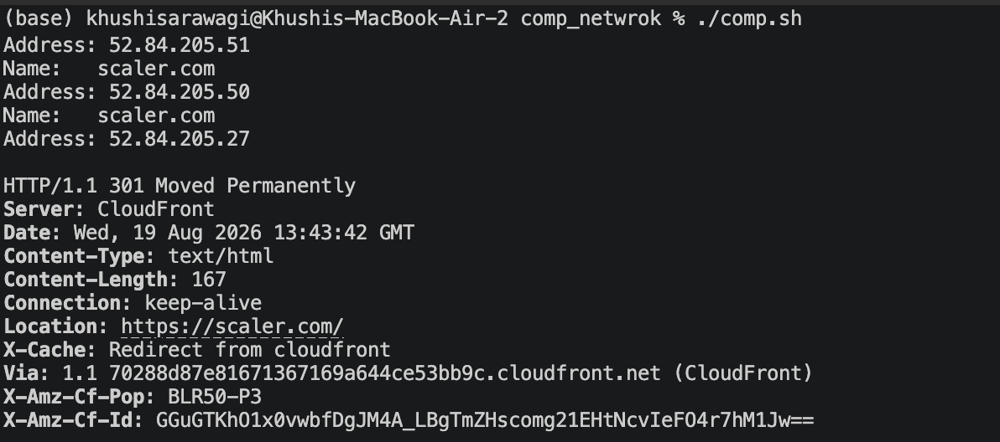
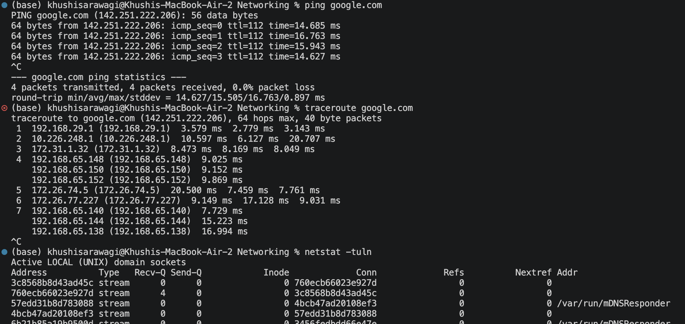
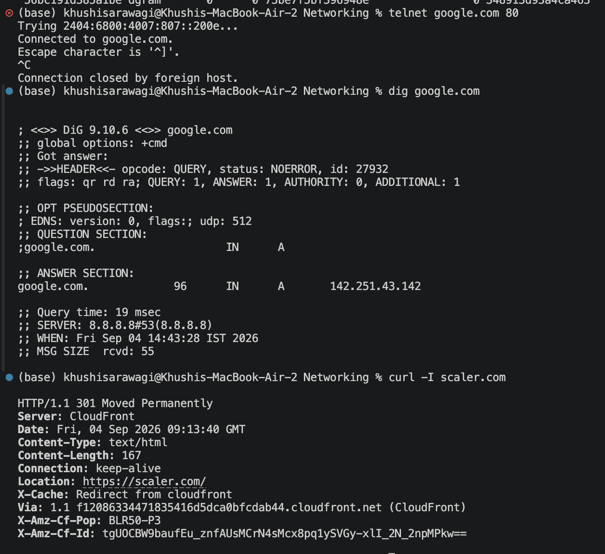

# Networking Homework

## Task 1





---
# Task 2

## Networking Commands

### 1. ping

```bash
ping google.com
```

Checks whether a host is reachable and measures network latency.

### 2. traceroute

```bash
traceroute google.com
```

Shows the route and network hops taken to reach a destination.

### 3. netstat

```bash
netstat -tuln
```

Shows network connections and listening ports on the system.

### 4. telnet

```bash
telnet google.com 80
```

Tests whether a connection can be established to a specific port.

### 5. tcpdump

```bash
sudo tcpdump -i eth0 host google.com
```

Captures and displays network packets for analysis.

### 6. nslookup

```bash
nslookup scaler.com
```

Queries DNS and shows the IP address associated with a domain.

### 7. dig

```bash
dig google.com
```

Provides detailed information about a DNS query and response.

### 8. curl

```bash
curl -I scaler.com
```

Tests HTTP connectivity and displays the response headers.

### 9. arp

```bash
arp -a
```

Displays the ARP table, which maps IP addresses to MAC addresses.

### 10. systemctl

```bash
systemctl status NetworkManager
```

Checks whether the network management service is running properly.

---

## IP Addressing

An IP address is a unique logical identifier used to identify a device or network interface.

### IPv4

IPv4 addresses are 32-bit addresses represented in four parts.

Example:

```text
192.168.1.10
```

The IPv4 range is:

```text
0.0.0.0 - 255.255.255.255
```

### IP Classes

```text
Class A: 1 - 127
Class B: 128 - 191
Class C: 192 - 223
Class D: 224 - 239
```

### Subnet Mask

A subnet mask separates the network portion from the host portion of an IP address.

Common default subnet masks:

```text
Class A: 255.0.0.0
Class B: 255.255.0.0
Class C: 255.255.255.0
```

### CIDR

CIDR notation represents the number of network bits.

Example:

```text
120.27.1.0/8
```

Here:

```text
Network bits = 8
Host bits = 24
```

For 24 host bits:

```text
Total hosts = 2^24
Usable hosts = 2^24 - 2
```

### Private IP Range

```text
10.0.0.0 - 10.255.255.255
```

---

## What I Understood

I learned how different networking commands can be used to troubleshoot connectivity, routing, DNS, ports, network packets, and local network information.

I also learned how IP addresses are divided into network and host portions using subnet masks and CIDR notation.

---

## Output / Screenshots

The networking commands were executed and their outputs were captured below.



