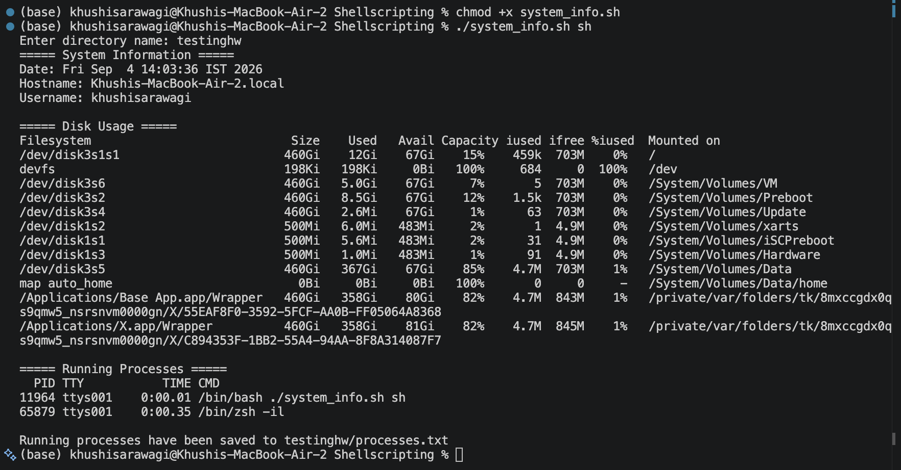

# Shell Scripting Homework Task

## System Information Script

### Commands Used

```bash
mkdir
touch
echo
df -h
ps
read -p
```

The script also uses **variables** to store system information and `>` output redirection to save running processes into a file.

### Script

```bash
#!/bin/bash

read -p "Enter directory name: " dir_name

mkdir "$dir_name"
touch "$dir_name/processes.txt"

current_date=$(date)
hostname=$(hostname)
username=$(whoami)
disk_usage=$(df -h)

echo "Date: $current_date"
echo "Hostname: $hostname"
echo "Username: $username"
echo "Disk Usage:"
echo "$disk_usage"

echo "Running Processes:"
ps

ps > "$dir_name/processes.txt"
```

### Output

The script takes the directory name as input, creates the directory and file, displays the system information and running processes, and stores the process information in `processes.txt`.

