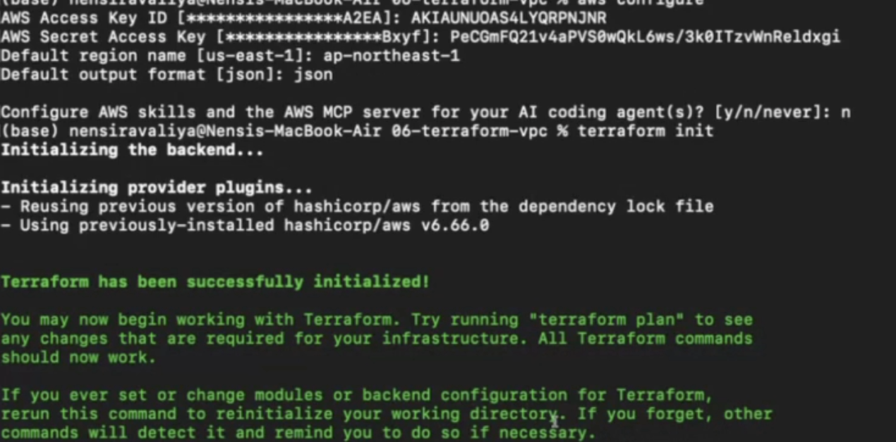
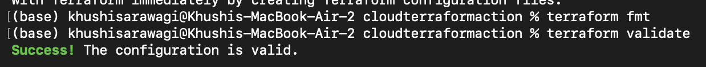
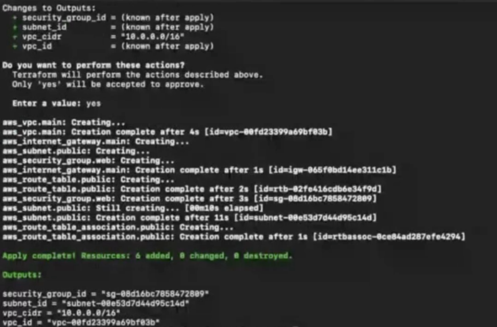

# Session 19: Cloud and Terraform in Action

This project demonstrates how Terraform can be used to define, provision,
inspect, and destroy AWS infrastructure. The architecture follows the
requested cloud infrastructure flow:

```text
Terraform
    |
    +-- VPC
    |     |
    |     +-- Public Subnet
    |     +-- Route Table
    |     +-- Internet Gateway
    |     +-- Security Group
    |     `-- EC2 instance
    |
    `-- S3 bucket
```

Terraform manages the infrastructure as code. Variables provide configurable
values, resources describe AWS objects, outputs expose useful IDs, resource
references create dependencies, and the Terraform state records the deployed
resources.

## Project contents

```text
cloudterraformaction/
|-- README.md
|-- miniproject/
|   |-- versions.tf
|   |-- variables.tf
|   |-- main.tf
|   |-- outputs.tf
|   `-- terraform.tfvars.example
|-- terraform-vpc/
|   |-- versions.tf
|   |-- variables.tf
|   |-- main.tf
|   |-- outputs.tf
|   `-- terraform.tfvars.example
|-- terraform-workflow/
|   |-- main.tf
|   `-- versions.tf
|-- cloud-service-models/
|-- regions-and-availability-zones/
|-- route-tables-and-internet-gateway/
|-- security-groups/
`-- vpc-and-subnets/
```

The `miniproject/` configuration is the Session 19 implementation. It
creates a VPC, public subnet, Internet Gateway, public route table, route
table association, and web security group. The `terraform-vpc/` folder
contains the corresponding VPC lab configuration. EC2 and S3 are included in
the target architecture and can be added as resources using the outputs and
network dependencies documented below.

## Prerequisites

Install:

- Terraform version `1.6.0` or later
- AWS CLI
- An AWS account
- AWS credentials with permission to manage the resources in this project

Configure and verify AWS credentials:

```bash
aws configure
aws sts get-caller-identity
```

Do not commit access keys, passwords, `terraform.tfvars`, or Terraform state
files containing sensitive values.

## AWS architecture

### VPC

The VPC provides an isolated AWS network. The `miniproject` configuration uses
the CIDR block `10.20.0.0/16`.

### Public subnet

The public subnet uses `10.20.1.0/24`, maps public IPv4 addresses on launch,
and is associated with the configured AWS Region's first Availability Zone.

### Internet Gateway and route table

The Internet Gateway connects the VPC to the internet. The public route table
contains a default route:

```text
0.0.0.0/0 -> Internet Gateway
```

The route table association connects the public subnet to that route table.

### Security group

The web security group allows inbound HTTP on port 80 and HTTPS on port 443,
and allows outbound IPv4 traffic. SSH is intentionally not opened to the
internet in the current network configuration.

### EC2 dependency

An EC2 instance in the public subnet must reference:

1. The VPC subnet ID.
2. The web security group ID.
3. An AMI and instance type.
4. A key pair if SSH access is required.

The subnet depends on the VPC, the Internet Gateway depends on the VPC, the
route table depends on the Internet Gateway, and the security group depends
on the VPC. Terraform infers these dependencies from resource references
such as `aws_vpc.main.id`.

### S3 dependency

An S3 bucket is a regional AWS resource and does not need to be placed inside
the VPC. It can be declared as a separate Terraform resource and exposed
through an output. Access should be controlled with IAM, bucket policies,
encryption, and S3 Block Public Access.

## Architecture diagram

```text
                              Internet
                                  |
                                  v
                      +----------------------+
                      |   Internet Gateway   |
                      +----------+-----------+
                                 |
                  +--------------v--------------+
                  |        VPC 10.20.0.0/16     |
                  |                             |
                  |  +-----------------------+  |
                  |  | Public Subnet         |  |
                  |  | 10.20.1.0/24          |  |
                  |  |                       |  |
                  |  |  +-----------------+  |  |
                  |  |  | EC2 instance    |  |  |
                  |  |  | Web SG: 80, 443 |  |  |
                  |  |  +-----------------+  |  |
                  |  +-----------------------+  |
                  |      ^                     |
                  |      |                     |
                  |  Public Route Table        |
                  +-----------------------------+

              Terraform-managed S3 bucket
              (separate regional AWS resource)
```

### Architecture diagram

## Terraform configuration

The Terraform files have separate responsibilities:

| File | Purpose |
|---|---|
| `versions.tf` | Defines the Terraform version and AWS provider version. |
| `variables.tf` | Defines configurable input variables such as the AWS Region. |
| `main.tf` | Defines the VPC, subnet, Internet Gateway, route table, association, and security group resources. |
| `outputs.tf` | Displays resource IDs and useful values after deployment. |
| `terraform.tfvars.example` | Example values for the input variables. |
| `terraform.tfstate` | Terraform's local record of managed resources; it should not be committed. |

## Complete Terraform workflow

Run the commands from the implementation directory:

```bash
cd miniproject
cp terraform.tfvars.example terraform.tfvars
```

Review `terraform.tfvars` and set the required AWS Region.

### 1. Initialize

```bash
terraform init
```

This downloads the AWS provider and initializes the working directory.

### 2. Format

```bash
terraform fmt
```

This formats the Terraform files consistently.

### 3. Validate

```bash
terraform validate
```

Expected result:

```text
Success! The configuration is valid.
```

### 4. Plan

```bash
terraform plan
```

The plan previews the AWS resources Terraform intends to create. It does not
change AWS infrastructure.

Expected resource shape:

```text
Plan: 6 to add, 0 to change, 0 to destroy.
```

### 5. Apply

```bash
terraform apply
```

Review the plan and enter `yes` when Terraform asks for confirmation.
Terraform then creates the VPC, subnet, Internet Gateway, route table, route
table association, and security group.

### 6. Inspect outputs

```bash
terraform output
```

Expected output values include:

```text
security_group_id = "sg-..."
subnet_id         = "subnet-..."
vpc_cidr          = "10.20.0.0/16"
vpc_id            = "vpc-..."
```

The IDs are different for every AWS account and deployment.

### 7. Inspect Terraform state

```bash
terraform state list
terraform show
```

The state should include resources similar to:

```text
aws_internet_gateway.main
aws_route_table.public
aws_route_table_association.public
aws_security_group.web
aws_subnet.public
aws_vpc.main
```

Terraform uses the state to compare the configuration with the real
infrastructure and to calculate future plans.

### 8. Verify AWS resources

```bash
aws ec2 describe-vpcs \
  --filters "Name=tag:Name,Values=session19-mini-vpc"

aws ec2 describe-subnets \
  --filters "Name=tag:Name,Values=session19-mini-public-subnet"

aws ec2 describe-route-tables \
  --filters "Name=tag:Name,Values=session19-mini-public-rt"

aws ec2 describe-security-groups \
  --filters "Name=group-name,Values=session19-mini-web-sg"
```

The AWS Console can also be used to verify the VPC, subnet, route table,
Internet Gateway, and security group.

### 9. Destroy

After completing the exercise, preview the cleanup:

```bash
terraform plan -destroy
```

Destroy the resources:

```bash
terraform destroy
```

Enter `yes` when prompted. Confirm that Terraform reports that the resources
were destroyed and that no billable test resources remain.

## Screenshots

The following screenshots are the safe evidence currently available in
`cloudterraformaction/assets/`.

### Screenshot 1: Terraform initialization, formatting, and validation

Commands to capture:

```bash
terraform init
terraform fmt
```



### Screenshot 2: Terraform plan

Commands to capture:

```bash
terraform plan
```



### Screenshot 3: Terraform apply

Command to capture:

```bash
terraform apply
```



## Cleanup and Git submission

Before pushing the project:

```bash
terraform destroy
git status
git add cloudterraformaction/
git commit -m "Document Session 19 cloud Terraform project"
git push origin <branch-name>
```

Ensure that credentials, `terraform.tfvars`, `.terraform/`, and state files
are excluded by `.gitignore` before committing.

## References

- [Terraform documentation](https://developer.hashicorp.com/terraform/docs)
- [AWS VPC documentation](https://docs.aws.amazon.com/vpc/latest/userguide/what-is-amazon-vpc.html)
- [AWS EC2 documentation](https://docs.aws.amazon.com/ec2/)
- [Amazon S3 documentation](https://docs.aws.amazon.com/s3/)
