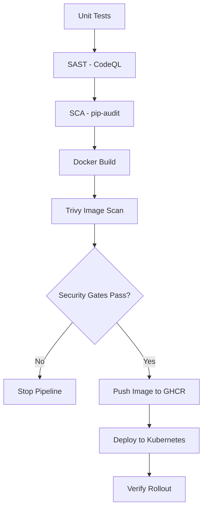
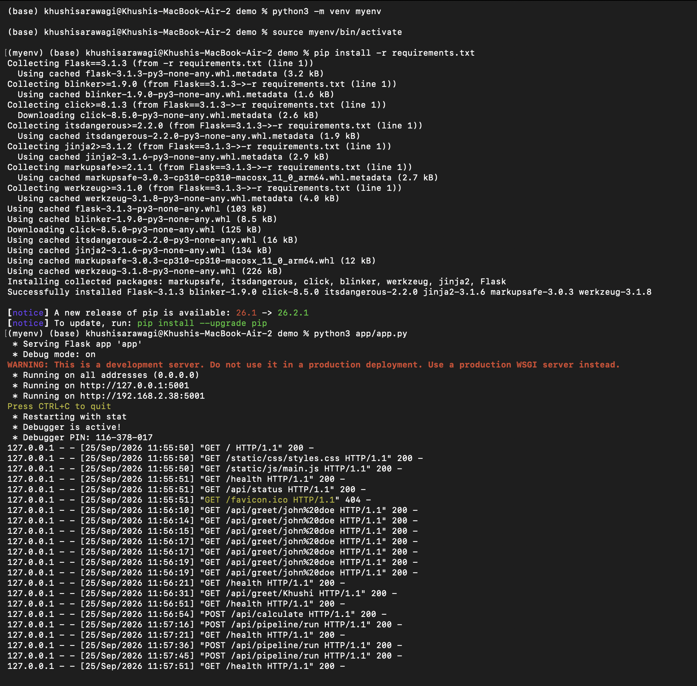
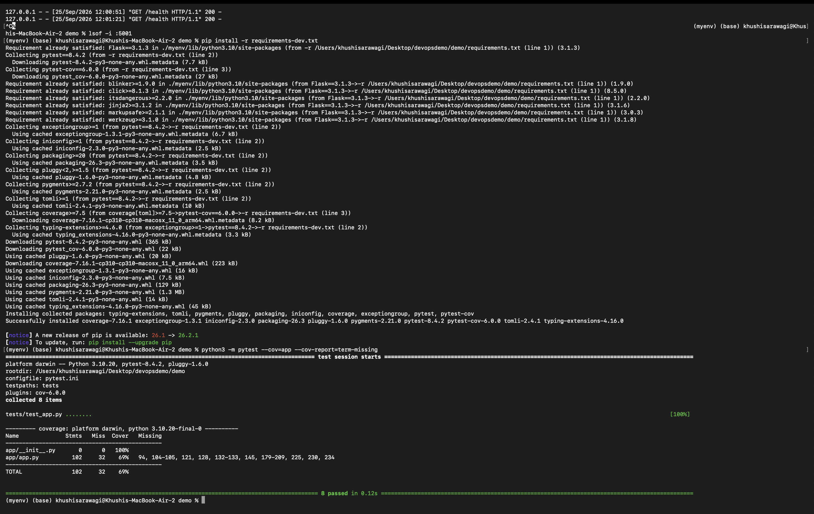
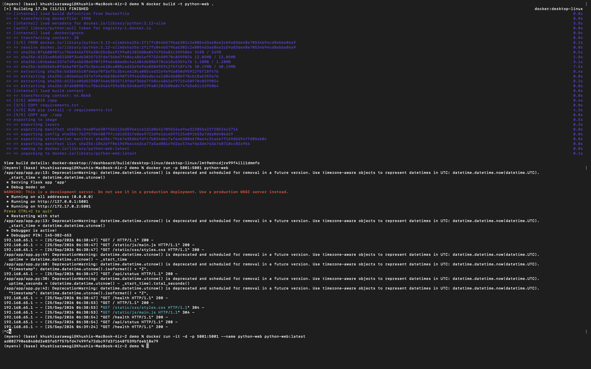
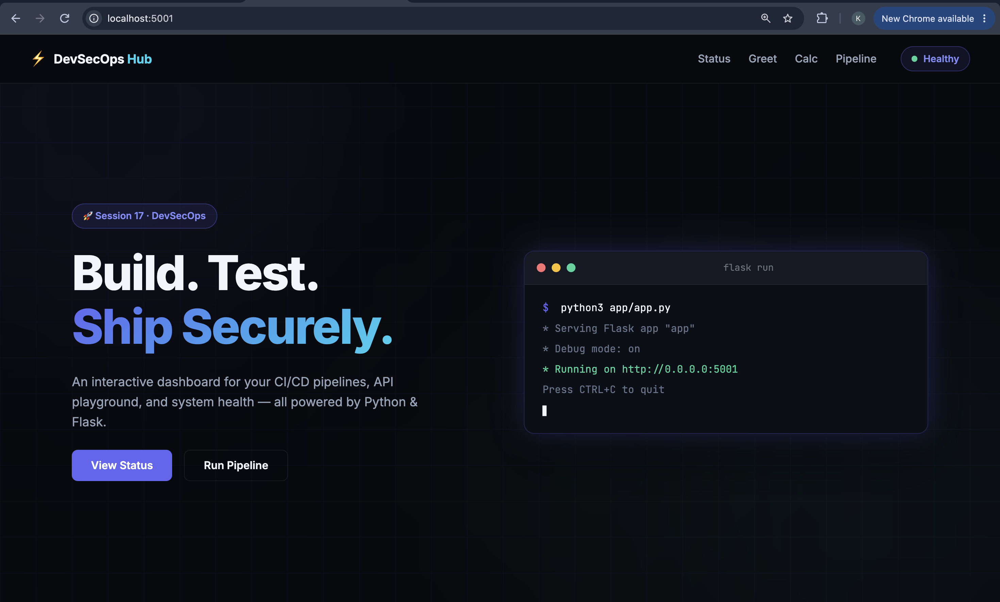
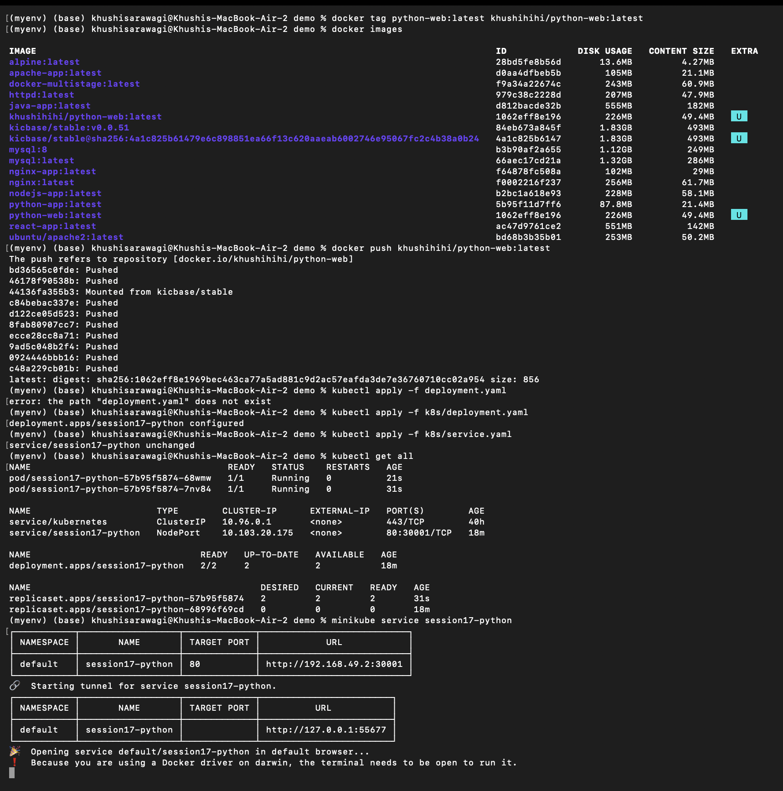
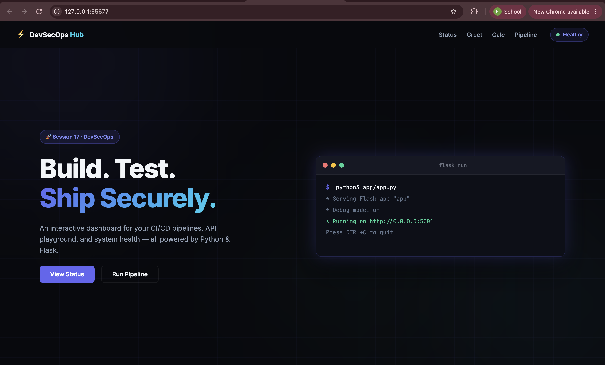
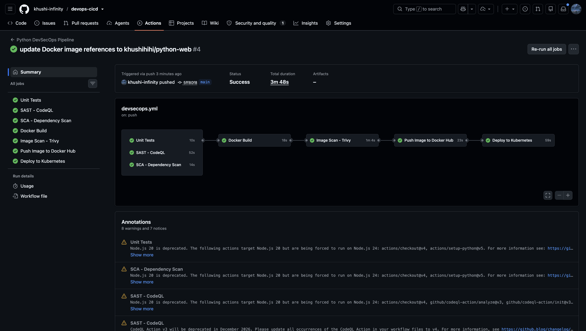
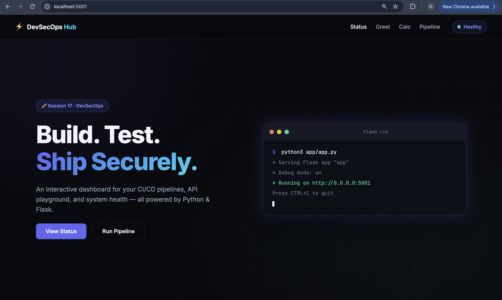

# DevSecOps Practice

This folder contains practical exercises for adding security checks throughout a CI/CD pipeline. The examples use a Python application, Docker, GitHub Actions, GitHub Container Registry (GHCR), Trivy, CodeQL, `pip-audit`, and Kubernetes.

The goal is to practice the complete flow:

```text
Code -> Test -> Scan -> Build -> Scan Image -> Push -> Deploy -> Verify
```

## What This Folder Covers

| Directory | Topic | Main tool or concept |
| --- | --- | --- |
| [`demo`](demo/) | Complete DevSecOps application | Flask, Docker, GitHub Actions, Kubernetes |
| [`sast`](sast/) | Static application security testing | GitHub CodeQL |
| [`sca`](sca/) | Software composition analysis | `pip-audit` |
| [`secret-scanning`](secret-scanning/) | Detecting exposed credentials | GitHub Secret Scanning |
| [`container-image-scanning`](container-image-scanning/) | Scanning built images | Trivy |
| [`container-registry`](container-registry/) | Publishing container images | GHCR |
| [`security-gates`](security-gates/) | Enforcing scan results | GitHub Actions `needs` and exit codes |
| [`kubernetes-deployment`](kubernetes-deployment/) | Deploying and verifying the image | Kubernetes and `kubectl` |

## Folder Structure

```text
devsecops/
├── README.md
├── assets/                         # Screenshots for this guide
├── demo/                           # Complete Flask DevSecOps application
├── sast/                           # CodeQL source-code scanning
├── sca/                            # Dependency vulnerability scanning
├── secret-scanning/                # Credential protection concepts
├── container-image-scanning/       # Trivy image scanning
├── container-registry/             # GHCR build and push
├── security-gates/                 # Pipeline quality and security gates
└── kubernetes-deployment/          # Kubernetes manifests and rollout checks
```

Each exercise is kept separate for practice. The existing structure does not need to be changed.

## Recommended Learning Order

1. Read [`sast/`](sast/) to understand source-code scanning.
2. Read [`sca/`](sca/) and run `pip-audit` against dependencies.
3. Read [`secret-scanning/`](secret-scanning/) and practice using fake credentials only.
4. Build and scan an image using [`container-image-scanning/`](container-image-scanning/).
5. Publish the image by following [`container-registry/`](container-registry/).
6. Apply the dependency rules from [`security-gates/`](security-gates/).
7. Deploy the published image using [`kubernetes-deployment/`](kubernetes-deployment/).
8. Use [`demo/`](demo/) as the end-to-end example.

## Demo Application

The [`demo`](demo/) project is a Flask dashboard with API endpoints, tests, a Dockerfile, Kubernetes manifests, and a GitHub Actions pipeline.

### API Endpoints

| Method | Endpoint | Purpose |
| --- | --- | --- |
| `GET` | `/` | Open the dashboard |
| `GET` | `/health` | Check application health |
| `GET` | `/api/status` | Show application status |
| `GET` | `/api/greet/<name>` | Return a greeting |
| `POST` | `/api/add` | Add two numbers |
| `POST` | `/api/calculate` | Perform a calculator operation |
| `POST` | `/api/pipeline/run` | Simulate a pipeline run |

### Run the Demo with Python

```bash
cd demo
python3 -m venv .venv
source .venv/bin/activate
python3 -m pip install -r requirements.txt
python3 app/app.py
```

Open the dashboard at `http://localhost:5001`.

Run the tests in another terminal:

```bash
cd demo
source .venv/bin/activate
python3 -m pip install -r requirements-dev.txt
python3 -m pytest --cov=app --cov-report=term-missing
```

### Test the API

```bash
curl http://localhost:5001/health
curl http://localhost:5001/api/greet/Student
curl -X POST http://localhost:5001/api/add \
	-H "Content-Type: application/json" \
	-d '{"number1": 10, "number2": 20}'
curl -X POST http://localhost:5001/api/calculate \
	-H "Content-Type: application/json" \
	-d '{"a": 6, "b": 3, "operation": "multiply"}'
```

## Run the Demo with Docker

Make sure Docker Desktop is running, then:

```bash
cd demo
docker build -t devsecops-python:latest .
docker run --rm -p 5001:5001 devsecops-python:latest
```

Open `http://localhost:5001` and check the health endpoint:

```bash
curl http://localhost:5001/health
```

## Security Checks

### SAST: Source Code

SAST analyzes application source code without running the application. The CodeQL example checks Python code for security weaknesses.

```text
Source code -> CodeQL analysis -> Code-scanning findings
```

Review results in the repository's **Security** tab under **Code scanning**.

### SCA: Dependencies

SCA checks third-party packages for known vulnerabilities.

```bash
cd demo
python3 -m pip install -r requirements.txt
python3 -m pip install pip-audit
pip-audit
```

When a vulnerability is reported, identify the package and installed version, update to a fixed version when available, rerun the tests, and run `pip-audit` again.

### Secret Scanning

Never commit real API keys, passwords, tokens, private keys, or cloud credentials. Use environment variables or GitHub Actions secrets instead:

```python
import os

api_key = os.getenv("API_KEY")
```

For demonstrations, use fake values such as `replace-with-test-value`. If a real secret is exposed, revoke or rotate it immediately; deleting the line alone is not enough.

### Container Image Scanning

Build the image and scan the final image, not only the source code:

```bash
cd demo
docker build -t devsecops-python:1.0 .
trivy image devsecops-python:1.0
trivy image --severity HIGH,CRITICAL devsecops-python:1.0
```

To make HIGH and CRITICAL findings fail a pipeline step:

```bash
trivy image \
	--severity HIGH,CRITICAL \
	--exit-code 1 \
	devsecops-python:1.0
```

The severity threshold is a classroom example. A real project should define thresholds according to its security policy and risk level.

## Security Gates and Pipeline Order

A scan is useful only when its result controls what happens next. The intended dependency order is:



In GitHub Actions, `needs` creates job dependencies. A job that needs a failed job will not run:

```yaml
docker-build:
	needs:
		- test
		- sast
		- sca
```

The image scan can also act as a gate when the scan command exits with code `1` for disallowed findings.

## Push an Image to GHCR

Images are published using this naming format:

```text
ghcr.io/OWNER/REPOSITORY:TAG
```

GitHub Actions needs package write permission:

```yaml
permissions:
	contents: read
	packages: write
```

The standard login action uses the automatically provided `GITHUB_TOKEN`:

```yaml
- name: Log in to GHCR
	uses: docker/login-action@v3
	with:
		registry: ghcr.io
		username: ${{ github.actor }}
		password: ${{ secrets.GITHUB_TOKEN }}
```

Use the commit SHA as a tag when you want each published image to map to one exact revision.

## Kubernetes Deployment

The Kubernetes exercise uses a Deployment and Service:

```text
k8s/
├── deployment.yaml
└── service.yaml
```

Replace the placeholder image in the Deployment with the exact GHCR image and tag, then run:

```bash
cd kubernetes-deployment
kubectl apply -f k8s/deployment.yaml
kubectl apply -f k8s/service.yaml
kubectl get deployment
kubectl get pods
kubectl get service
```

For a local cluster, forward the service port:

```bash
kubectl port-forward svc/devsecops-python-service 8080:5000
curl http://localhost:8080/health
```

Check the rollout:

```bash
kubectl rollout status deployment/devsecops-python
kubectl get pods
```

A GitHub-hosted runner cannot normally reach a Kubernetes cluster running only on a student's laptop. Local Kubernetes deployment is therefore a separate practice step unless the cluster is reachable from GitHub Actions or a self-hosted runner is used.

## Trigger the GitHub Actions Pipeline

The complete demo pipeline runs on pushes to `main` and pull requests according to its workflow configuration.

```bash
cd demo
git add .
git commit -m "Run DevSecOps pipeline"
git push origin main
```

Then open the repository on GitHub and select **Actions** to watch the jobs.

If the workflow also includes `workflow_dispatch`, it can be run manually:

1. Open the repository's **Actions** tab.
2. Select the desired workflow.
3. Click **Run workflow**.
4. Select the branch.
5. Click **Run workflow** again.

Run the first workflow to completion before manually starting a second workflow. The `needs` keyword chains jobs inside one workflow; it does not automatically chain separate workflow files.

### Required Secret for Kubernetes Deployment

If the workflow deploys to a remote cluster, add the required Kubernetes configuration in **Settings -> Secrets and variables -> Actions**. The exact secret name must match the workflow, commonly `KUBECONFIG` or `KUBE_CONFIG`.

Do not commit kubeconfig files, tokens, or private keys to this repository.

## Screenshots

### DevSecOps Dashboard





### Docker Application





### Kubernetes Application





### CI/CD Pipeline





## Failure Testing

Security pipelines should be tested in both passing and failing states. Useful classroom experiments include:

- Introduce a failing unit test and confirm that later jobs stop.
- Run `pip-audit` against a dependency set with a known advisory in a safe practice branch.
- Run Trivy with `--exit-code 1` and confirm that the image scan blocks publishing.
- Change the Kubernetes image tag to an unavailable image and inspect the rollout failure.

Always use a separate practice branch and fake credentials for failure demonstrations.

## Key Concepts

| Concept | Meaning |
| --- | --- |
| SAST | Scans application source code |
| SCA | Scans third-party dependencies |
| Secret scanning | Detects exposed credentials |
| Image scanning | Finds vulnerabilities in the built container |
| Security gate | Decision that allows or blocks the next stage |
| GHCR | GitHub's container image registry |
| `needs` | Makes a workflow job wait for another job |
| Rollout | Kubernetes process of replacing old Pods with new ones |

## DevSecOps Summary

DevSecOps means making security part of delivery rather than leaving it until the end:

```text
Detect -> Evaluate -> Enforce -> Remediate -> Deploy -> Verify
```

The practical target for this folder is:

```text
Tests pass
	-> source scan passes
	-> dependency scan passes
	-> image builds
	-> image scan passes
	-> image is published
	-> Kubernetes rollout succeeds
```
