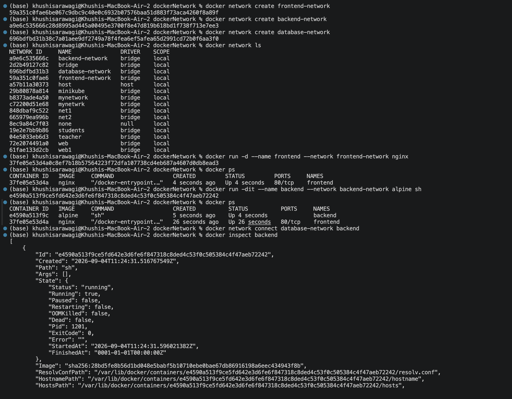
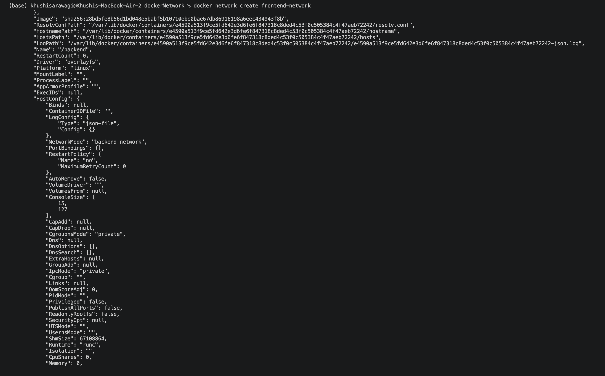
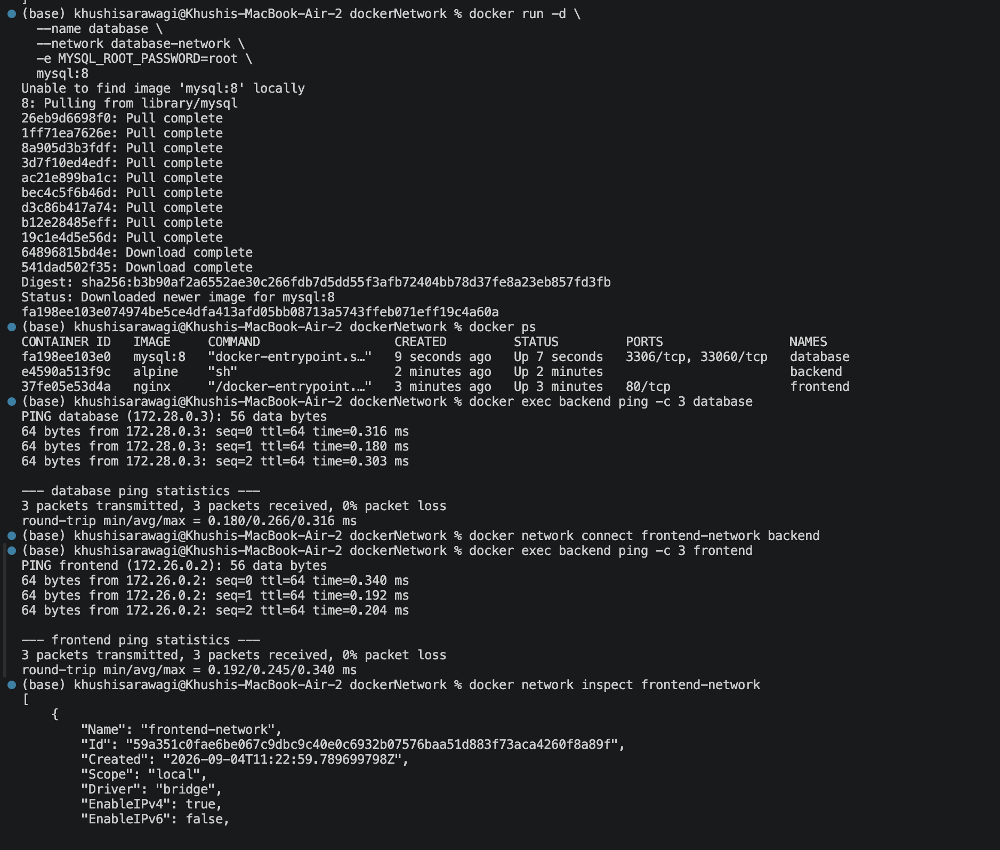
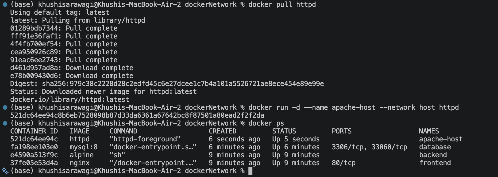
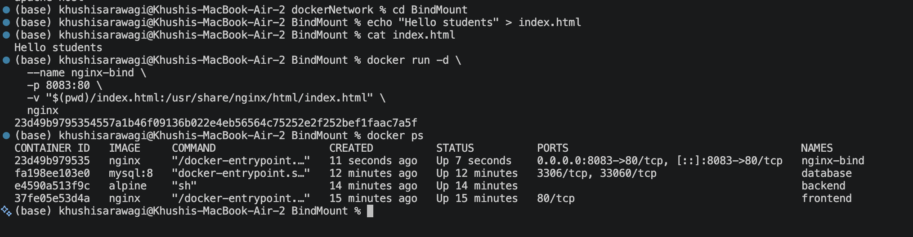
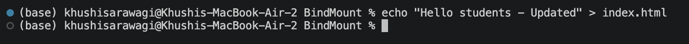

# Docker Networking & Volume Homework

## Task 1: Docker Container Networking

Created 3 Docker containers:

- Frontend: Nginx
- Backend: Alpine
- Database: MySQL

Created 3 Docker networks:

```text
frontend-network
backend-network
database-network
```

The backend container was connected to multiple networks:

```text
backend-network
database-network
frontend-network
```

### Connectivity Verification

Backend to Database:

```bash
docker exec backend ping -c 3 database
```

Result:

```text
3 packets transmitted, 3 packets received, 0% packet loss
```

Backend to Frontend:

```bash
docker exec backend ping -c 3 frontend
```

Result:

```text
3 packets transmitted, 3 packets received, 0% packet loss
```

### Screenshot





---

## Task 2: Host Network

Pulled the Apache image:

```bash
docker pull httpd
```

Created the container using host networking:

```bash
docker run -d --name apache-host --network host httpd
```

Verified the network mode:

```bash
docker inspect -f '{{.HostConfig.NetworkMode}}' apache-host
```

Output:

```text
host
```

### Note

The Apache container was successfully created using host networking. On macOS Docker Desktop, direct access through `localhost:80` was not available because host networking behaves differently from native Linux.

### Screenshot



---

## Task 3: Bind Mount

Created a local `index.html`:

```text
Hello students
```

Started an Nginx container with a bind mount:

```bash
docker run -d \
  --name nginx-bind \
  -p 8083:80 \
  -v "$(pwd)/index.html:/usr/share/nginx/html/index.html" \
  nginx
```

The webpage was verified at:

```text
http://localhost:8083
```

After modifying `index.html`, the changes were reflected in the browser without restarting the container.

### Screenshot





---

## Task 4: Overlay Network

### What is an Overlay Network?

An overlay network connects containers running on different Docker hosts and allows them to communicate across those hosts.

### Use Cases

- Multi-host container communication
- Docker Swarm applications
- Distributed applications

### How It Works

An overlay network creates a virtual network across multiple Docker hosts, allowing container traffic to be communicated between hosts.

---

## Key Learning

This homework helped me understand Docker container networking, host networking, bind mounts, container connectivity, and overlay networks.