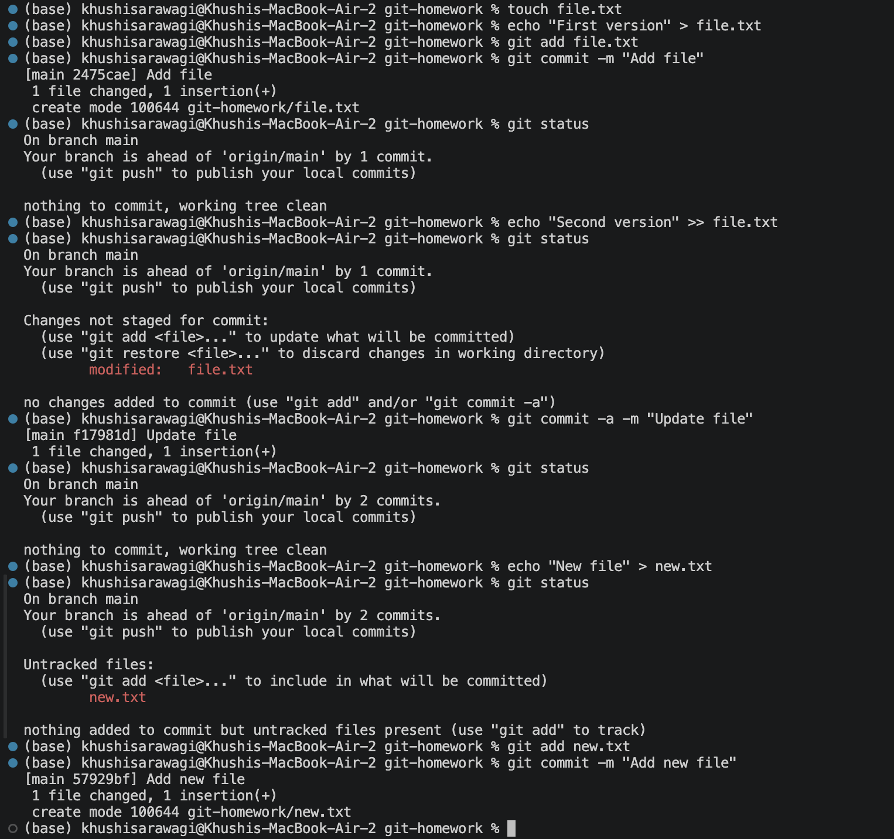
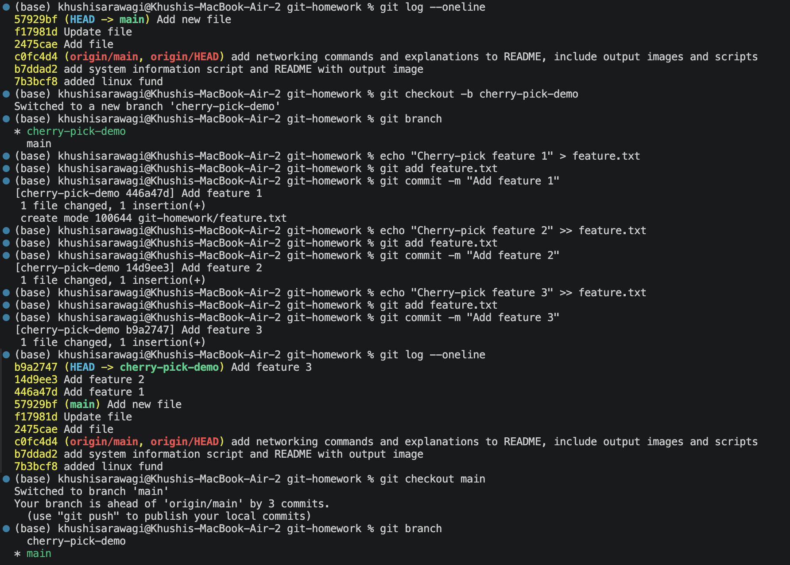
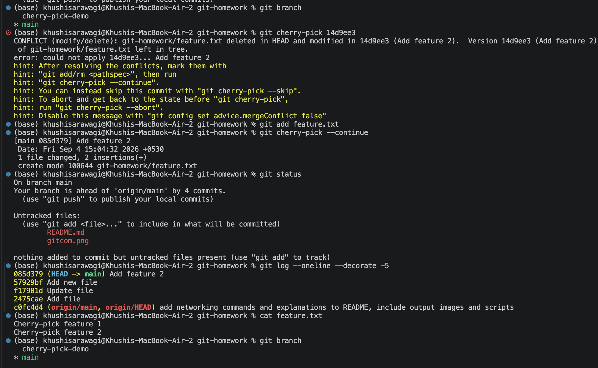

# Git Homework

## Task 1: Git Commit

### Objective

Practice `git commit -a -m` and understand the difference between `git commit -m` and `git commit -a -m`.

### `git commit -m`

Created and committed `file.txt`:

```bash
touch file.txt
echo "First version" > file.txt
git add file.txt
git commit -m "Add file"
```

After modifying the tracked file:

```bash
echo "Second version" >> file.txt
git status
```

The file appeared as **modified but not staged**.

### `git commit -a -m`

Committed the modification using:

```bash
git commit -a -m "Update file"
```

The modified tracked file was automatically staged and committed.

### Untracked File

Created a new file:

```bash
echo "New file" > new.txt
git status
```

`new.txt` appeared as **untracked**.

This showed that `git commit -a -m` does not include new files.

The new file must be staged first:

```bash
git add new.txt
git commit -m "Add new file"
```

### Difference

| Command | Purpose |
|---|---|
| `git commit -m` | Commits staged changes |
| `git commit -a -m` | Automatically stages and commits modified/deleted tracked files |
| New files | Must be added using `git add` |

### Key Learning

`git commit -a -m` automatically stages changes to files that Git is already tracking, but it does not include new untracked files.

### Screenshot



---

## Task 2: Git Cherry-Pick

### Objective

Practice creating commits on a separate branch and cherry-picking a specific commit into `main`.

### Steps

Created a new branch:

```bash
git checkout -b cherry-pick-demo
```

Created 3 commits on the branch:

```text
446a47d Add feature 1
14d9ee3 Add feature 2
b9a2747 Add feature 3
```

Used `git log --oneline` to identify the commit:

```text
14d9ee3 Add feature 2
```

Switched back to `main`:

```bash
git checkout main
```

Cherry-picked the selected commit:

```bash
git cherry-pick 14d9ee3
```

The cherry-pick created a new commit on `main`:

```text
085d379 Add feature 2
```

### Verification

Checked the commit history:

```bash
git log --oneline --decorate -5
```

Verified the change:

```bash
cat feature.txt
```

Output:

```text
Cherry-pick feature 1
Cherry-pick feature 2
```

### Key Learning

`git cherry-pick` allows a specific commit from another branch to be applied to the current branch.

### Screenshot


