# GitHub Actions Practice

This folder contains a set of small GitHub Actions and CI/CD exercises. Each exercise is kept in its own directory so that the concepts can be practiced independently.

The examples cover:

- GitHub Actions workflows and manual triggers
- Jobs and steps
- Runners
- Secrets
- Python build and test automation
- Build artifacts
- Complete CI/CD pipeline flow

## Learning Path

The exercises are arranged from simple workflow concepts to a complete pipeline:

| Exercise | Main topic | Workflow |
| --- | --- | --- |
| [`civscd`](civscd/) | CI, continuous delivery, and continuous deployment | Conceptual exercises |
| [`cicd`](cicd/) | Pipeline stages | Conceptual exercises |
| [`githubaction`](githubaction/) | Basic GitHub Actions workflow | `Hello GitHub Actions` |
| [`workflows`](workflows/) | Manual workflow execution | `Workflow Demo` |
| [`jobs-and-steps`](jobs-and-steps/) | Multiple jobs and steps | `Jobs and Steps Demo` |
| [`runners`](runners/) | GitHub-hosted runners | `Runner Demo` |
| [`secrets`](secrets/) | Repository secrets | `Secrets Demo` |
| [`artifacts`](artifacts/) | Uploading build output | `Artifact Demo` |
| [`build-and-test`](build-and-test/) | Python testing and build automation | `Build and Test Pipeline` |
| [`demo`](demo/) | Python CI example | `Python CI Pipeline` |
| [`final-cicd-pipeline`](final-cicd-pipeline/) | Test, build, security check, and artifact upload | `Final CI Pipeline` |

## Repository Layout

```text
githubaction/
├── README.md
├── assets/                         # Screenshots used in this guide
├── artifacts/                     # Upload and download workflow artifacts
├── build-and-test/                # Python tests, build, and artifact upload
├── cicd/                          # CI/CD concepts
├── civscd/                        # CI versus CD concepts
├── demo/                          # Python CI demonstration
├── final-cicd-pipeline/           # Complete CI pipeline
├── githubaction/                  # Basic hello-world workflow
├── jobs-and-steps/                # Multiple jobs and steps
├── runners/                       # Runner information
├── secrets/                       # Secret availability check
└── workflows/                     # Manual workflow demonstration
```

Every executable exercise contains its own workflow under:

```text
.github/workflows/
```

## Important GitHub Repository Note

GitHub only loads workflow files from `.github/workflows/` at the root of a GitHub repository. The directories in this folder are practice subprojects, not one combined workflow repository.

For example, the workflow in:

```text
githubaction/workflows/.github/workflows/workflow-demo.yml
```

must be pushed with `workflows/` as the root of its GitHub repository, or copied into a separate practice repository. Do not move the files inside this local practice folder unless you intentionally want to change its structure.

## Run an Exercise Locally

The Python exercises use Python 3 and `pytest`.

```bash
cd build-and-test
python3 -m pip install -r requirements.txt
pytest -v
chmod +x build.sh
./build.sh
```

The final pipeline can be run locally in the same way:

```bash
cd final-cicd-pipeline
python3 -m pip install -r requirements.txt
pytest -v
chmod +x build.sh
./build.sh
```

The generated build output is placed in `build/` and includes `build-info.txt`.

## Manually Trigger a Workflow

The executable workflow files include:

```yaml
on:
  workflow_dispatch:
```

This enables the **Run workflow** button in GitHub.

1. Push the selected exercise as the root of a GitHub repository.
2. Open that repository on GitHub.
3. Select the **Actions** tab.
4. Select the workflow from the left side, such as **Workflow Demo** or **Final CI Pipeline**.
5. Click **Run workflow**.
6. Select the branch, normally `main`.
7. Click **Run workflow** again.
8. Open the run to view its jobs, steps, logs, and artifacts.

### Trigger One Workflow, Then Another

The current examples do not automatically chain separate workflows. To run two workflows in order:

1. Open **Actions** and run the first workflow.
2. Wait until the first run finishes successfully.
3. Select the second workflow.
4. Click **Run workflow** and start it on the same branch.

The `needs` keyword only controls job order inside one workflow. For example, in `final-cicd-pipeline`, the `build` and `security-check` jobs wait for the `test` job. It does not connect two different workflow files.

## Workflow Examples

### Basic Manual Workflow

`workflows/.github/workflows/workflow-demo.yml` runs four simple steps:

```text
Start → Application → Testing → Finish
```

### Build and Test Pipeline

`build-and-test/.github/workflows/ci.yml` performs:

```text
Checkout → Setup Python → Install dependencies → Test → Build → Upload artifact
```

It runs on pushes and pull requests targeting `main`, and it can also be started manually.

### Final CI Pipeline

`final-cicd-pipeline/.github/workflows/ci.yml` contains three jobs:

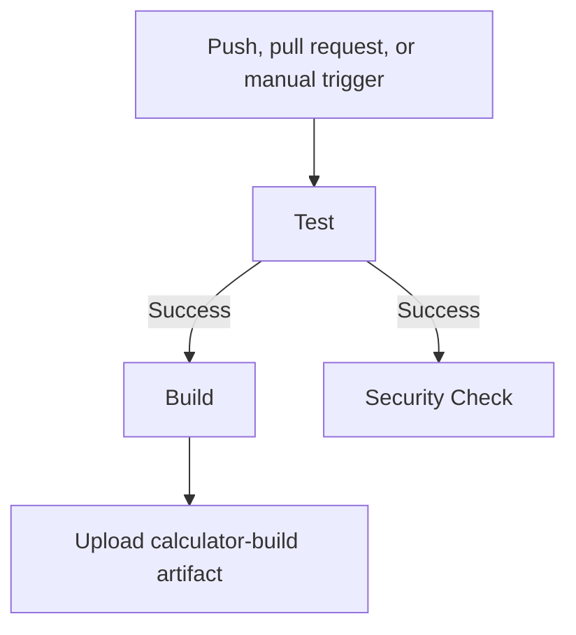

The build and security jobs use `needs: test`, so they run only after the test job succeeds.

### Secrets Workflow

Before running `secrets/secrets-demo.yml`, create a repository secret named `DEMO_SECRET`:

1. Open the repository on GitHub.
2. Go to **Settings**.
3. Select **Secrets and variables** → **Actions**.
4. Select **New repository secret**.
5. Enter `DEMO_SECRET` as the name and provide a value.
6. Run **Secrets Demo** from the **Actions** tab.

The workflow intentionally reports failure when the secret is not configured. Never print the secret value in a workflow log.

## Artifacts

The artifact workflows upload build output using `actions/upload-artifact`.

For the artifact exercise:

```text
Build → build/ → Upload artifact → Download from workflow summary
```

After a successful run:

1. Open the workflow run.
2. Open the run summary.
3. Find the **Artifacts** section.
4. Download `session16-build` or `calculator-build`, depending on the exercise.

## Screenshots

The screenshots below show the practice results and GitHub Actions workflow runs.

### Basic GitHub Actions

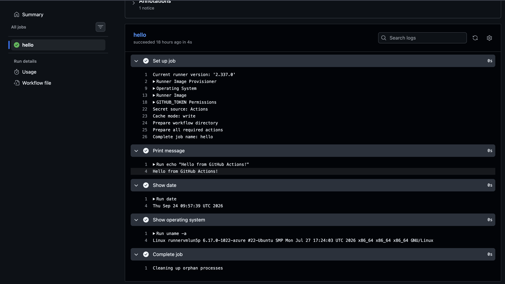

### Manual Workflow

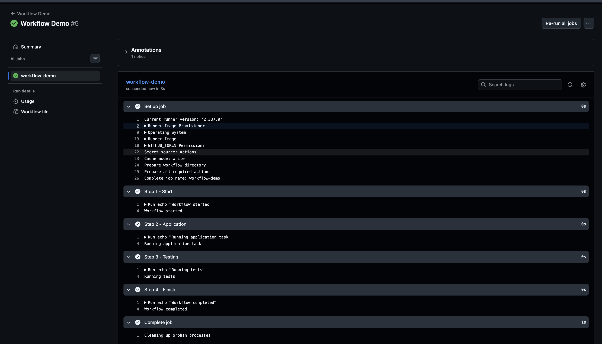

### Jobs and Steps

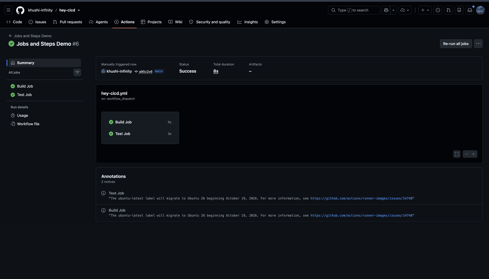

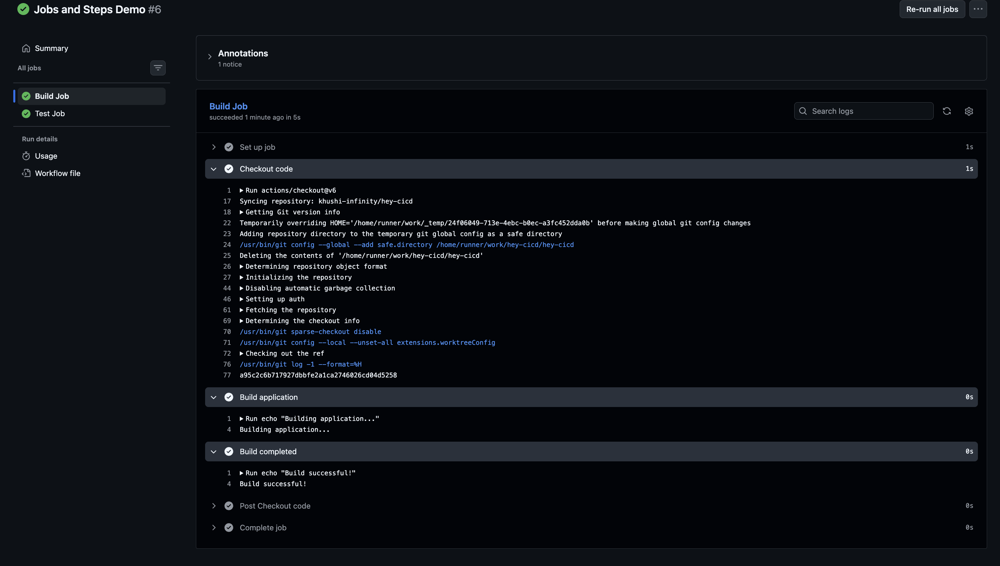

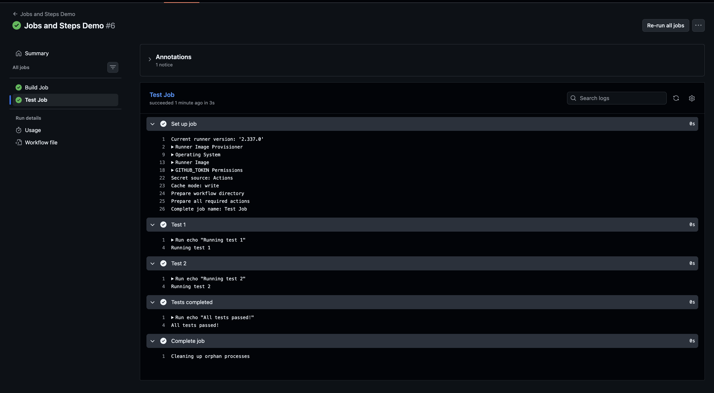

### Runner Information

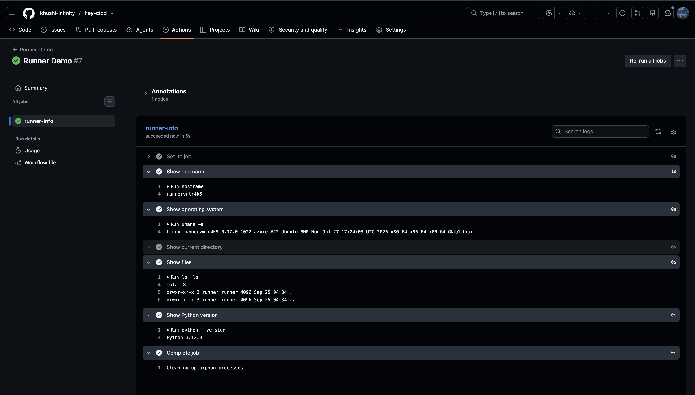

### Repository Secrets

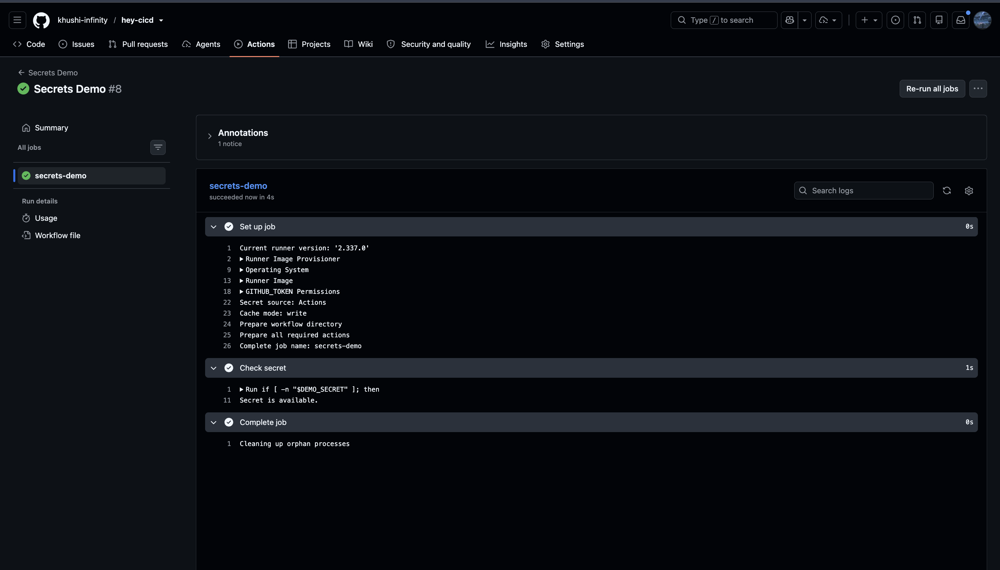

### Build Artifacts

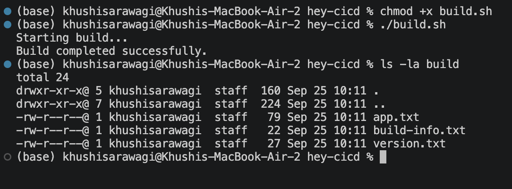

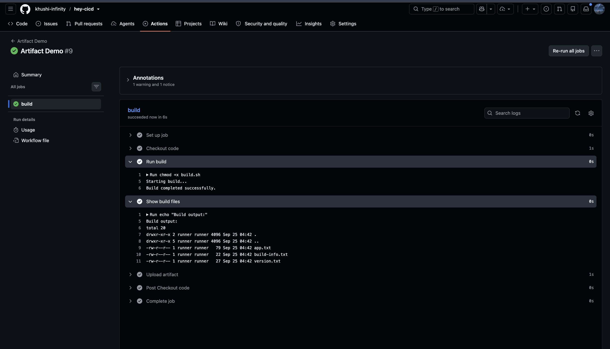

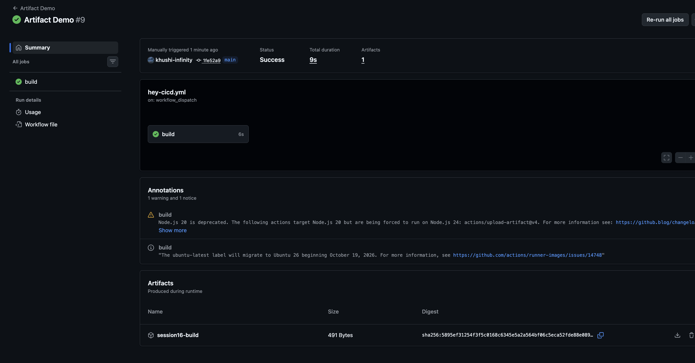

### Build and Test

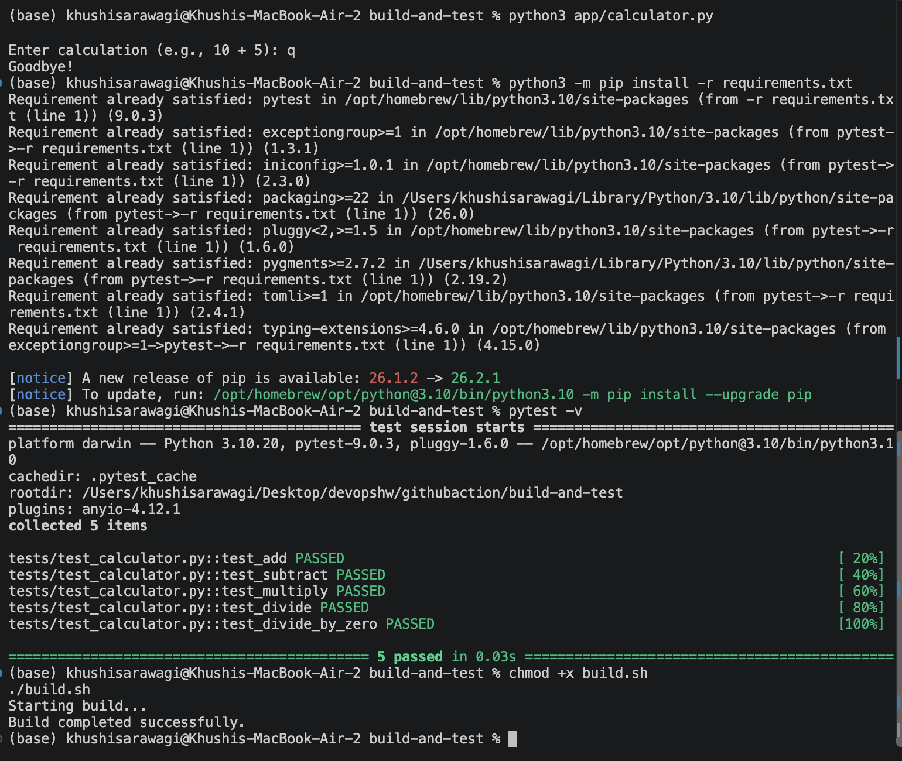

### Python CI Demo

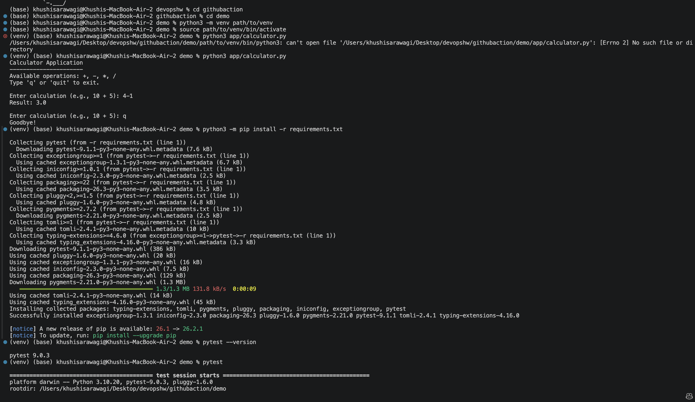

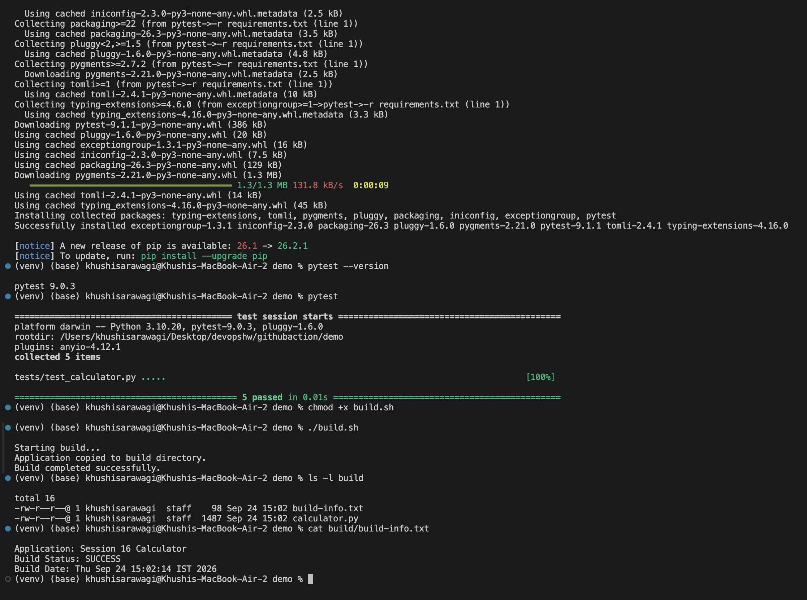

### Final CI/CD Pipeline

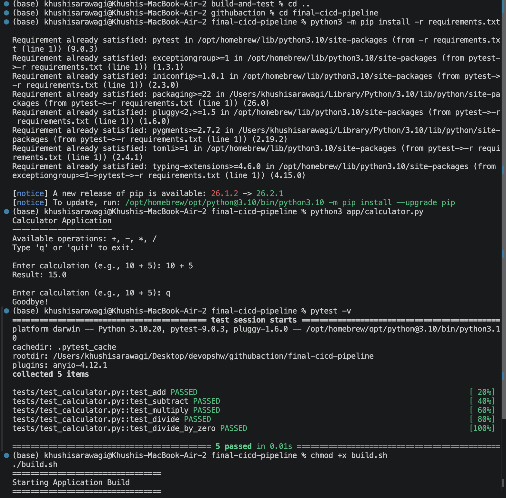

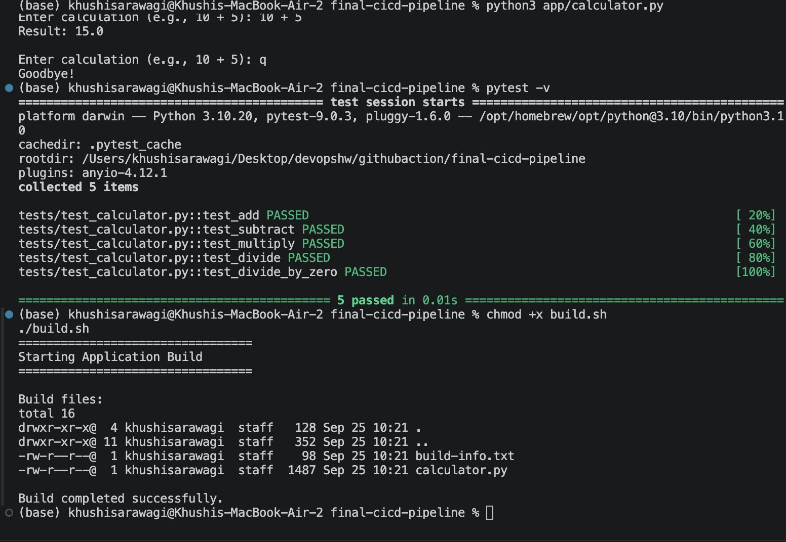

## Testing a Failure

The Python calculator exercises can be used to observe a failed pipeline. Temporarily change the addition function so that it returns an incorrect result:

```python
def add(a, b):
	return a + b + 1
```

Run the tests locally or push the change to GitHub. The test job should fail, and jobs that depend on it will not run. Restore the original implementation afterward:

```python
def add(a, b):
	return a + b
```

## Useful Git Commands

```bash
git status
git add .
git commit -m "Run GitHub Actions practice"
git push origin main
```

Use `git status` before committing so that you can confirm which practice files are being pushed.

## Key Concepts

| Concept | Meaning |
| --- | --- |
| Workflow | A YAML automation definition |
| Trigger | The event that starts a workflow |
| `workflow_dispatch` | Allows manual execution from GitHub |
| Job | A group of steps running on a runner |
| Step | One command or action inside a job |
| Runner | The machine that executes a job |
| `needs` | Makes one job wait for another job |
| Artifact | Output saved after a workflow completes |
| Secret | Encrypted value made available to a workflow |

## Summary

The overall CI flow practiced here is:

```text
Code → Push or manual trigger → Checkout → Build → Test → Package → Artifact
```

For the final pipeline, the flow is:

```text
Test → Build and Security Check → Upload Artifact
```
