# Helm Kubernetes Labs

This directory contains a progressive set of Helm exercises. The labs start with Helm concepts and chart structure, then build toward templated applications, release upgrades, rollback, and a complete Notes application deployed with environment-specific values.

Helm is the package manager for Kubernetes. It packages Kubernetes manifests into reusable **charts**, combines a chart with configuration into a running **release**, and uses **values** to customize the same chart for different environments.

```text
Chart + Values
			|
			v
	Helm Release
			|
			v
Kubernetes resources
```

## Prerequisites

- A running Kubernetes cluster, such as Minikube or Docker Desktop Kubernetes
- `kubectl` configured to use that cluster
- Helm 3 installed locally
- Permission to create Deployments, Services, ConfigMaps, and Secrets in the selected namespace

Verify the tools and cluster:

```bash
helm version
kubectl version --client
kubectl cluster-info
kubectl get nodes
```

On macOS with Homebrew, Helm can be installed with:

```bash
brew install helm
```

## Lab Map

| Order | Directory | What you learn |
| --- | --- | --- |
| 1 | [`what-is-helm/`](what-is-helm/) | Helm purpose, repositories, releases, and Helm 3 |
| 2 | [`chart-structure/`](chart-structure/) | `Chart.yaml`, `values.yaml`, and `templates/` |
| 3 | [`chart-yaml/`](chart-yaml/) | Chart metadata, versions, and `helm lint` |
| 4 | [`helm-charts/`](helm-charts/) | Generate and install a chart with `helm create` |
| 5 | [`templates/`](templates/) | Go template expressions and conditionals |
| 6 | [`values-yaml/`](values-yaml/) | Defaults and environment-specific overrides |
| 7 | [`deploying-application/`](deploying-application/) | Build and deploy a Guestbook chart |
| 8 | [`install-upgrade/`](install-upgrade/) | Install, upgrade, and release revisions |
| 9 | [`rollback/`](rollback/) | Recover from a failed upgrade |
| 10 | [`miniproject/`](miniproject/) | Package and operate the Notes application |

The detailed notes inside each directory remain useful as focused references. This README connects them into one workflow.

## Helm Concepts

### Chart

A chart is the source package. It contains metadata, default values, and Kubernetes templates.

```text
my-chart/
├── Chart.yaml       # Chart metadata and version
├── values.yaml      # Default configuration
├── charts/          # Dependency charts, when present
└── templates/       # Kubernetes resources with Go templates
```

### Release

A release is one installed instance of a chart. The same chart can have several releases:

```bash
helm install notes-dev ./notes-chart
helm install notes-staging ./notes-chart
helm install notes-prod ./notes-chart
```

Each release has its own name, values, resources, history, and revision numbers.

### Values

Values separate configuration from templates. One chart can use different replica counts or image tags without copying its manifests:

```yaml
replicaCount: 3

image:
	repository: nginx
	tag: "1.25"
```

## 1. Helm Basics

Read [`what-is-helm/README.md`](what-is-helm/README.md) to compare repeated `kubectl apply` commands with a single chart release.

List current releases and configure a public repository:

```bash
helm list
helm list --all-namespaces
helm repo add bitnami https://charts.bitnami.com/bitnami
helm repo update
helm search repo nginx
```

Install and inspect a sample chart:

```bash
helm install my-nginx bitnami/nginx
helm status my-nginx
kubectl get pods
kubectl get services
helm uninstall my-nginx
```

Helm 3 does not use the old Tiller server. Helm runs as a client and uses the permissions supplied by the current Kubernetes context.

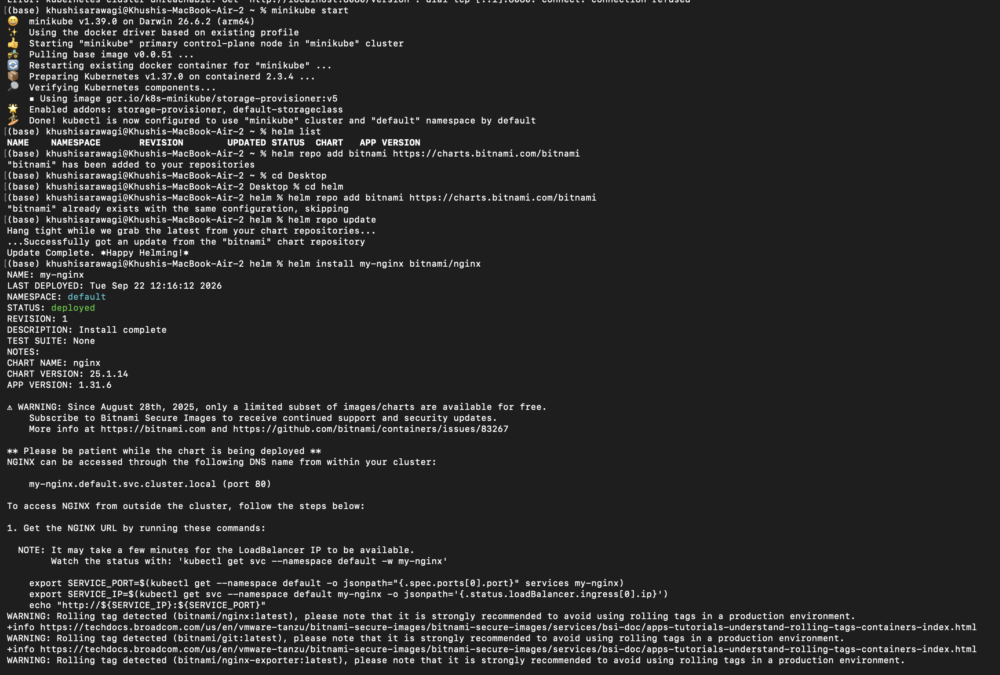

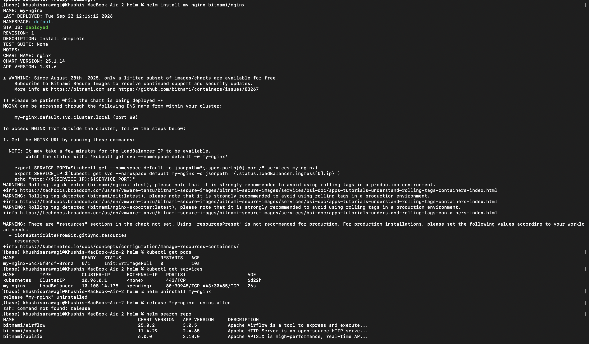

## 2. Chart Structure

The [`chart-structure/`](chart-structure/) lab creates a small chart with a Deployment and Service. The chart has three important layers:

| File or directory | Responsibility |
| --- | --- |
| `Chart.yaml` | Chart name, type, chart version, and application version |
| `values.yaml` | Default values used by templates |
| `templates/` | Kubernetes resources generated from those values |

Run the sample chart:

```bash
cd chart-structure
helm lint simple-chart
helm template my-release simple-chart
helm install my-release simple-chart
kubectl get deployment,service,pods
helm uninstall my-release
cd ..
```

`helm template` renders YAML locally without contacting the cluster. It is a safe way to inspect substitutions before deployment.

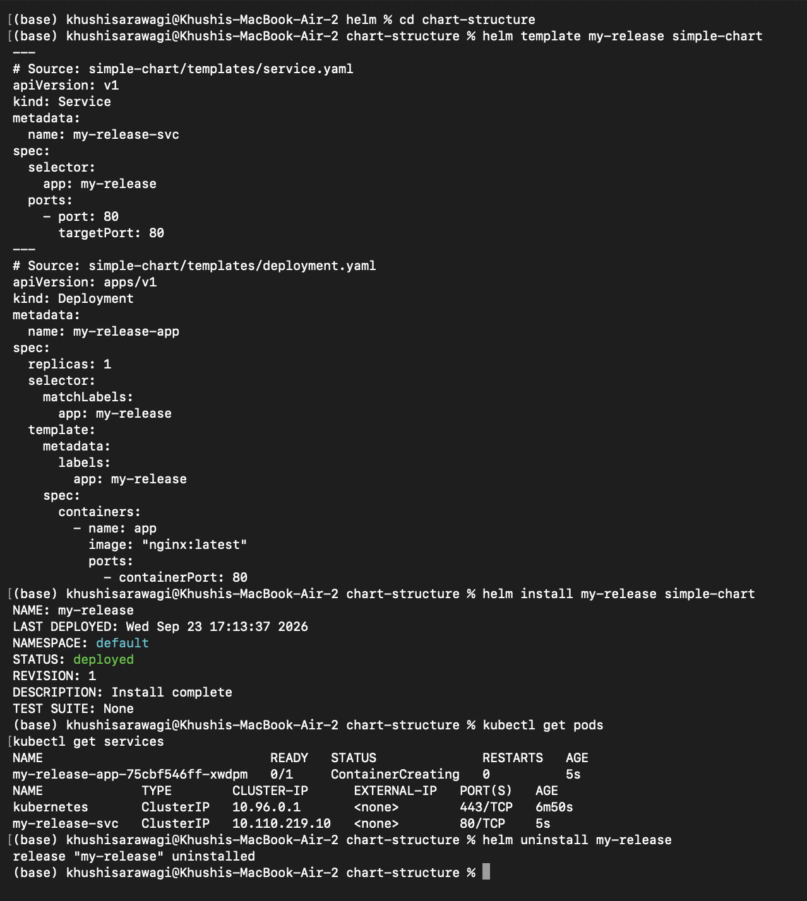

## 3. Chart Metadata with `Chart.yaml`

The [`chart-yaml/`](chart-yaml/) lab focuses on metadata:

```yaml
apiVersion: v2
name: my-app
description: A learning chart
type: application
version: 0.1.0
appVersion: "1.0"
```

- `version` is the version of the Helm chart. Increase it when chart templates or defaults change.
- `appVersion` describes the application being packaged, often matching a container image tag.
- `type: application` identifies a deployable chart; `library` charts provide reusable templates.

Validate the example:

```bash
cd chart-yaml
helm lint .
cd ..
```

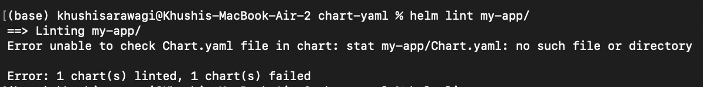

## 4. Generate a Chart with `helm create`

The [`helm-charts/`](helm-charts/) lab uses Helm's scaffold generator:

```bash
cd helm-charts
helm create demo-chart
helm lint demo-chart
helm template demo-release demo-chart
helm install demo-release demo-chart
kubectl get pods
helm list
helm uninstall demo-release
cd ..
```

The generated chart includes common templates such as a Deployment, Service, ServiceAccount, optional Ingress, optional HPA, helper definitions, and `NOTES.txt`. Remove or simplify generated resources that the application does not need before production use.

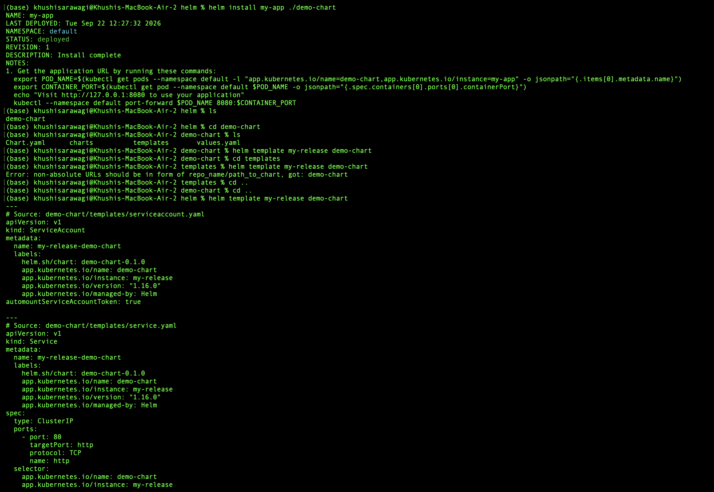

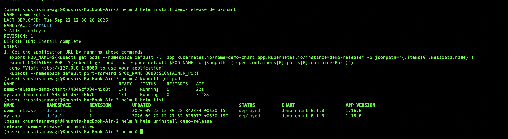

## 5. Templates and Go Expressions

The [`templates/`](templates/) lab shows how Helm substitutes values in Kubernetes YAML:

```yaml
replicas: {{ .Values.replicaCount }}
name: {{ .Release.Name }}-app
image: "{{ .Values.image.repository }}:{{ .Values.image.tag }}"
```

Render the sample chart:

```bash
cd templates
helm lint template-demo
helm template my-release template-demo
helm template my-release template-demo --set replicaCount=5
cd ..
```

| Expression | Meaning |
| --- | --- |
| `.Values.*` | Configuration from `values.yaml` or an override |
| `.Release.Name` | Release name supplied to `helm install` |
| `.Chart.Name` | Name from `Chart.yaml` |
| `.Chart.Version` | Chart version from `Chart.yaml` |
| `.Chart.AppVersion` | Application version from `Chart.yaml` |

Conditionals can include or omit resources:

```yaml
{{- if .Values.service.enabled }}
apiVersion: v1
kind: Service
{{- end }}
```

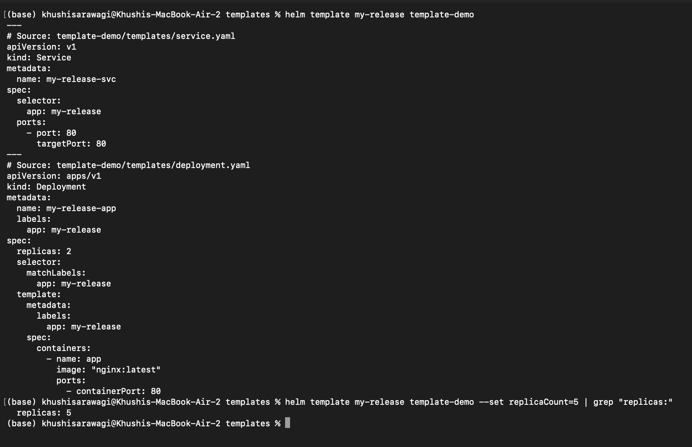

## 6. Values and Environment Overrides

The [`values-yaml/`](values-yaml/) lab demonstrates Helm's configuration precedence:

```text
values.yaml  ->  -f values-prod.yaml  ->  --set flag
lowest priority                         highest priority
```

Preview different configurations without installing:

```bash
cd values-yaml
helm template my-app .
helm template my-app . --set replicaCount=3
helm template my-app . -f values-prod.yaml
cd ..
```

Use `--set` for quick experiments and a reviewed values file for repeatable development, staging, and production deployments.

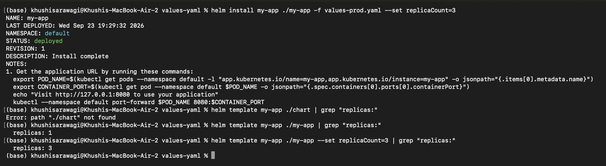

## 7. Deploy a Guestbook Application

The [`deploying-application/`](deploying-application/) lab builds a chart from scratch. It deploys an nginx Deployment, a NodePort Service, and a ConfigMap containing the application name and welcome message.

```bash
cd deploying-application
helm lint guestbook-chart
helm template my-guestbook guestbook-chart
helm install my-guestbook guestbook-chart
kubectl get pods
kubectl get services
kubectl get configmaps
helm status my-guestbook
```

The example exposes NodePort `30080`. On Minikube, retrieve the URL with:

```bash
minikube service my-guestbook-svc --url
```

Upgrade to three replicas and inspect the release history:

```bash
helm upgrade my-guestbook guestbook-chart --set replicaCount=3
kubectl get pods
helm history my-guestbook
helm uninstall my-guestbook
cd ..
```

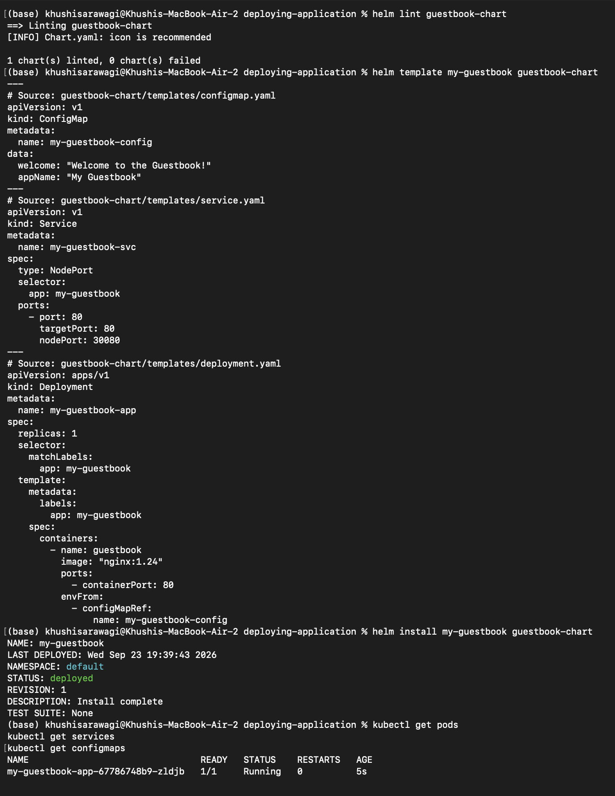

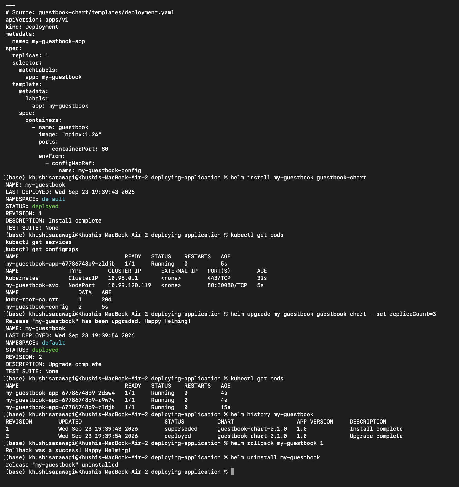

## 8. Install and Upgrade a Release

The [`install-upgrade/`](install-upgrade/) lab uses `my-chart` to demonstrate release revisions.

```bash
cd install-upgrade
helm lint my-chart
helm install web-app ./my-chart
kubectl get pods
helm list
helm upgrade web-app ./my-chart --set replicaCount=3
kubectl get pods
helm history web-app
helm uninstall web-app
cd ..
```

| Command | Behavior |
| --- | --- |
| `helm install` | Creates a new release; fails if that release name already exists |
| `helm upgrade` | Updates an existing release; fails if the release does not exist |
| `helm upgrade --install` | Installs if absent, otherwise upgrades; useful in CI/CD |
| `helm uninstall` | Deletes the release's managed resources |

For automation, use:

```bash
helm upgrade --install web-app ./my-chart
```

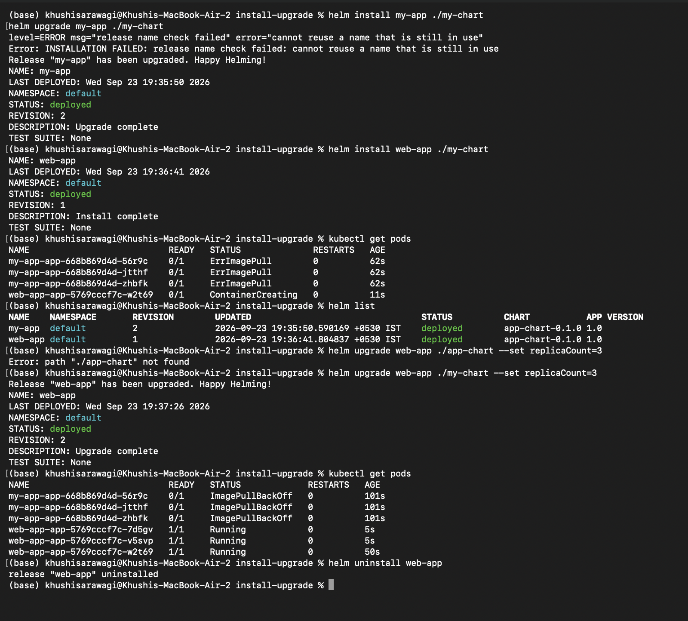

## 9. Roll Back a Failed Upgrade

The [`rollback/`](rollback/) lab intentionally upgrades a release with an invalid image tag:

```bash
cd rollback
helm install rollback-demo ./app-chart
helm upgrade rollback-demo ./app-chart --set image.tag=doesnotexist
kubectl get pods
helm history rollback-demo
```

Inspect the failure and return to revision 1:

```bash
kubectl get pods
kubectl describe pod <pod-name>
helm rollback rollback-demo 1
kubectl get pods
helm history rollback-demo
```

Rollback creates a new revision rather than deleting old history. Use `--atomic` to roll back automatically if an upgrade does not become ready:

```bash
helm upgrade rollback-demo ./app-chart \
	--set image.tag=doesnotexist \
	--atomic \
	--timeout 60s
```

Clean up:

```bash
helm uninstall rollback-demo
cd ..
```

## 10. Mini-Project: Notes Application

The [`miniproject/`](miniproject/) lab packages a simple nginx-based Notes application. Its chart is located at `miniproject/notes-chart`:

```text
notes-chart/
├── Chart.yaml
├── values.yaml
├── values-prod.yaml
└── templates/
		├── configmap.yaml
		├── deployment.yaml
		└── service.yaml
```

The chart creates a Deployment, a NodePort Service, and a ConfigMap. The development and production values differ in replica count, nginx image tag, and environment value.

### Lint and render

```bash
cd miniproject
helm lint notes-chart
helm template notes-dev notes-chart
helm template notes-prod notes-chart -f notes-chart/values-prod.yaml
```

### Install development values

```bash
helm install notes-dev notes-chart
kubectl get pods
kubectl get services
kubectl get configmaps
helm status notes-dev
```

The default release starts with one replica and the development configuration.

### Upgrade to production values

```bash
helm upgrade notes-dev notes-chart -f notes-chart/values-prod.yaml
kubectl get pods
kubectl get service
helm history notes-dev
```

The production values increase the release to three replicas, use nginx `1.25`, and set the application environment to production.

### Simulate failure and recover

```bash
helm upgrade notes-dev notes-chart --set image.tag=broken-tag-does-not-exist
kubectl get pods
kubectl describe pod <pod-name>
helm history notes-dev
helm rollback notes-dev 2
kubectl get pods
```

Revision 2 is the healthy production upgrade in this sequence. Confirm the actual revision with `helm history` before rolling back if you have made additional changes.

### Clean up

```bash
helm uninstall notes-dev
kubectl get pods
kubectl get services
cd ..
```

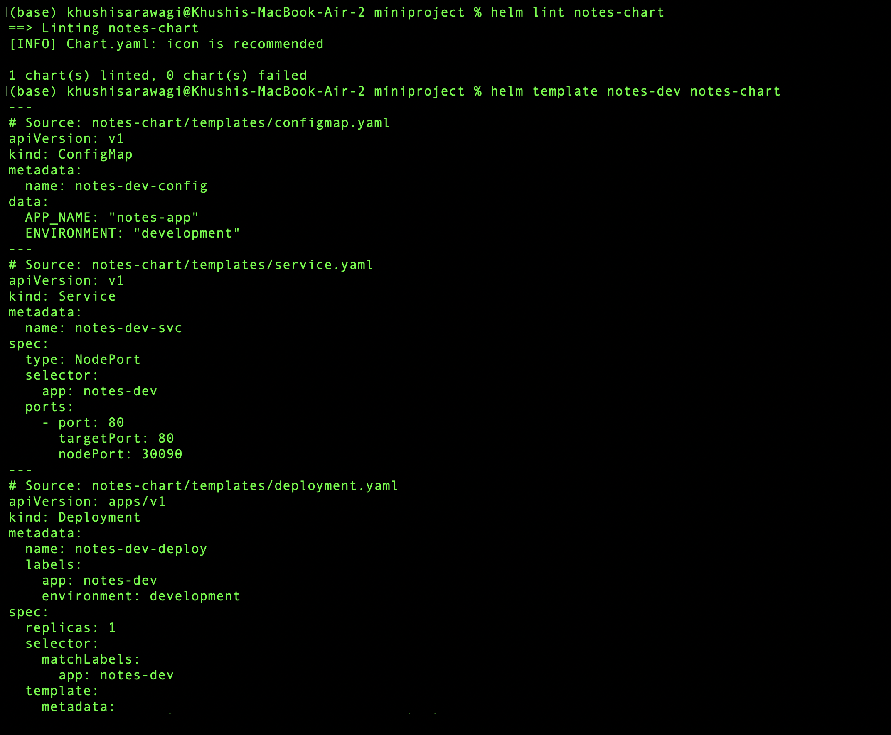

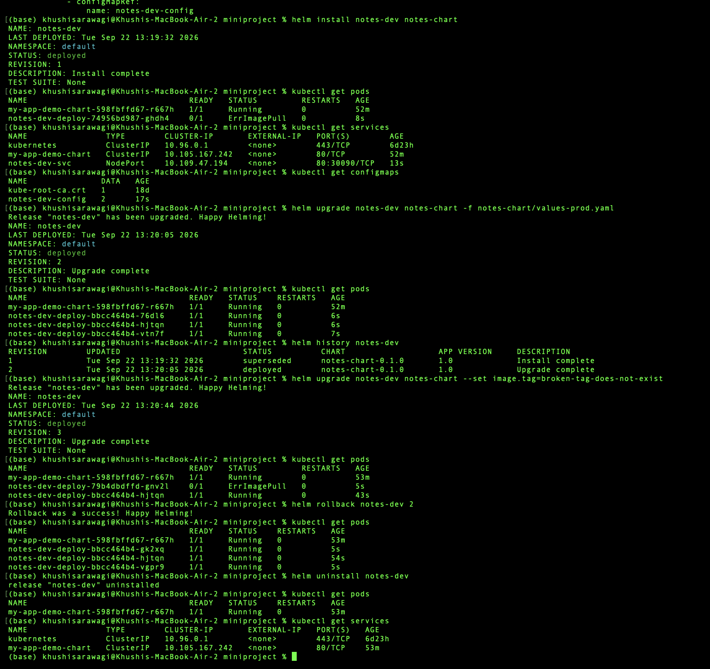

## Recommended Validation Workflow

Before installing or upgrading a chart:

```bash
helm lint <chart-directory>
helm template <release-name> <chart-directory> [options]
helm install <release-name> <chart-directory> --dry-run --debug
helm install <release-name> <chart-directory>
kubectl get all
helm status <release-name>
```

After an upgrade:

```bash
helm upgrade <release-name> <chart-directory>
helm history <release-name>
kubectl rollout status deployment/<deployment-name>
```

The optional `helm diff` plugin can show changes before an upgrade. Without it, compare `helm template` output between configurations.

## Common Troubleshooting

### Chart lint fails

```bash
helm lint <chart-directory>
```

Check YAML indentation, required `Chart.yaml` fields, template syntax, and values paths such as `.Values.image.tag`.

### Template rendering fails

```bash
helm template <release-name> <chart-directory> --debug
```

Confirm every template variable has a matching value and generated names are valid Kubernetes names.

### Release already exists

```bash
helm list
helm upgrade <release-name> <chart-directory>
```

Or use `helm upgrade --install` in repeatable scripts.

### Pods do not become Ready

```bash
helm status <release-name>
kubectl get pods
kubectl describe pod <pod-name>
kubectl logs <pod-name>
```

Check the image tag, Service selector, port and targetPort, ConfigMap references, resource limits, and readiness probes.

### Upgrade failed

```bash
helm history <release-name>
helm rollback <release-name> <revision>
kubectl get pods
```

## Useful Helm Commands

```bash
helm repo list
helm search repo <keyword>
helm show chart <chart>
helm show values <chart>
helm lint <chart-directory>
helm template <release-name> <chart-directory>
helm install <release-name> <chart-directory>
helm upgrade <release-name> <chart-directory>
helm status <release-name>
helm get values <release-name>
helm get manifest <release-name>
helm history <release-name>
helm rollback <release-name> <revision>
helm uninstall <release-name>
```

## Cleanup Checklist

Remove releases created during the labs as needed:

```bash
helm list
helm uninstall my-nginx 2>/dev/null || true
helm uninstall my-release 2>/dev/null || true
helm uninstall demo-release 2>/dev/null || true
helm uninstall my-guestbook 2>/dev/null || true
helm uninstall web-app 2>/dev/null || true
helm uninstall rollback-demo 2>/dev/null || true
helm uninstall notes-dev 2>/dev/null || true
```

The `2>/dev/null || true` pattern makes cleanup safe when a release was never installed or was already removed.

## References

- [Helm Documentation](https://helm.sh/docs/)
- [Helm Chart Guide](https://helm.sh/docs/topics/charts/)
- [Chart Template Guide](https://helm.sh/docs/chart_template_guide/)
- [Helm Install](https://helm.sh/docs/helm/helm_install/)
- [Helm Upgrade](https://helm.sh/docs/helm/helm_upgrade/)
- [Helm Rollback](https://helm.sh/docs/helm/helm_rollback/)
