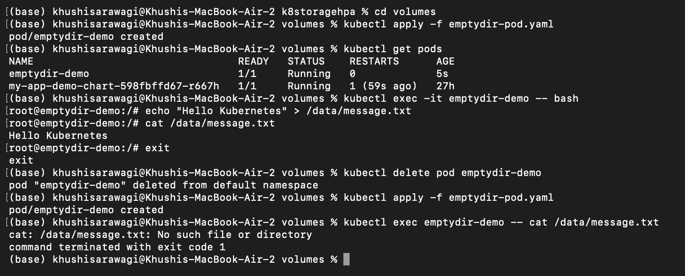
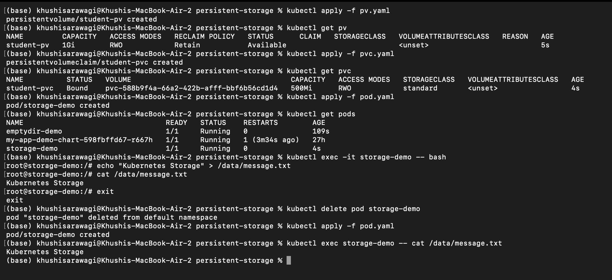
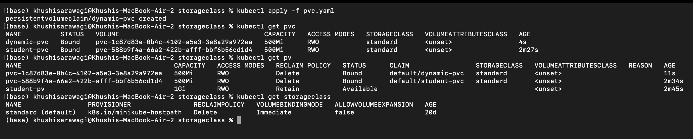
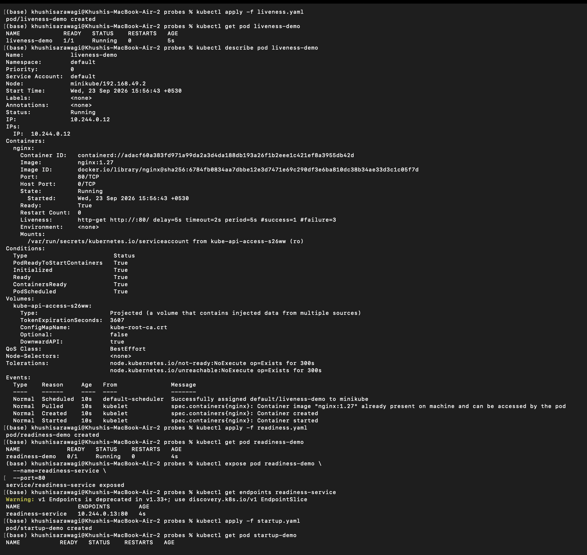
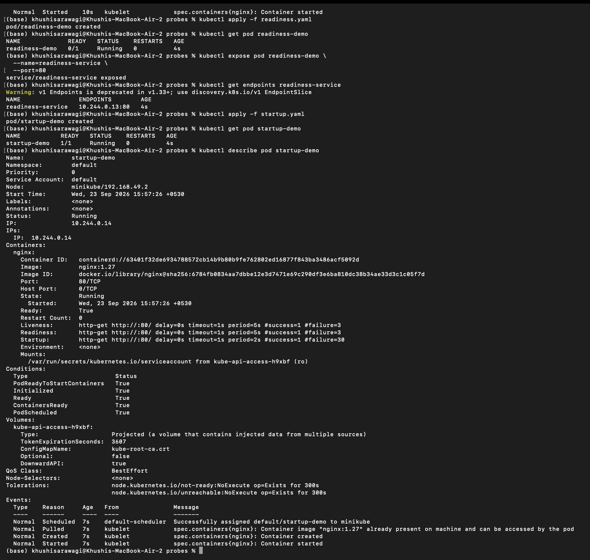
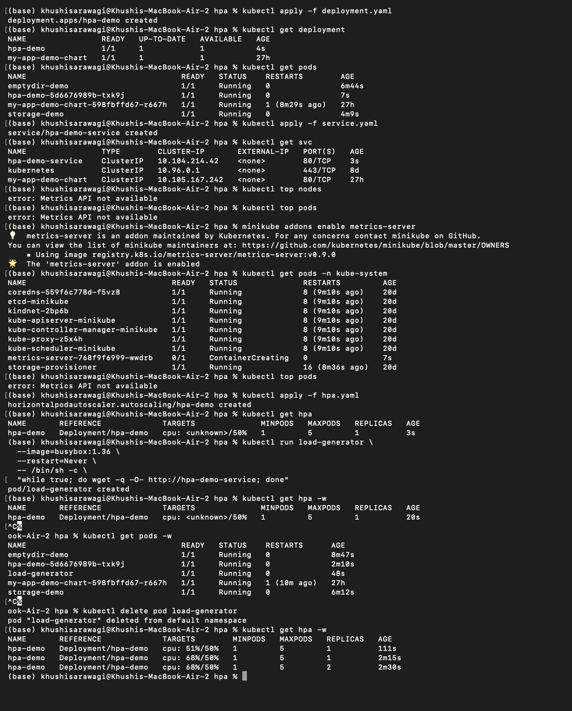
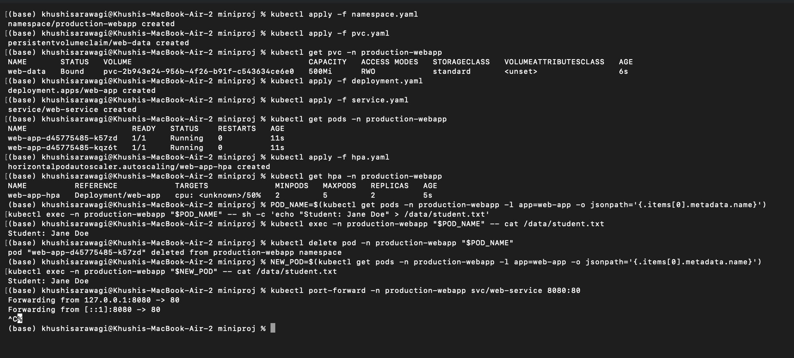
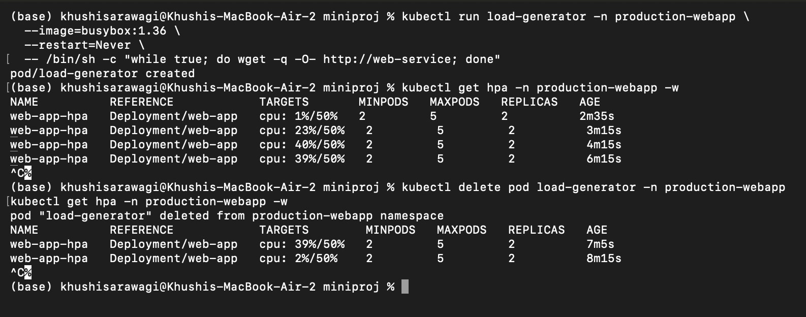
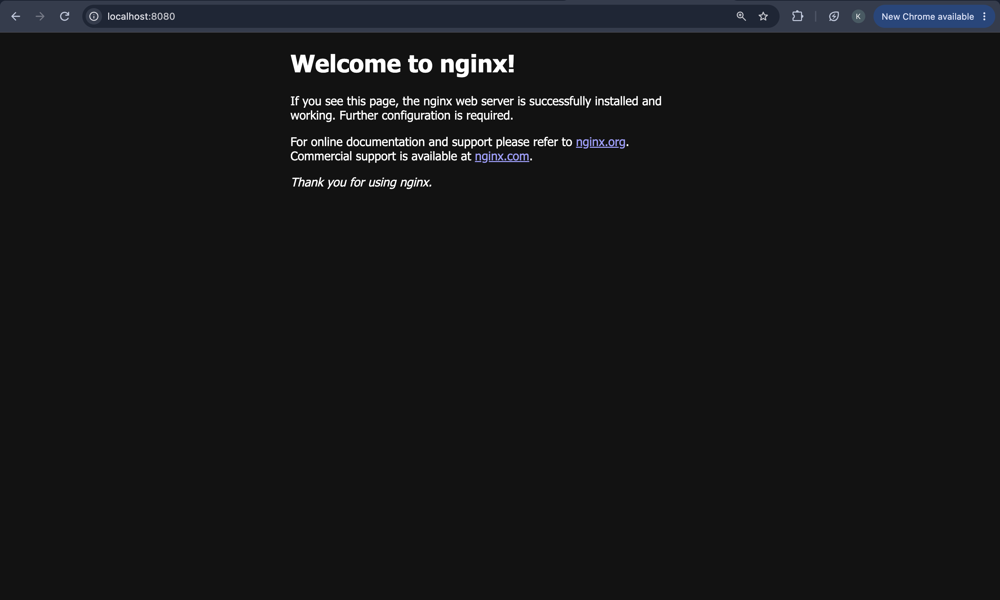

# Kubernetes Storage, Probes, and HPA

This module contains hands-on Kubernetes examples for managing container storage, checking application health, and scaling workloads automatically.

## Topics

| Directory | Topic | Main resources |
| --- | --- | --- |
| `volumes/` | Pod-scoped and node-mounted volumes | `emptyDir`, `hostPath` |
| `persistent-storage/` | Persistent storage that survives Pod recreation | `PersistentVolume`, `PersistentVolumeClaim` |
| `storageclass/` | Dynamic storage provisioning | `StorageClass`, PVC |
| `probes/` | Application health checks | Startup, readiness, and liveness probes |
| `hpa/` | Automatic horizontal scaling | Deployment, Service, HPA |
| `miniproj/` | Combined production-style exercise | PVC, probes, Service, HPA |

Each topic directory includes its own notes and manifests. Start with the individual examples, then finish with `miniproj/`.

## Screenshots

### Volumes



### Persistent Storage



### StorageClass



### Health Probes





### Horizontal Pod Autoscaler



### Mini Project







## Prerequisites

- A running Kubernetes cluster, such as Minikube or Docker Desktop Kubernetes
- `kubectl` configured for the target cluster
- `metrics-server` for the HPA examples
- `helm` if you want to run the chart under `hpa/demo-chart/`

Check the cluster connection:

```bash
kubectl cluster-info
kubectl get nodes
```

For Minikube, enable the required metrics components:

```bash
minikube addons enable metrics-server
minikube addons enable default-storageclass
```

## Recommended Learning Path

### 1. Volumes

The `volumes/` examples demonstrate the difference between temporary Pod storage and a directory mounted from the node.

```bash
cd volumes
kubectl apply -f emptydir-pod.yaml
kubectl get pod emptydir-demo
kubectl exec emptydir-demo -- sh -c 'echo "Kubernetes storage" > /data/message.txt'
kubectl exec emptydir-demo -- cat /data/message.txt
kubectl delete pod emptydir-demo
kubectl delete -f emptydir-pod.yaml
```

Read [volumes/volume.md](volumes/volume.md) for the `hostPath` example and the Pod lifetime behavior of `emptyDir`.

### 2. PersistentVolume and PersistentVolumeClaim

The `persistent-storage/` example creates a manually managed `PersistentVolume`, binds a claim to it, and mounts the claim in a Pod.

```bash
cd persistent-storage
kubectl apply -f pv.yaml
kubectl apply -f pvc.yaml
kubectl apply -f pod.yaml
kubectl get pv,pvc,pod
```

Write a file, delete and recreate the Pod, then verify that the file remains:

```bash
kubectl exec storage-demo -- sh -c 'echo "Persistent data" > /data/message.txt'
kubectl delete pod storage-demo
kubectl apply -f pod.yaml
kubectl exec storage-demo -- cat /data/message.txt
```

Clean up the resources when finished:

```bash
kubectl delete -f pod.yaml -f pvc.yaml -f pv.yaml
```

See [persistent-storage/readme.md](persistent-storage/readme.md) for the full explanation.

### 3. StorageClass and Dynamic Provisioning

The `storageclass/` example lets the cluster provision a PV automatically from a PVC.

```bash
cd storageclass
kubectl get storageclass
kubectl apply -f pvc.yaml
kubectl get pvc,pv
kubectl describe pvc dynamic-pvc
kubectl delete -f pvc.yaml
```

The manifest expects a StorageClass named `standard`. Use the name of the available class in your cluster if it differs.

### 4. Health Probes

The `probes/` directory contains separate examples for each probe type:

```bash
cd probes
kubectl apply -f startup.yaml
kubectl apply -f readiness.yaml
kubectl apply -f liveness.yaml
kubectl get pods
kubectl describe pod startup-demo
kubectl describe pod readiness-demo
kubectl describe pod liveness-demo
```

Use the following mental model:

- **Startup probe:** Has the application finished starting?
- **Readiness probe:** Can the Pod receive traffic?
- **Liveness probe:** Is the application still healthy enough to keep running?

Remove the examples with:

```bash
kubectl delete -f startup.yaml -f readiness.yaml -f liveness.yaml
```

See [probes/probes.md](probes/probes.md) for expected behavior.

### 5. Horizontal Pod Autoscaler

The basic HPA example in `hpa/` scales the `hpa-demo` Deployment from 1 to 5 replicas when average CPU utilization reaches 50 percent.

```bash
cd hpa
kubectl apply -f deployment.yaml
kubectl apply -f service.yaml
kubectl apply -f hpa.yaml
kubectl top pods
kubectl get deployment,pods,svc,hpa
```

Generate test load from inside the cluster:

```bash
kubectl run load-generator \
	--image=busybox:1.36 \
	--restart=Never \
	-- /bin/sh -c 'while true; do wget -q -O- http://hpa-demo-service; done'
```

Watch scaling and stop the load generator when finished:

```bash
kubectl get hpa -w
kubectl delete pod load-generator
kubectl delete -f hpa.yaml -f service.yaml -f deployment.yaml
```

The optional Helm chart is in `hpa/demo-chart/`.

## Mini Project

The `miniproj/` directory combines persistent storage, health probes, a Service, and HPA in the `production-webapp` namespace.

Deploy it in this order:

```bash
cd miniproj
kubectl apply -f namespace.yaml
kubectl apply -f pvc.yaml
kubectl apply -f deployment.yaml
kubectl apply -f service.yaml
kubectl apply -f hpa.yaml
kubectl get all,pvc -n production-webapp
kubectl get hpa -n production-webapp
```

Verify the Service locally:

```bash
kubectl port-forward -n production-webapp svc/web-service 8080:80
curl http://localhost:8080
```

Verify storage persistence by writing a file to `/data`, deleting one `web-app` Pod, and reading the file from its replacement. The complete walkthrough, expected output, and troubleshooting notes are in [miniproj/README.md](miniproj/README.md).

Clean up the mini project:

```bash
kubectl delete -f hpa.yaml -f service.yaml -f deployment.yaml -f pvc.yaml -f namespace.yaml
```

## Troubleshooting

### HPA shows `<unknown>` metrics

Check whether the Metrics API is available:

```bash
kubectl top pods
kubectl get pods -n kube-system | grep metrics-server
```

Enable or repair Metrics Server, and confirm that the Deployment has CPU requests configured.

### PVC remains `Pending`

Inspect the claim and available StorageClasses:

```bash
kubectl describe pvc <claim-name>
kubectl get storageclass
```

Make sure the requested `storageClassName` exists and that the cluster has a working provisioner.

### Pod is not `Ready`

Inspect probe events and container logs:

```bash
kubectl describe pod <pod-name>
kubectl logs <pod-name>
```

## Useful References

- [Kubernetes Volumes](https://kubernetes.io/docs/concepts/storage/volumes/)
- [Persistent Volumes](https://kubernetes.io/docs/concepts/storage/persistent-volumes/)
- [Storage Classes](https://kubernetes.io/docs/concepts/storage/storage-classes/)
- [Configure Liveness, Readiness, and Startup Probes](https://kubernetes.io/docs/tasks/configure-pod-container/configure-liveness-readiness-startup-probes/)
- [Horizontal Pod Autoscaling](https://kubernetes.io/docs/tasks/run-application/horizontal-pod-autoscale/)
