# Kubernetes Troubleshooting

This module is a hands-on guide to investigating common Kubernetes failures. The exercises move from basic inspection commands to broken workloads, scheduling problems, image failures, and Service/DNS connectivity.

## Prerequisites

- A running Kubernetes cluster such as Minikube or Docker Desktop Kubernetes
- `kubectl` configured for the cluster
- A shell with access to the commands shown below

Check the cluster before starting:

```bash
kubectl cluster-info
kubectl get nodes
```

## The Nine Troubleshooting Scenarios

| Scenario | Main question | Exercise |
| --- | --- | --- |
| `kubectl get` | What is the current resource status? | [`kubectl-get/`](kubectl-get/) |
| `kubectl describe` | Why is a resource in that state? | [`kubectl-describe/`](kubectl-describe/) |
| `kubectl logs` | What did the application output? | [`kubectl-logs/`](kubectl-logs/) |
| `kubectl exec` | What can be tested from inside the container? | [`kubectl-exec/`](kubectl-exec/) |
| Kubernetes Events | What did the control plane attempt? | [`events/`](events/) |
| `CrashLoopBackOff` | Why does the container keep restarting? | [`crashloopbackoff/`](crashloopbackoff/) |
| `ImagePullBackOff` | Why can the image not be downloaded? | [`imagepullbackoff/`](imagepullbackoff/) |
| Pending Pods | Why has the Pod not been scheduled? | [`pending-pods/`](pending-pods/) |
| Service and DNS | Why can the Service not reach the application? | [`service-dns-troubleshooting/`](service-dns-troubleshooting/) |

## `kubectl get` Versus `kubectl describe`

Use `kubectl get` for a quick view of the current state. Use `kubectl describe` when you need detailed configuration, conditions, container state, and Events.

| Command | Scope | When to use it | Example |
| --- | --- | --- | --- |
| `kubectl get` | A resource collection or a named resource | Start an investigation and check `STATUS`, `READY`, and `RESTARTS` | `kubectl get pods -o wide` |
| `kubectl describe` | One named resource | Investigate why a Pod, Service, Deployment, or Node is behaving unexpectedly | `kubectl describe pod <pod-name>` |

Typical workflow:

```bash
kubectl get pods
kubectl describe pod <pod-name>
kubectl logs <pod-name>
```

## `kubectl logs` Versus Kubernetes Events

These commands answer different questions. Logs are application output from a specific container. Events are Kubernetes activity records for resources in a namespace or cluster.

| Command | What it shows | Scope | Common scenarios |
| --- | --- | --- | --- |
| `kubectl logs <pod-name>` | Output written by the application in a container | A specific Pod and container | Application exceptions, startup messages, failed commands, request output |
| `kubectl logs <pod-name> --previous` | Output from the previous container instance | A specific Pod after a restart | `CrashLoopBackOff`, failed startup, or a container that already exited |
| `kubectl get events` | Kubernetes Events such as scheduling, image pulls, mounts, and probes | Events in the current namespace | Pending Pods, image pull errors, failed scheduling, volume problems |
| `kubectl get events -A` | Events across all namespaces | The whole cluster | Cluster-wide investigation and comparing failures between namespaces |
| `kubectl describe pod <pod-name>` | Resource details plus its Events section | One resource | Correlating Pod configuration with its failure events |

In short:

```text
kubectl logs       = What did the application say?
kubectl get events = What did Kubernetes try to do?
```

## Documented Commands and Screenshots

Each scenario has detailed notes in its subdirectory. The commands below are the core commands used in the exercises, followed by the captured output.

### 1. Inspect Resources with `kubectl get`

```bash
kubectl get pods
kubectl get pods -o wide
kubectl get services
kubectl get deployments
kubectl get nodes
kubectl get all
kubectl get pods -w
```

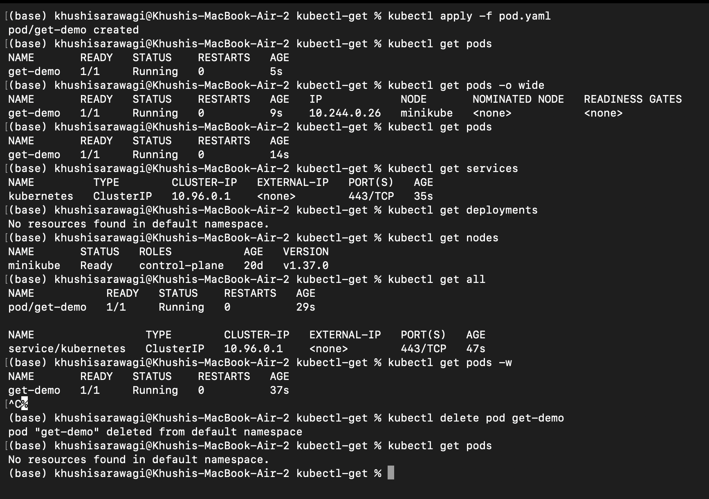

### 2. Investigate Details with `kubectl describe`

```bash
kubectl describe pod describe-demo
kubectl describe deployment <deployment-name>
kubectl describe service <service-name>
kubectl describe node <node-name>
```

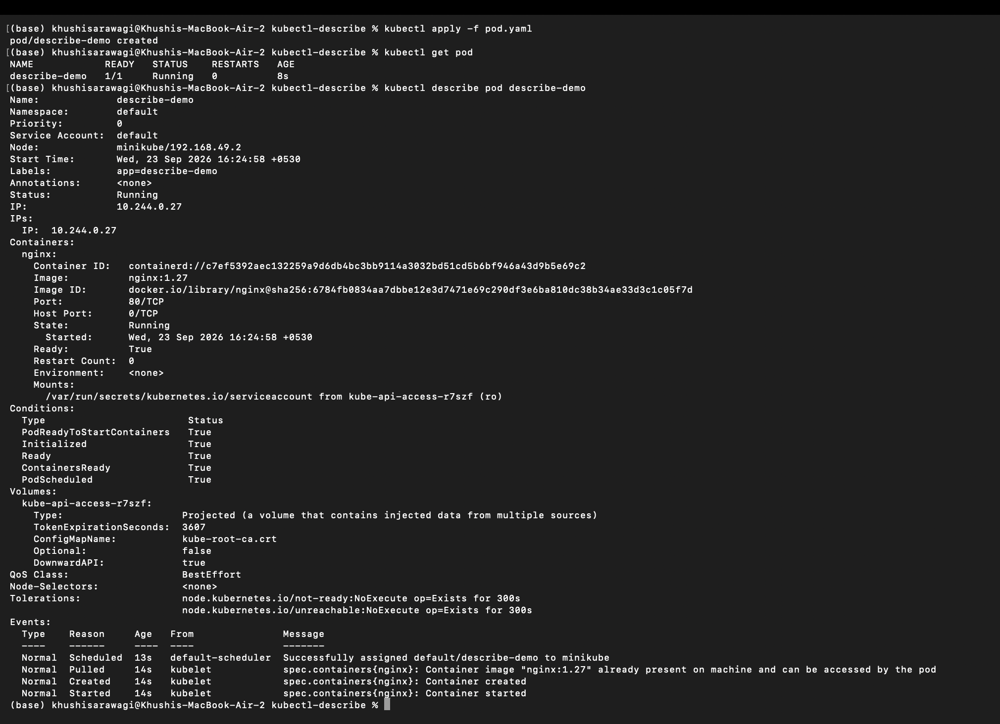

### 3. Read Application Logs

```bash
kubectl logs <pod-name>
kubectl logs <pod-name> --previous
kubectl logs -f <pod-name>
```

Use `--previous` when a container has restarted and the current instance no longer contains the useful output.

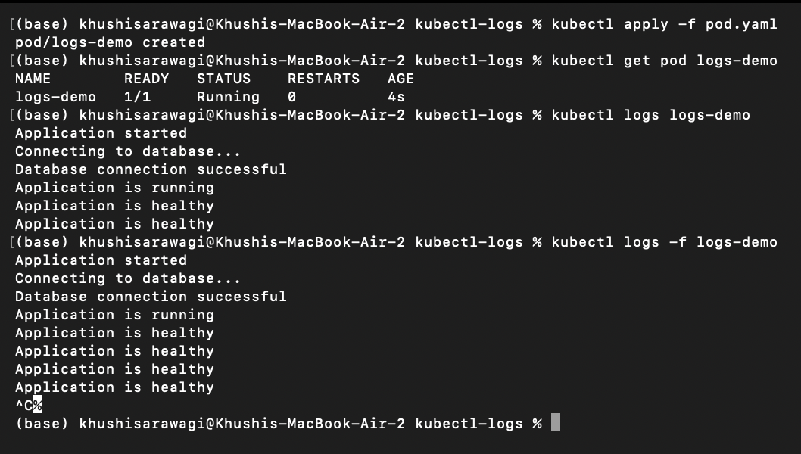

### 4. Run Commands with `kubectl exec`

```bash
kubectl exec -it exec-demo -- bash
kubectl exec exec-demo -- hostname
kubectl exec exec-demo -- ls /usr/share/nginx/html
kubectl exec exec-demo -- cat /etc/hosts
```

Use `curl localhost` or `wget -qO- http://localhost` inside a running container to confirm whether the application itself responds.

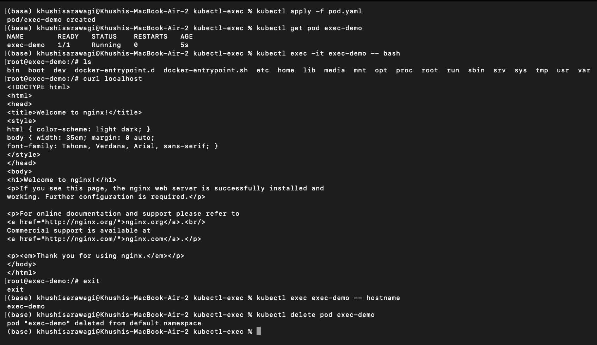

### 5. Inspect Kubernetes Events

```bash
kubectl get events
kubectl get events --sort-by=.lastTimestamp
kubectl get events -A
kubectl events --watch
kubectl describe pod events-demo
```

Events commonly reveal `FailedScheduling`, `Failed`, `Pulling`, `Pulled`, `Created`, and `Started` reasons. Event messages are cluster-generated and can differ between Kubernetes distributions.

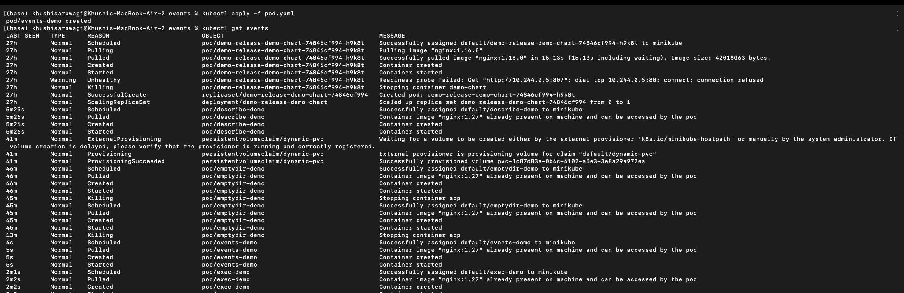

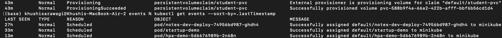

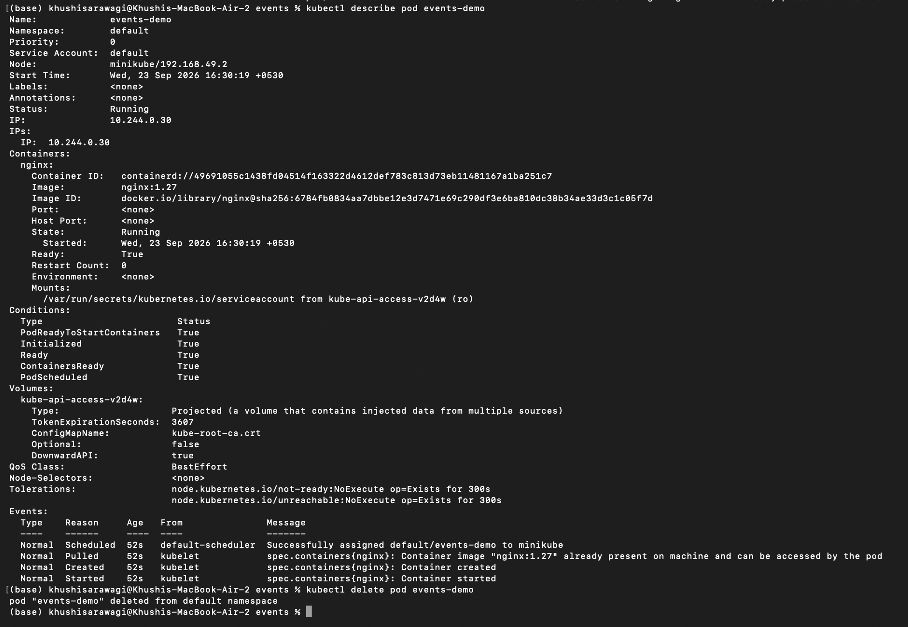

### 6. Diagnose `CrashLoopBackOff`

```bash
kubectl apply -f crashloopbackoff/broken-pod.yaml
kubectl get pod crash-demo
kubectl describe pod crash-demo
kubectl logs crash-demo
kubectl logs crash-demo --previous
```

`CrashLoopBackOff` means that the container starts, exits or crashes, and Kubernetes repeatedly restarts it with an increasing delay. In this exercise, the command exits with code `1`.

Fix and verify it:

```bash
kubectl delete pod crash-demo
kubectl apply -f crashloopbackoff/fixed-pod.yaml
kubectl get pod crash-demo
kubectl logs crash-demo
```

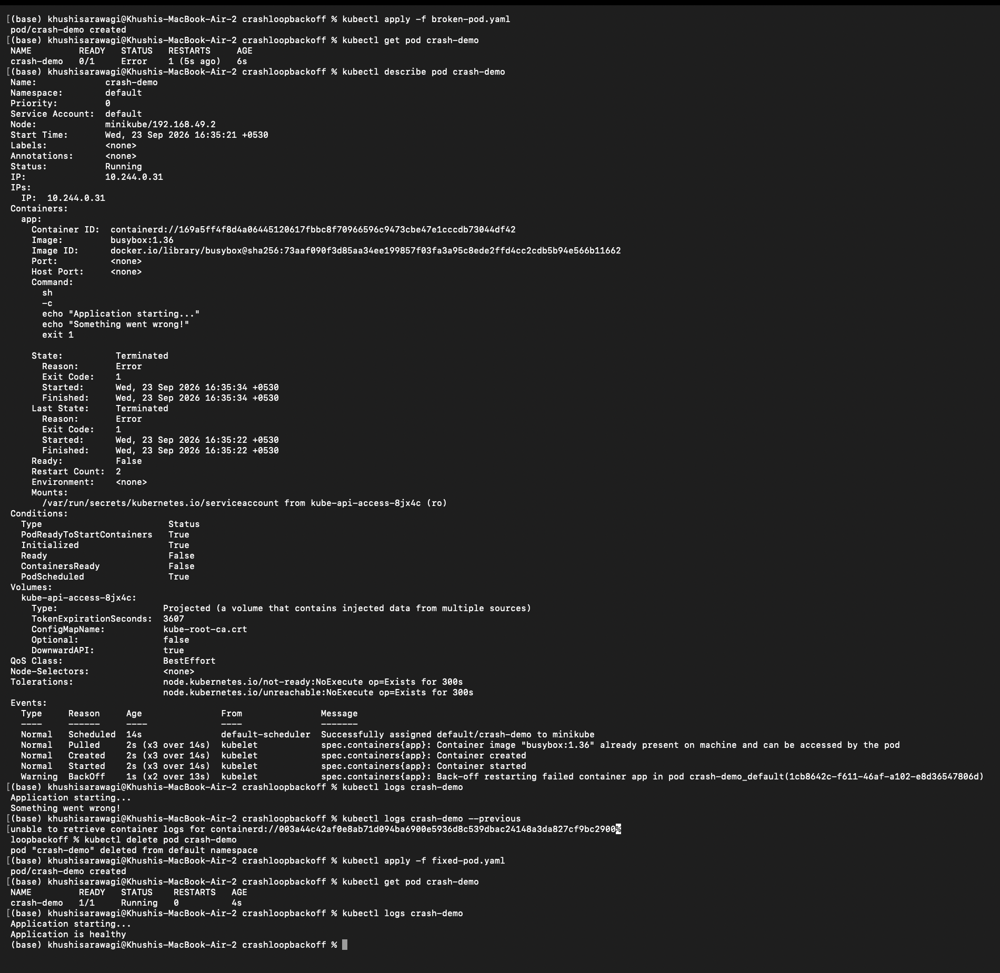

### 7. Diagnose `ImagePullBackOff`

```bash
kubectl apply -f imagepullbackoff/broken-pod.yaml
kubectl get pod image-demo
kubectl describe pod image-demo
```

Check the Events section and the image name or tag. The exercise uses a tag that does not exist.

Fix and verify it:

```bash
kubectl delete pod image-demo
kubectl apply -f imagepullbackoff/fixed-pod.yaml
kubectl get pod image-demo
```

Other causes include a private registry that needs credentials, a registry outage, or network access problems.

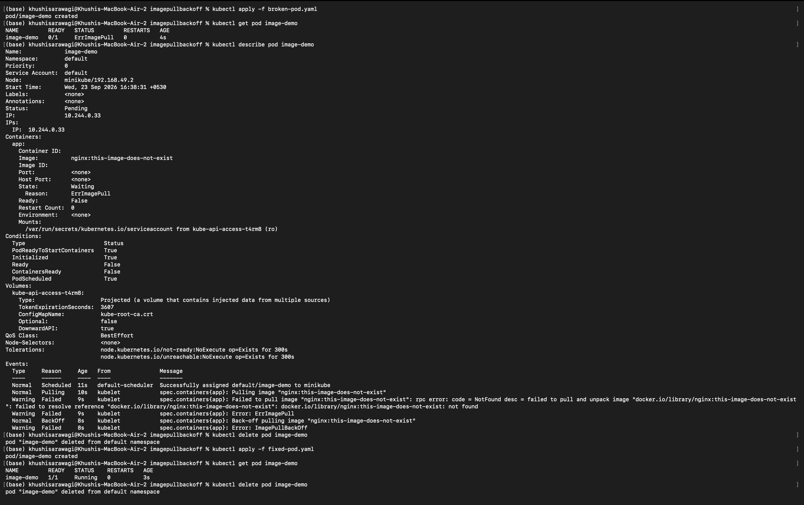

### 8. Diagnose a Pending Pod

```bash
kubectl apply -f pending-pods/broken-pod.yaml
kubectl get pod pending-demo
kubectl describe pod pending-demo
kubectl get nodes --show-labels
```

The broken manifest requests a node named `node-that-does-not-exist`, so the scheduler cannot place the Pod.

Fix and verify it:

```bash
kubectl delete pod pending-demo
kubectl apply -f pending-pods/fixed-pod.yaml
kubectl get pod pending-demo
```

Other causes include insufficient CPU or memory, taints, affinity rules, and unavailable PVCs.

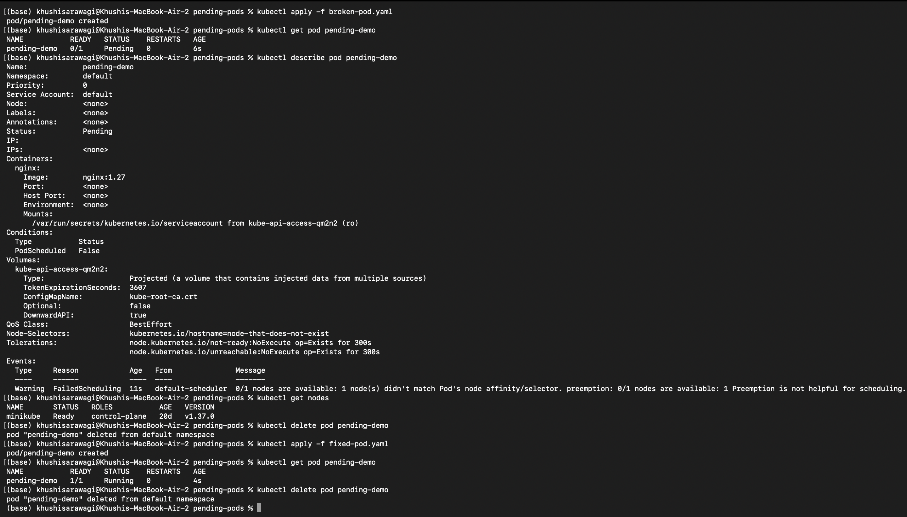

### 9. Troubleshoot Services and DNS

Deploy the application and Service:

```bash
kubectl apply -f service-dns-troubleshooting/deployment.yaml
kubectl apply -f service-dns-troubleshooting/service.yaml
kubectl get pods
kubectl get service
kubectl describe service web-service
kubectl get endpoints web-service
```

The Service selector must match the Pod label. Test DNS and HTTP from the cluster:

```bash
kubectl apply -f service-dns-troubleshooting/dns-test-pod.yaml
kubectl exec -it dns-test -- nslookup web-service
kubectl exec dns-test -- wget -qO- http://web-service
```

If endpoints show `<none>`, compare the Service selector with the labels shown by `kubectl get pods --show-labels`. A full DNS name follows this pattern:

```text
service-name.namespace.svc.cluster.local
```

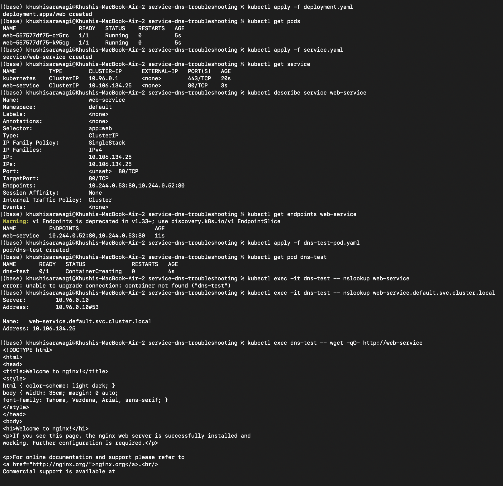

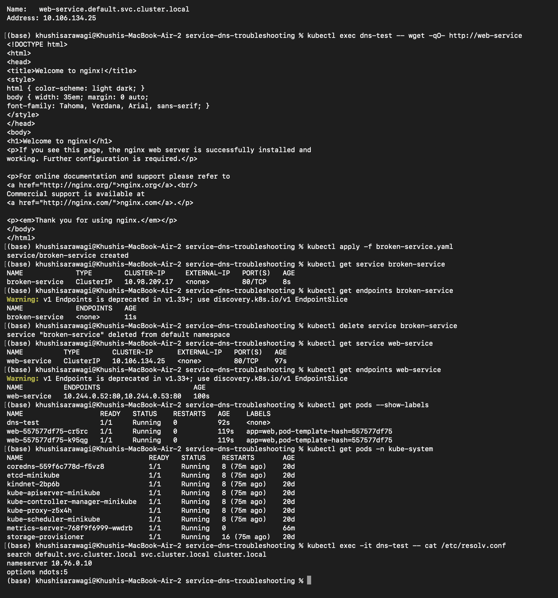

## Mini-Project: Broken Pod and Service Challenge

The `mini-project/` folder combines Pod, Deployment, and Service troubleshooting. Follow the investigation order in its [README](mini-project/README.md): deploy, observe, break, investigate, fix, and verify.

### 1. Deploy the application

```bash
cd mini-project
kubectl apply -f deployment.yaml
kubectl apply -f service.yaml
kubectl get pods
kubectl get service
```

Confirm the Pods are running, then inspect the application:

```bash
kubectl get pods -o wide
kubectl describe pod <pod-name>
kubectl logs <pod-name>
kubectl exec -it <pod-name> -- bash
curl localhost
```

### 2. Verify the Service

```bash
kubectl describe service troubleshooting-service
kubectl get endpoints troubleshooting-service
```

Check the selector, target port, and endpoints. Healthy endpoints should contain the IP addresses of the application Pods.

### 3. Investigate the broken Pod

Apply the broken manifest without editing it first:

```bash
kubectl apply -f broken-pod.yaml
kubectl get pod project-broken-pod
kubectl describe pod project-broken-pod
```

Use the Events section to identify the image-related root cause. Answer these questions in your notes:

1. What is the Pod status?
2. What is the actual error?
3. Which command revealed the reason?
4. What is wrong with the image?
5. What change would fix it?

### 4. Investigate a Service selector failure

Change the Service selector from `app: troubleshooting-app` to `app: wrong-app`, apply the Service, and inspect the result:

```bash
kubectl apply -f service.yaml
kubectl get service troubleshooting-service
kubectl get endpoints troubleshooting-service
kubectl get pods --show-labels
kubectl describe service troubleshooting-service
```

The endpoints should show `<none>` because the selector no longer matches the Pod label. Restore the correct selector, apply the Service again, and verify that endpoints return.

### Mini-project troubleshooting table

| Problem | Evidence to collect | Root cause | Fix |
| --- | --- | --- | --- |
| Broken Pod | `get pod`, `describe pod`, Events | Invalid or unavailable image | Correct the image name or tag |
| Service has no endpoints | `get endpoints`, Pod labels, Service selector | Selector does not match Pod labels | Restore matching labels and selector |
| Application is unreachable | `logs`, `exec`, Service details, endpoints | Application, port, DNS, or routing issue | Fix the failing layer and verify from inside the cluster |

### Mini-project screenshots

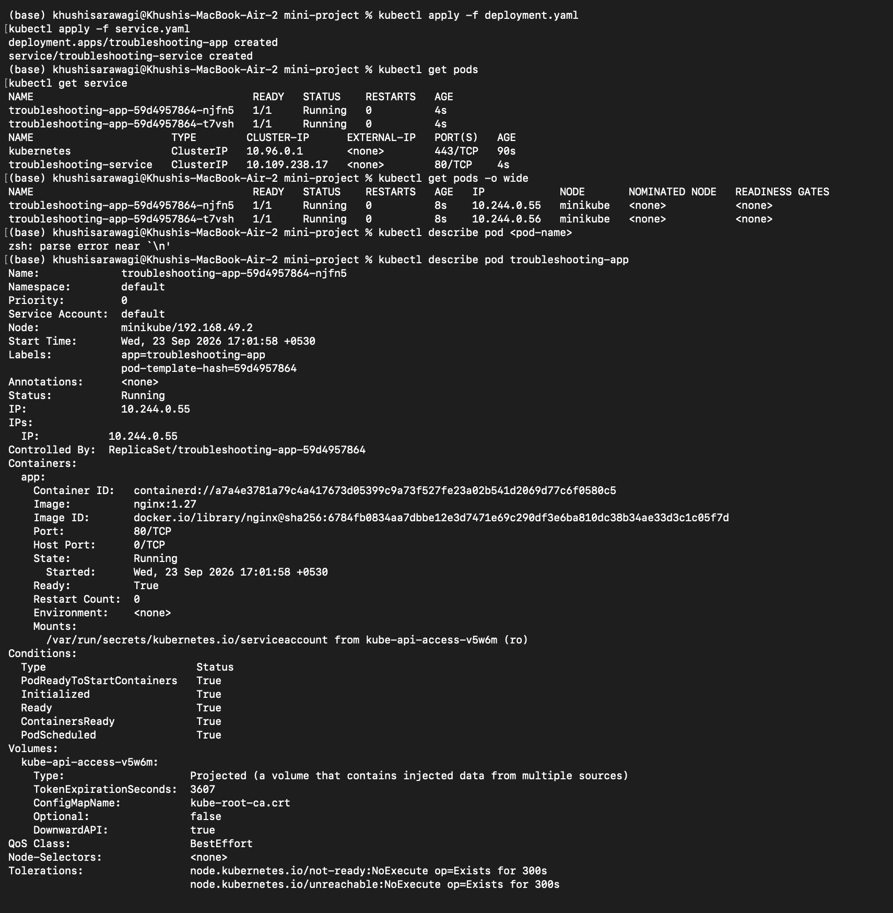

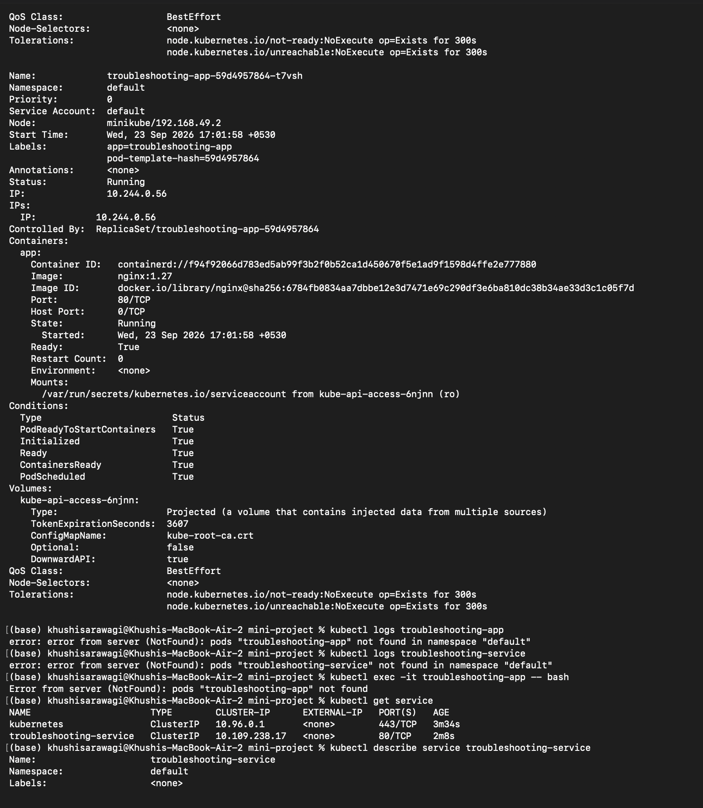

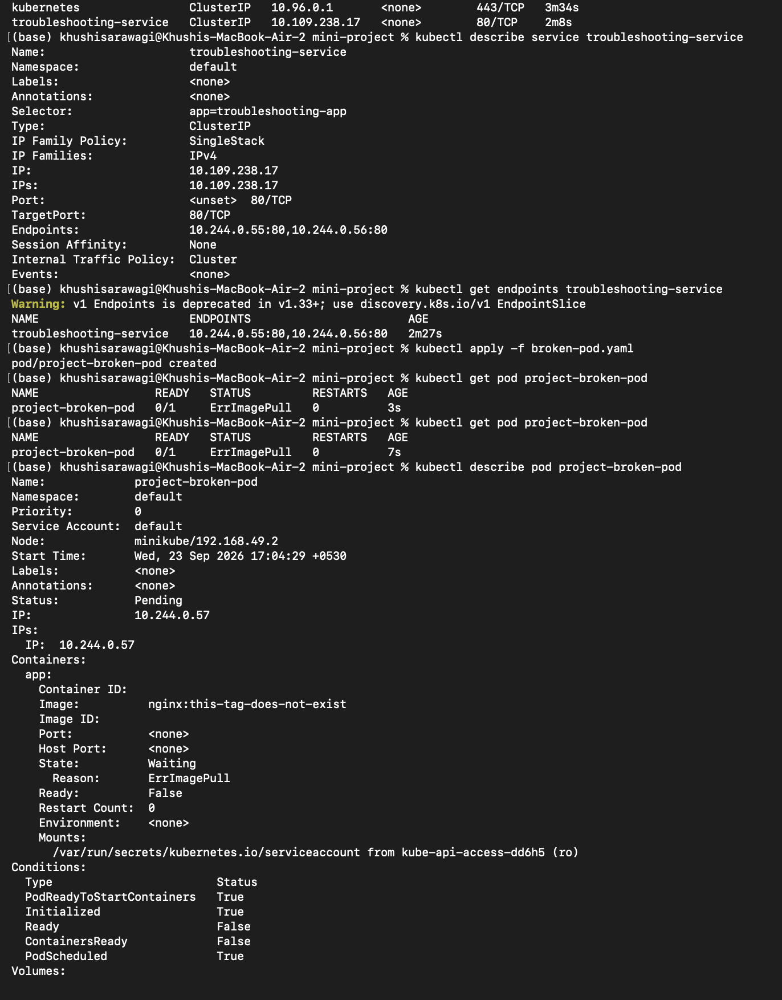

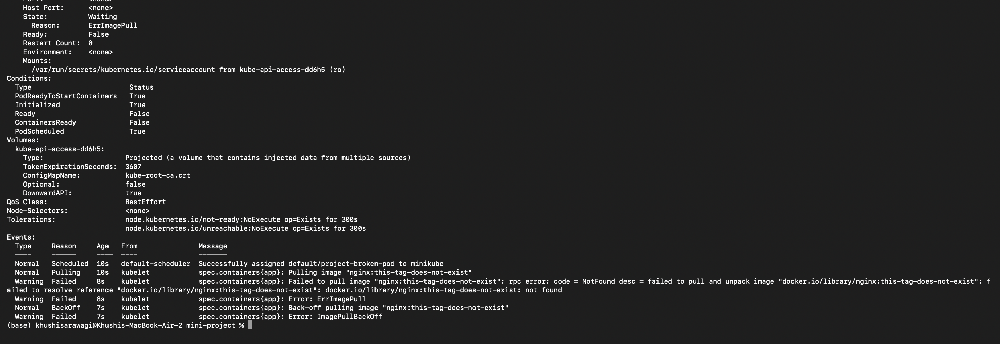

## Show All Nine Exercises

To provide the required evidence that the nine troubleshooting examples were created, inspect the resources after applying each scenario's manifest:

```bash
kubectl get pods
kubectl get all
```

The exact output depends on which examples are currently running. Pod names and generated Deployment names can also differ between clusters. Capture the output after the nine exercises are deployed and compare the `NAME`, `READY`, `STATUS`, and `RESTARTS` columns.

## Cleanup

Delete individual examples with the corresponding manifest or fixed manifest:

```bash
kubectl delete -f crashloopbackoff/fixed-pod.yaml
kubectl delete -f imagepullbackoff/fixed-pod.yaml
kubectl delete -f pending-pods/fixed-pod.yaml
kubectl delete -f service-dns-troubleshooting/deployment.yaml
kubectl delete -f service-dns-troubleshooting/service.yaml
kubectl delete pod dns-test
```

For the mini-project:

```bash
kubectl delete -f mini-project/service.yaml
kubectl delete -f mini-project/deployment.yaml
kubectl delete -f mini-project/broken-pod.yaml
```

## No Helm Homework

Helm is not included in this module's homework because it was not completed in the referenced lecture. Helm work will continue in a later lecture.

## Troubleshooting Habit

Use this sequence whenever a Kubernetes workload is not working:

```text
kubectl get
	|
	v
kubectl describe
	|
	v
kubectl logs / kubectl logs --previous
	|
	v
kubectl get events
	|
	v
kubectl exec and Service/DNS checks
	|
	v
Find the root cause, fix it, and verify
```

The important distinction is that a status such as `CrashLoopBackOff`, `ImagePullBackOff`, or `Pending` describes a symptom. The Events, logs, labels, selectors, and resource configuration reveal the cause.
Difference between kubectl log and kubectl event commands

You need to create a table explaining the differences
Include scenarios where each command is used
Explain that kubectl log shows logs for a specific pod, while kubectl event shows logs for all pods in the cluster
2. All troubleshooting commands documentation

Create a README.md file documenting all 9 troubleshooting scenarios covered
For each command, include:
Command name
The actual command you ran
Screenshot of the output
Must show kubectl get all/kubectl get pods output proving you created all 9 containers
3. Mini challenge/mini project

Located in session 14 directory
Run broken pod.yml, deployment, service files
Use the provided README.md files when you get stuck
Document your troubleshooting process
4. No Helm homework

The instructor mentioned Helm wasn't completed, so no homework for that yet
They'll continue Helm in the next lecture