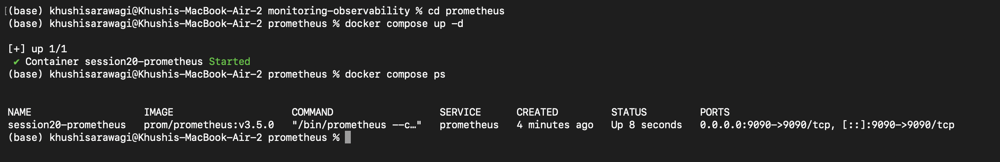
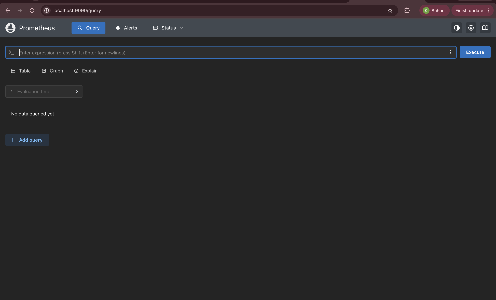
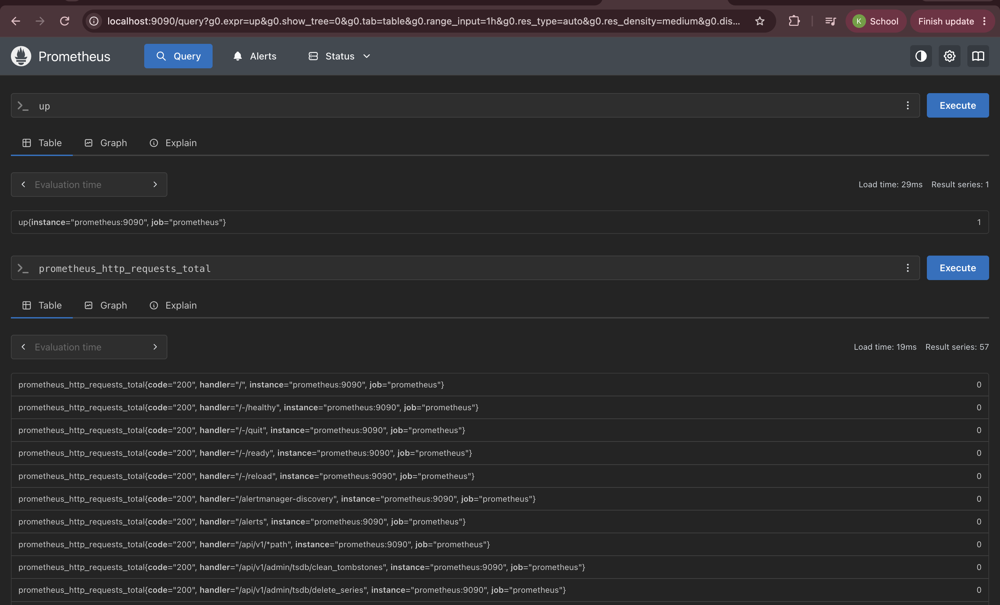
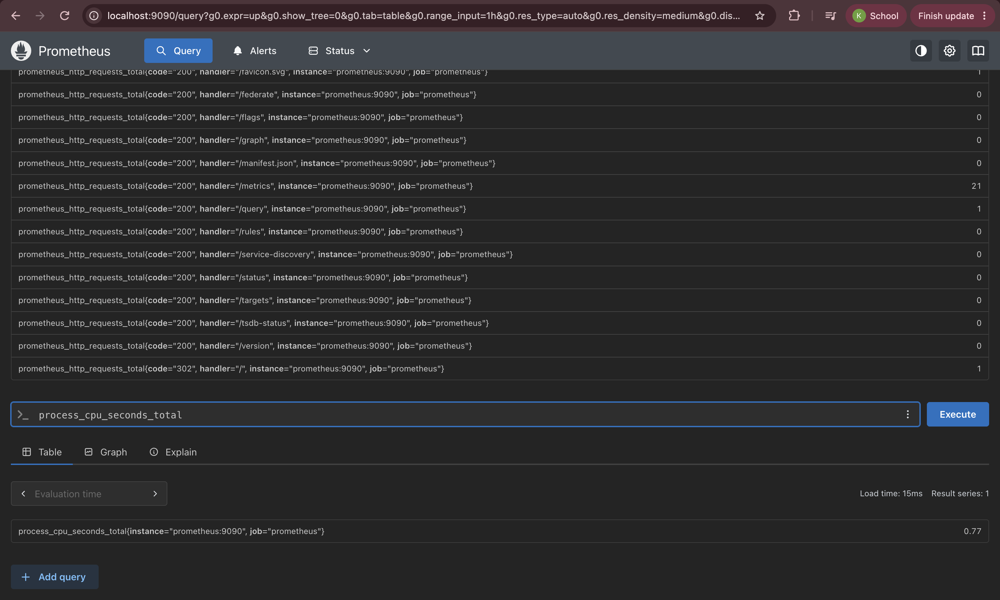
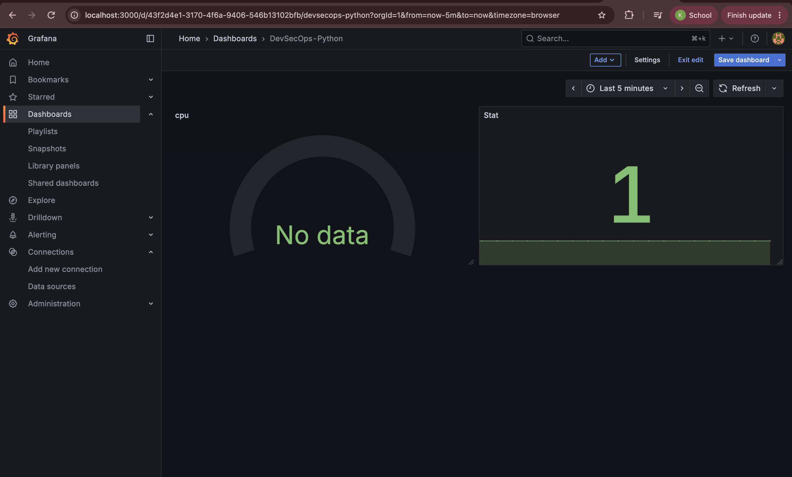
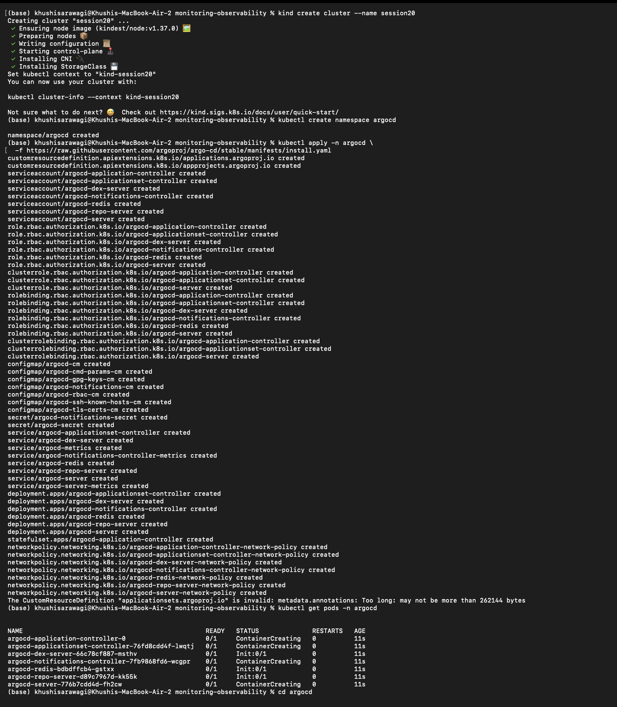
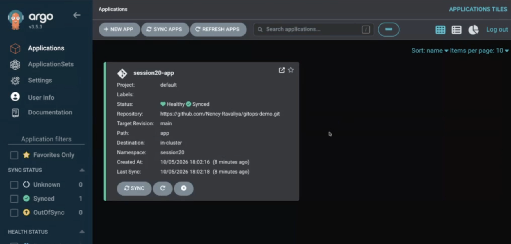
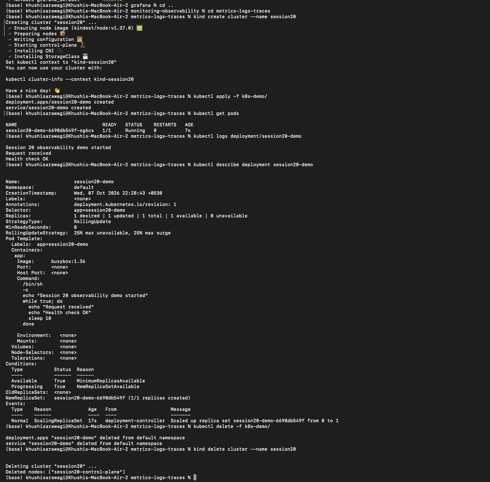
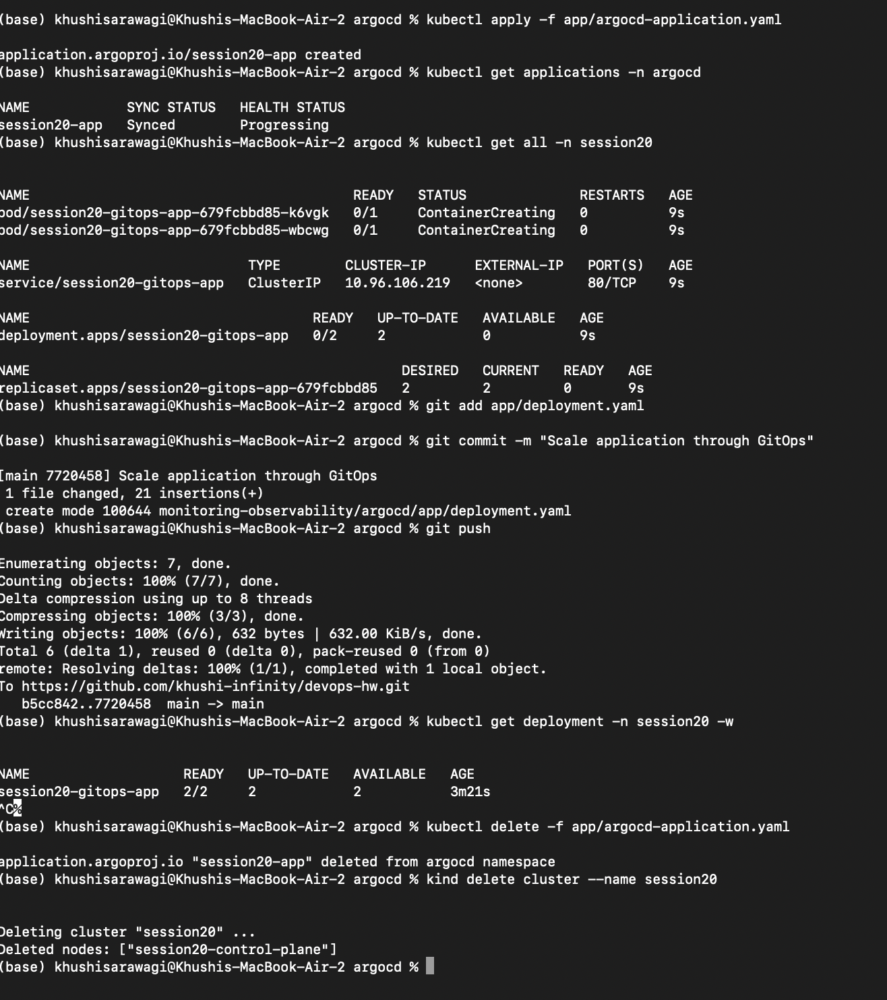

# Session 20: Monitoring, Observability, and GitOps

This project covers the three Session 20 objectives:

1. Monitoring application and Kubernetes health.
2. Understanding metrics, logs, and traces as the three observability pillars.
3. Managing Kubernetes desired state with GitOps and Argo CD.

## Project structure

```text
monitoring-observability/
|-- README.md
|-- prometheus/
|   |-- README.md
|   |-- docker-compose.yaml
|   `-- prometheus.yaml
|-- grafana/
|   |-- README.md
|   |-- docker-compose.yaml
|   `-- prometheus.yaml
|-- metrics-logs-traces/
|   |-- README.md
|   `-- k8s-demo/
|-- introduction-to-gitops/
|   |-- README.md
|   `-- app/
|-- git-as-source-of-truth/
|   |-- README.md
|   `-- gitops-repo/
|-- argocd/
|   |-- README.md
|   `-- app/
`-- miniproject/
    |-- README.md
    `-- app/
```

## Task 1: Monitoring

Monitoring collects measurements from systems and compares them with
expected values. It helps identify whether a service is healthy and alerts
when a measurable condition requires attention.

### Metrics

Metrics are numerical values recorded over time. Examples include:

- CPU utilization
- Memory utilization
- Request count
- Error count
- Request latency
- Pod restart count
- Application availability

Prometheus is used in this project to collect and query time-series metrics.
Prometheus scrapes metrics endpoints and stores the values for PromQL
queries.

### Logs

Logs are timestamped messages emitted by an application, container, or
Kubernetes component. They explain events such as requests, startup,
warnings, errors, and failed health checks.

View Kubernetes application logs with:

```bash
kubectl logs deployment/session20-demo
kubectl logs <pod-name>
kubectl logs <pod-name> --previous
```

### Alerts

An alert is a notification generated when a metric crosses a defined
threshold or a health condition fails. Examples include:

- CPU utilization remains above 80%.
- Memory utilization approaches the container limit.
- An application has too many errors.
- A Pod is restarting repeatedly.
- A health endpoint is unavailable.

Prometheus can evaluate alert rules, while Alertmanager can group, route, and
deliver notifications. A useful alert should include the affected service,
severity, observed value, threshold, and a link to investigation details.

### CPU and memory utilization

For a Kubernetes workload, inspect resource usage with:

```bash
kubectl top nodes
kubectl top pods -A
kubectl describe pod <pod-name>
```

`kubectl top` requires the Metrics Server to be installed. CPU and memory
requests reserve scheduling capacity, while limits cap container usage.
Sustained high CPU can cause latency and throttling. High memory usage can
lead to eviction or an out-of-memory restart.

### Application health

Application health is commonly checked through:

- Liveness probes: whether the container should be restarted.
- Readiness probes: whether the Pod should receive traffic.
- Startup probes: whether a slow-starting application has initialized.
- HTTP status codes and request error rates.
- Dependency and database health checks.

Check Kubernetes health with:

```bash
kubectl get pods
kubectl get deployment
kubectl describe deployment session20-demo
kubectl get events --sort-by=.lastTimestamp
```

### Monitoring demonstration

Start the Prometheus demonstration:

```bash
cd prometheus
docker compose up -d
docker compose ps
```

Open `http://localhost:9090` and query:

```text
up
prometheus_http_requests_total
process_cpu_seconds_total
```

An `up` value of `1` indicates that the target is reachable. Stop the
demonstration with:

```bash
docker compose down
```

The Grafana demonstration can be started with:

```bash
cd grafana
docker compose up -d
docker compose ps
```

Open `http://localhost:3000`, add Prometheus using
`http://prometheus:9090` as the data source, and create a dashboard using the
`up` query. Stop it with `docker compose down`.

### Monitoring screenshots

The monitoring demonstration was run with Docker Compose. Prometheus was
started successfully, its `up` query returned `1`, and PromQL queries
returned collected time-series data. Grafana displayed the Prometheus data in
a dashboard.











## Task 2: Observability

Observability is the ability to understand a system's internal state from
the telemetry it produces. Monitoring usually asks whether a known condition
is healthy. Observability helps investigate unfamiliar failures and explain
why they occurred.

### The three pillars

| Pillar | Meaning | Example question |
|---|---|---|
| Metrics | Numeric measurements over time. | How many requests are failing? |
| Logs | Detailed records of events. | What error did the application produce? |
| Traces | A request's journey across services, represented by spans. | Which service caused the latency? |

#### Metrics

Metrics are efficient for dashboards, trends, capacity planning, and alerts.
Common metric types include counters, gauges, histograms, and summaries.
Prometheus and PromQL are used for collection and analysis in this project.

#### Logs

Logs provide event details and context. Structured logs should include fields
such as timestamp, severity, service, environment, request ID, and error
information. Kubernetes logs can be read with `kubectl logs`, while larger
systems commonly aggregate logs into tools such as Loki, Elasticsearch, or
CloudWatch Logs.

#### Traces

A trace represents one request across multiple components. It contains
spans for operations such as an API call, service-to-service request, or
database query. Trace IDs allow logs and metrics to be connected to the
request that produced them. OpenTelemetry is a common standard for collecting
and exporting traces.

### Why observability is required

Observability is required because distributed systems have many components
and failures are not always visible from one signal. Combining metrics, logs,
and traces helps teams:

- Detect incidents quickly.
- Find the component responsible for a failure.
- Separate application errors from infrastructure problems.
- Investigate latency and dependency failures.
- Understand user impact.
- Verify deployments and capacity decisions.

### Common tools

| Area | Examples |
|---|---|
| Metrics | Prometheus, Grafana, Datadog, CloudWatch |
| Logs | Loki, Elasticsearch, Fluent Bit, CloudWatch Logs |
| Traces | OpenTelemetry, Jaeger, Tempo, AWS X-Ray |
| Kubernetes collection | Metrics Server, kube-state-metrics, Prometheus Operator, Fluent Bit |

### Kubernetes observability demonstration

Create a local cluster and deploy the demonstration workload:

```bash
kind create cluster --name session20
cd metrics-logs-traces
kubectl apply -f k8s-demo/
kubectl get pods
kubectl logs deployment/session20-demo
kubectl describe deployment session20-demo
```

The commands demonstrate workload status and logs. Delete the resources after
the exercise:

```bash
kubectl delete -f k8s-demo/
kind delete cluster --name session20
```

### Observability screenshot

The Kubernetes observability demonstration created a kind cluster, deployed
the `session20-demo` workload, verified the Pod was running, viewed
application logs, described the Deployment, and cleaned up the resources.



## Task 3: GitOps

GitOps is a deployment and operations model in which Git stores the desired
state of applications and infrastructure. A GitOps controller continuously
compares the desired state in Git with the actual state in Kubernetes and
reconciles differences.

### Git as the source of truth

The Git repository contains declarative Kubernetes manifests. For example:

```yaml
spec:
  replicas: 3
```

This describes the desired state. Git provides:

- Version history
- Code review
- Diffs
- Collaboration
- Audit history
- A rollback reference

The Kubernetes cluster is the actual state. Git is not the cluster; a
controller such as Argo CD connects the two.

### Declarative configuration

Declarative configuration states what the system should look like rather
than listing every imperative command required to build it. Kubernetes
manifests declare resources such as Namespaces, Deployments, Services, and
replica counts.

### Continuous reconciliation

The GitOps controller repeatedly compares:

```text
Desired state in Git  !=  Actual state in Kubernetes
```

When they differ, the controller applies the required changes. With
self-healing enabled, manual changes in the cluster are corrected back to
the version stored in Git.

### GitOps workflow

```text
Developer changes manifest
            |
            v
       Git commit
            |
            v
       Git push
            |
            v
         Argo CD
            |
   Compare and reconcile
            |
            v
       Kubernetes
```

The normal workflow is:

1. Edit a Kubernetes manifest.
2. Review the diff.
3. Commit and push the change.
4. Argo CD detects the new Git revision.
5. Argo CD synchronizes Kubernetes.
6. Verify application health and synchronization status.

### Kubernetes and GitOps demonstration

Create the local cluster:

```bash
kind create cluster --name session20
```

Install Argo CD:

```bash
kubectl create namespace argocd
kubectl apply -n argocd \
  -f https://raw.githubusercontent.com/argoproj/argo-cd/stable/manifests/install.yaml
kubectl get pods -n argocd
```

Update `argocd/app/argocd-application.yaml` with the Git repository URL,
commit the Kubernetes manifests, and push them. Apply the Argo CD Application
manifest once:

```bash
cd argocd
kubectl apply -f app/argocd-application.yaml
kubectl get applications -n argocd
kubectl get all -n session20
```

To demonstrate Git-driven reconciliation, change the `replicas` value in the
Git repository, commit, and push:

```bash
git add app/deployment.yaml
git commit -m "Scale application through GitOps"
git push
kubectl get deployment -n session20 -w
```

Do not use `kubectl scale` as the normal deployment method in this
demonstration. The desired replica count should be changed in Git.

Clean up:

```bash
kubectl delete -f app/argocd-application.yaml
kind delete cluster --name session20
```

### GitOps screenshots

The GitOps demonstration created a kind cluster, installed Argo CD, applied
the Argo CD Application, committed a manifest change, pushed it to Git, and
verified the Kubernetes Deployment after synchronization.







## Deliverables

- Monitoring demonstration using Prometheus and Grafana.
- Observability documentation covering metrics, logs, traces, purpose, tools,
  and Kubernetes observability.
- GitOps demonstration using Git as the source of truth and Argo CD
  reconciliation.
- Screenshots of the monitoring, observability, and GitOps demonstrations.
- This `README.md` documenting the work.

## References

- [Prometheus documentation](https://prometheus.io/docs/)
- [Grafana documentation](https://grafana.com/docs/)
- [Kubernetes observability](https://kubernetes.io/docs/concepts/cluster-administration/monitoring/)
- [OpenTelemetry documentation](https://opentelemetry.io/docs/)
- [Argo CD documentation](https://argo-cd.readthedocs.io/)
