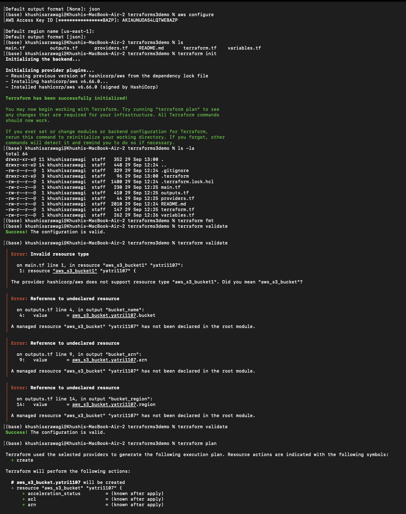
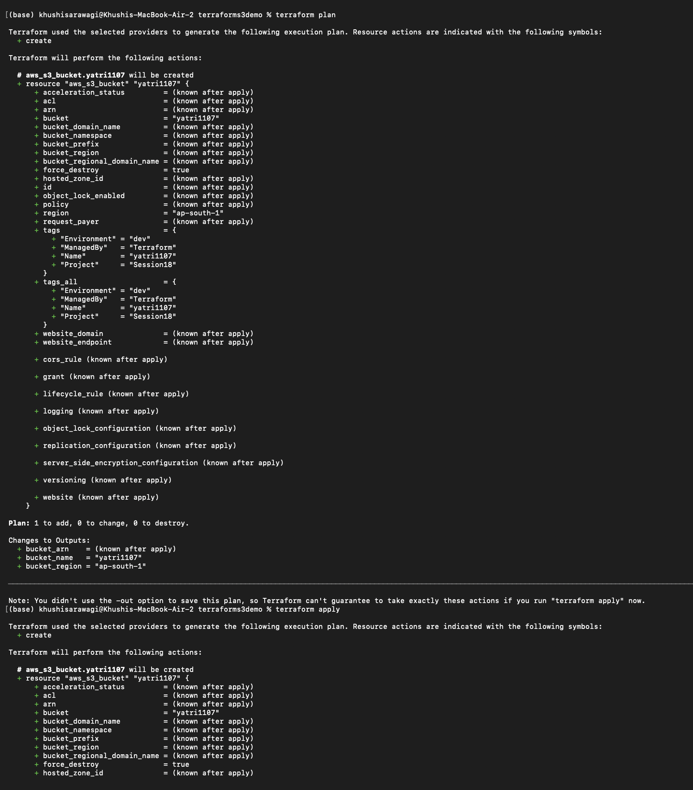
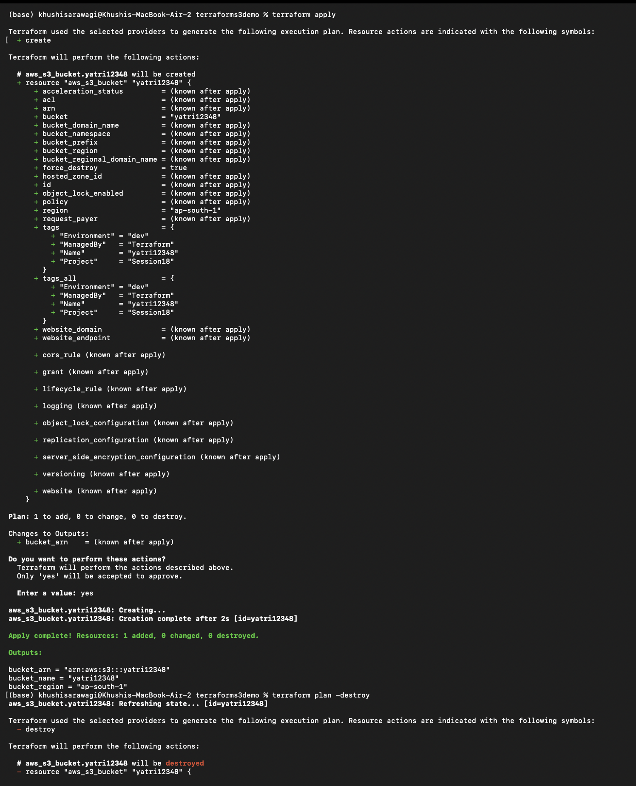
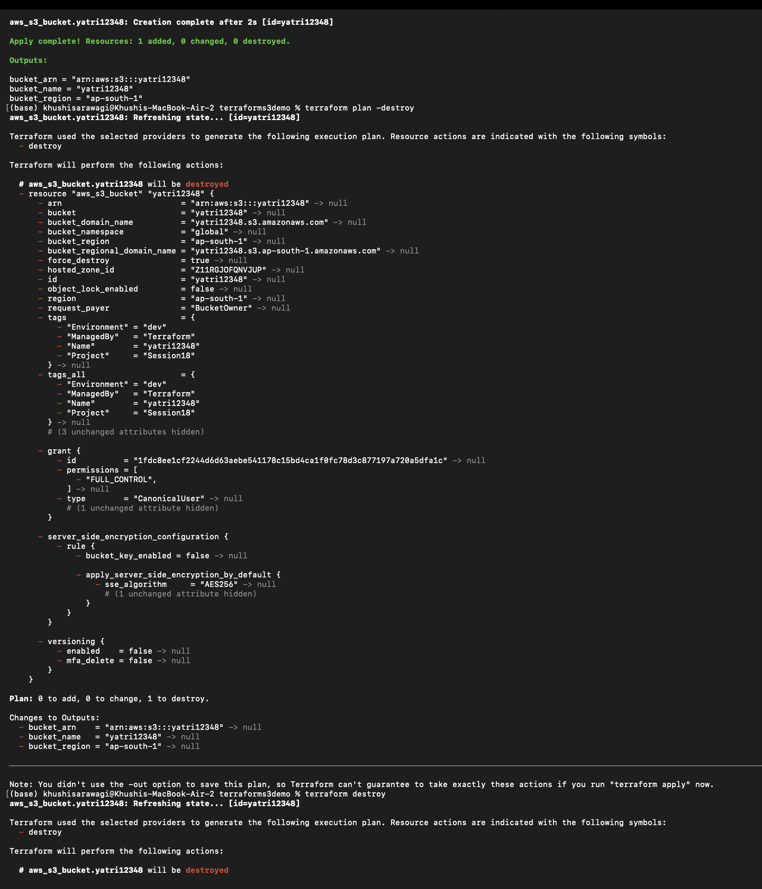
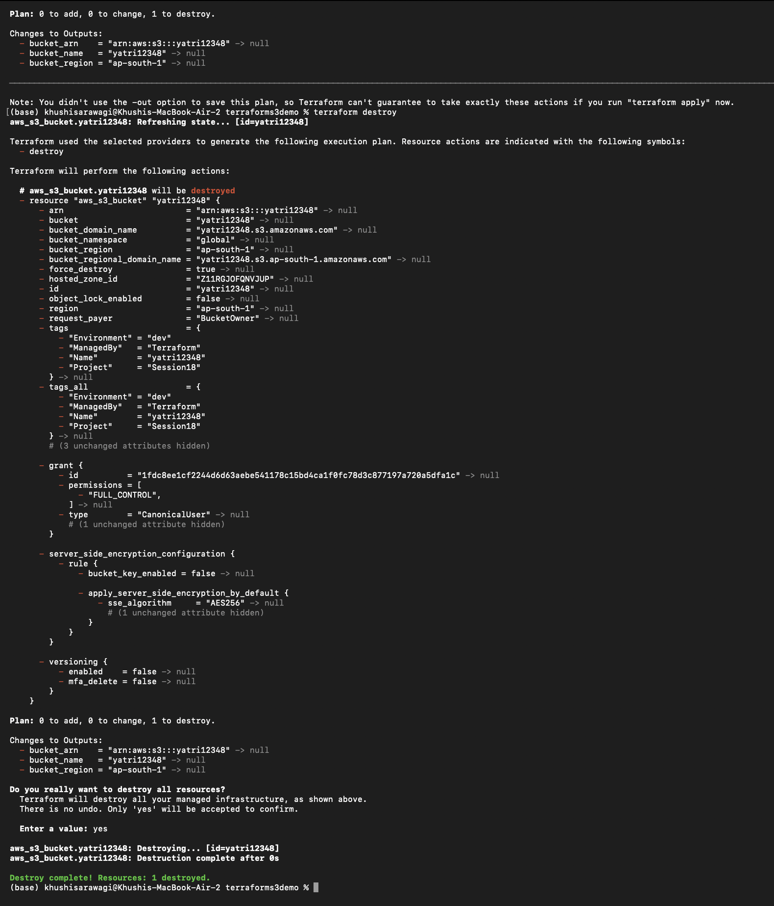

# Session 18: Terraform and Infrastructure as Code

This folder contains the Session 18 work:

1. A Terraform project that creates an AWS S3 bucket.
2. Research notes for IAM, EC2, S3, VPC, DynamoDB, and RDS.

## Deliverables

```text
terraform/
|-- terraforms3demo/
|   |-- main.tf
|   |-- variables.tf
|   |-- outputs.tf
|   |-- providers.tf
|   |-- README.md
|   `-- terraform.tfvars (optional)
|-- aws-services/
|   |-- 01-iam/README.md
|   |-- 02-ec2/README.md
|   |-- 03-s3/README.md
|   |-- 04-vpc/README.md
|   `-- 05-dynamodb-rds/README.md
`-- assets/
    |-- terraformdemo.png
    |-- terraformdemo2.png
    |-- terraformdemo3.png
    |-- terraformdemo4.png
    `-- terraformdemo5.png
```

## Terraform S3 demo

See [`terraforms3demo/README.md`](terraforms3demo/README.md) for the
configuration, commands, outputs, screenshots, and cleanup workflow.

### Terraform workflow screenshots

The following screenshots provide visual evidence for the complete Terraform
S3 workflow. Detailed command explanations are available in the project
README linked above.

| Step | Commands demonstrated | Screenshot |
|---|---|---|
| Initialization and validation | `terraform init`, `terraform fmt`, `terraform validate` |  |
| Plan and apply | `terraform plan`, `terraform apply` |  |
| Output values | `terraform output` |  |
| State and resource details | `terraform show`, `terraform state list`, `terraform state show` |  |
| Destroy | `terraform destroy` |  |

## AWS services research

- [01. IAM - Governance](aws-services/01-iam/README.md)
- [02. EC2 - Compute](aws-services/02-ec2/README.md)
- [03. S3 - Storage](aws-services/03-s3/README.md)
- [04. VPC - Networking](aws-services/04-vpc/README.md)
- [05. DynamoDB and RDS - Database Services](aws-services/05-dynamodb-rds/README.md)

## References

- [Terraform AWS provider](https://registry.terraform.io/providers/hashicorp/aws/latest/docs)
- [AWS Documentation](https://docs.aws.amazon.com/)